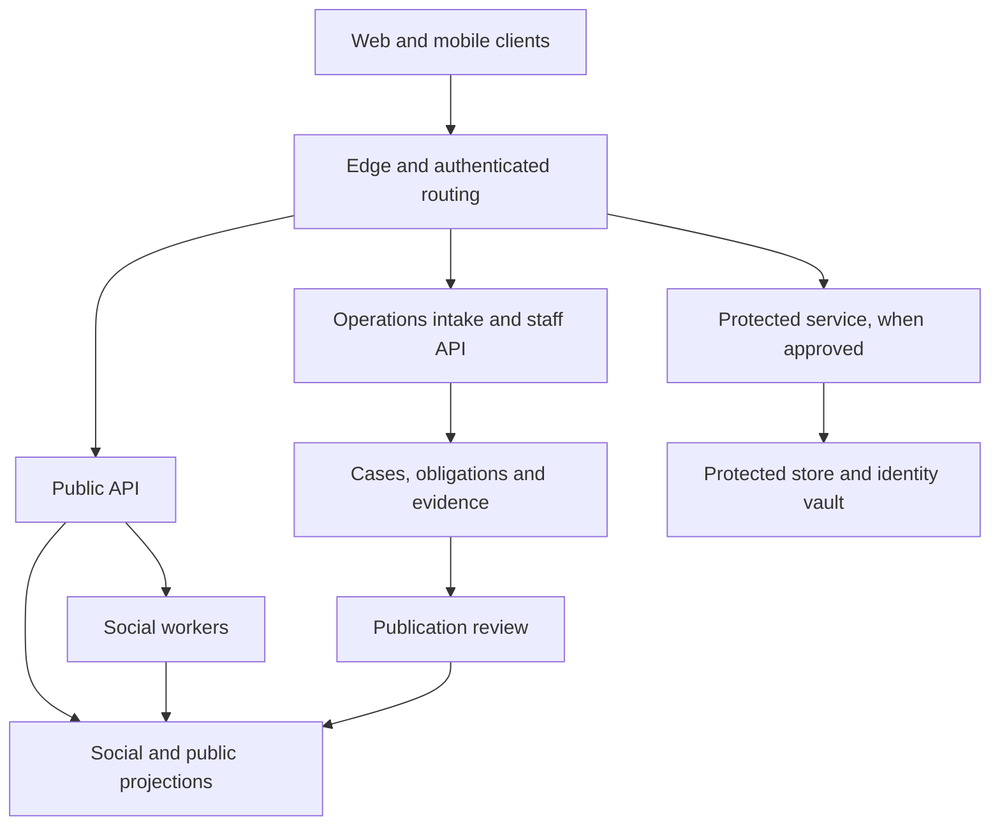
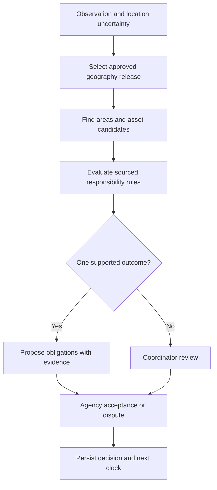
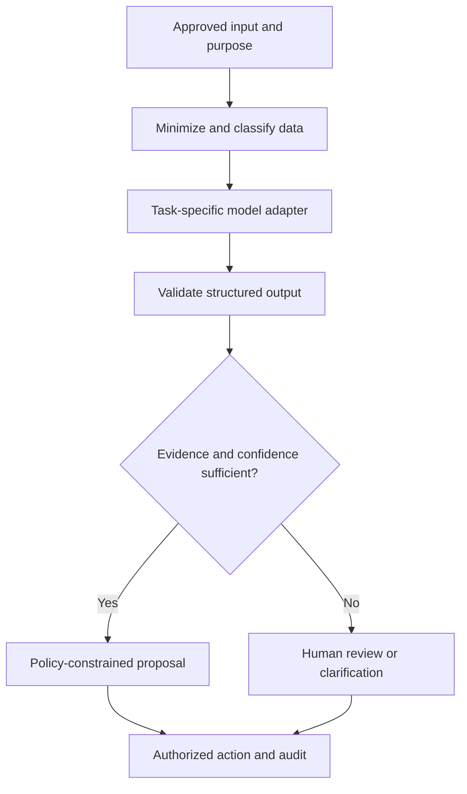
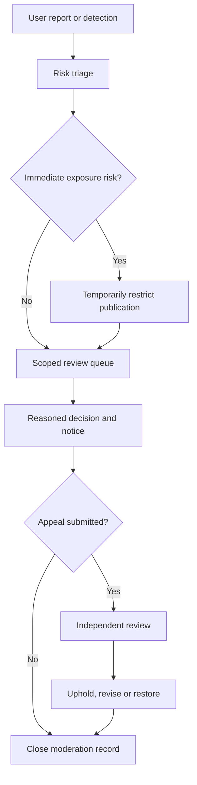

# JanSetu AI — Detailed Product and Implementation Blueprint

> Historical design snapshot. The [v3 specification suite](docs/spec/README.md) supersedes this document. Use its PRD, UI and backend contracts for implementation; earlier limits, examples and timelines here may differ. Preserved for design history.

**Version:** 2.2\
**Date:** 3 October 2026  
**Status:** Design for implementation; software and integrations have not been built by this document.  
**Deliverables covered:** BRD, PRD, mobile and website UI specification, system architecture, AI design, database model, API contracts, backend algorithms, operations, and delivery plan.

| Read this part | Sections | Main decisions |
|---|---|---|
| Business requirements | 1–2 | Product scope, stakeholders, value, economics, pilot measures |
| Product requirements | 3–6 | Roles, communities, posts, comments, cases, feeds, search |
| Mobile and website UI | 7–9 | Navigation, design tokens, components, detailed screen behavior |
| Architecture and data | 10–13 | Stack, capacity, SQL schema, versioned geography, routing |
| Backend implementation | 14–16 | API contracts, transactions, retries, projections, pagination |
| AI, media, and security | 17–20 | Inference, evidence, access rules, pseudonymity, moderation |
| Launch and delivery | 21–25 | Operations, testing, counsel questions, roadmap, references |

## 1. Product decision and scope

Build JanSetu as a civic social network connected to an accountable case-management system. Residents participate through familiar communities, short posts, threaded discussions, follows, votes, reposts, and useful local feeds. A service problem can become a persistent case whose owner, obligations, evidence, and progress remain visible across departmental handoffs.

The social product brings people together. The operational product preserves responsibility. Neither a popular post nor a moderator's decision establishes that an allegation is true, an agency has accepted responsibility, or a repair has happened.

This version replaces the earlier master blueprint's general social-feed and implementation sections with explicit product behavior. The existing **JanSetu AI Blueprint v1.0 — Adjudication and Enforcement Design** remains the companion specification for disputed handoffs. Its pilot agreement must be adapted and signed; this document does not confer enforcement powers.

The [social experience, OCR, and image recognition plan](docs/PRODUCT_EXPERIENCE_PLAN.md) expands the user's Reddit + X direction into visual, screen, and scenario requirements. The [reference research](docs/REFERENCE_RESEARCH.md) traces the original CampusFix idea and four supplied AI projects to their source code. OCR means reading text from images; it does not select a cloud provider. These documents add implementation requirements, not evidence of completed software.

### 1.1 What “like Reddit and X” means here

| Familiar interaction | JanSetu implementation | Civic constraint |
|---|---|---|
| Reddit communities | Locality and topic communities with rules, stewards, and discussions | Community boundaries do not determine statutory jurisdiction |
| Nested comments | Replies, sorting, moderation, and selected helpful responses | Comments cannot change case status |
| Voting | Upvote/downvote the usefulness of posts and comments | Votes do not verify reports or reduce an operational priority |
| X-style following | Follow residents, organizations, communities, and cases | A protected report never appears in the follower graph |
| Short updates | Quick observations and agency progress messages | An official badge verifies account affiliation, not every claim |
| Reposts and quote posts | Share an eligible public post or add context | Original visibility and removal decisions remain enforceable |
| Personalized feed | Explicit interests, locality, follows, and optional limited interaction signals | No targeting from protected reports or inferred sensitive traits |
| Trending issues | “Needs attention” using severity, elapsed time, and verified service impact | Virality and accusations do not determine urgency |
| Public profile | Chosen name, handle, biography, and public contributions | Real identity and reporter identity remain separate |
| Search | Public discussions, communities, playbooks, and published case receipts | Protected reports are absent, including from autocomplete |

These are interaction patterns, not claims about either platform's internal ranking algorithms. References S1–S2 explain the source products' public interaction conventions.

### 1.2 Five objects that must remain distinct

| Object | Meaning | Owner of truth |
|---|---|---|
| Post | A public or community-scoped statement | Its author, subject to moderation |
| Report | A submitted observation and associated evidence | Intake record with source attribution |
| Case | A persistent operational problem receiving one or more reports | Authorized case workflow |
| Obligation | A specific action, accepted or disputed by a responsible organization | Agency and agreed adjudication process |
| Public receipt | A reviewed, sanitized projection of selected case facts | Publication service with versioned approval |

A post may discuss several cases. Several posts and reports may relate to one case. A report need not create a public post. Deleting a post does not delete a separately retained operational record. The interface explains that distinction before submission.

### 1.3 Release assumptions

The first operational pilot covers one city or district, two or three participating service organizations, approximately ten locality communities, and two supported languages. Public participation is initially for adults; anonymous reading remains available. Age assurance and child-access rules require counsel and safeguarding review before launch.

Child abuse, violence against women, coercion, extortion, police misconduct, and corruption are included in the long-term product scope through a protected reporting service. They are not public community categories for naming alleged perpetrators. The pilot enables real protected intake only after the separate legal, staffing, referral, and security gates in section 22 pass. Until then, the UI presents verified support options and clearly labels the intake demonstration as synthetic.

## 2. BRD — Business problem and value

### 2.1 The failures JanSetu addresses

Residents currently separate the work of reporting, finding the department, gaining attention, gathering neighbors, and proving that a response was inadequate. Agencies receive overlapping complaints without a reliable shared history. Public platforms reward visibility, but a popular thread rarely becomes a durable operational record.

The original social signals translate into concrete business requirements:

| Signal | Underlying failure | Business requirement |
|---|---|---|
| Viral commuter reporting | Accountability depends on exceptional personal effort | BR-01: An ordinary resident can create a durable public-service record |
| Departmental deflection | Each transfer loses continuity and time | BR-02: Responsibility disputes preserve case age and next action |
| Footpath repair playbook | Practical administrative knowledge stays inside individual stories | BR-03: Successful processes become reusable, versioned playbooks |
| Civic app abandonment | Participation outlives institutional attention | BR-04: Every participating category has a funded operational owner |
| Social-platform workarounds | Citizen attention is disconnected from agency workflow | BR-05: Public discussion links to auditable operational progress |
| Retaliation | Public visibility can reveal vulnerable reporters | BR-06: Publication and identity disclosure are separate decisions |
| Personalized unresolved feed | Popularity can bury severe, neglected problems | BR-07: Need and evidence determine attention before engagement |

### 2.2 Stakeholders and incentives

| Stakeholder | Value received | Commitment required |
|---|---|---|
| Resident | Less coordination work; useful local information; progress tracking | Submit observations honestly and participate safely |
| Community steward | Tools to maintain useful discussion | Apply published rules and accept independent appeal |
| Agency coordinator | Fewer duplicate contacts; clear work queue | Accept, partially accept, or dispute obligations with reasons |
| Field worker | Actionable task and evidence requirements | Record work without claiming independent verification |
| District or municipal sponsor | Cross-department visibility and continuity | Maintain named adjudicators and escalation capacity |
| Safety partner | Controlled referrals with relevant information | Safe-contact procedures, staffed coverage, and accountability |
| JanSetu operator | Sustainable service revenue and reusable infrastructure | Operate moderation, security, reliability, and support |
| Independent reviewer | Reconstructable process records | Review retaliation, publication, and procedural complaints |

An agency's payment buys workflow and support. It does not buy a better feed rank, the suppression of criticism, or permission to close a case without the required evidence.

### 2.3 Business objectives and proposed pilot measures

Targets below are proposed acceptance targets, not observed results or promises of government response. Establish a four-week baseline before using them in a contract.

| Metric | Exact definition | Proposed pilot target |
|---|---|---|
| Accepted ownership | Eligible cases with at least one accepted next-action obligation within the agreed window / eligible cases due in that window | At least 80% by pilot month three |
| Ownership time | Median and p90 elapsed time from first valid report to first accepted responsibility | Median improves at least 30% against baseline |
| Reporter effort | Number of additional contacts required from a reporter after initial submission | Median at most one |
| Verified restoration | Cases verified restored / cases whose applicable restoration target fell within the cohort period | Report by category; never mix with raw closure rate |
| Unsupported closure | Closure attempts rejected or reopened for inadequate evidence / all closure attempts | Downward trend after the baseline period |
| Community usefulness | Sampled sessions in which a resident found information, contributed evidence, or completed a chosen action | At least 70% positive interview responses |
| Publication safety | Confirmed exposure of protected material through public projections | Zero; any incident triggers containment |
| Retention after outcome | Eligible residents returning voluntarily within 30 days of a meaningful case update | Learn baseline; do not impose a screen-time target |

Report denominators, exclusions, severity, locality, and partner participation. A district with poor digital access must not appear to have fewer problems merely because it produces fewer posts.

### 2.4 Commercial and institutional model

Offer an annual organization subscription for case coordination, integrations, support, and service analytics. Add explicitly priced onboarding, data maintenance, and specialist operations where needed. NGO or philanthropic sponsorship can fund assisted access and independent oversight.

Do not sell reporter identity, protected case data, behavioral targeting, or preferential treatment of cases. Public reading, ordinary reporting, and core participation should remain free. Provide contractually specified exports, including case history and evidence manifests, to avoid dependence through withheld records.

Use this contribution-margin model before pricing:

`margin = recurring revenue − hosting − media delivery − AI processing − moderation − case coordination − support`

Model public-social costs separately from agency workflow costs. Moderation and human coordination may exceed model inference costs. Budget them explicitly. Do not count volunteer labor as permanently free capacity.

### 2.5 Launch operating model

Start communities only where stewards and agency contacts exist. Import authoritative service guides and a small number of consented, real cases; label synthetic examples as demonstrations. Invite local associations, accessibility groups, and field workers before paid acquisition.

One named program owner maintains agency agreements and service scope. One trust-and-safety lead owns publication and appeals. An engineering owner owns incident response and access controls. The launch decision requires all three, plus legal approval for any enabled protected category.

## 3. PRD — Release boundaries

### 3.1 Priority definitions

P0 means required for the controlled public-service pilot. P1 means the next validated release after pilot evidence. P2 means growth or intelligence work with its own business case.

| Capability | Priority | Release decision |
|---|---:|---|
| Responsive website and Android/iOS app | P0 | Shared contracts and visual tokens; separate web/native presentation |
| Chosen-name profile, follows, mute, block | P0 | No contact-book upload |
| Public and restricted-posting communities | P0 | Platform approves community creation |
| Short posts, discussions, questions, text comments | P0 | One primary community per post |
| Votes, bookmarks, reposts | P0 | No paid boosts or public voter lists |
| Public-service intake and case follow | P0 | One supported pilot jurisdiction |
| Unresolved, Following, For You, and Resolved views | P0 | Explainable ranking and finite sessions |
| Authority workspace and worker task view | P0 | Contract-backed responsibilities only |
| Moderation, appeals, publication redaction | P0 | Must ship with social writing |
| Protected intake using real reports | Conditional P0 | Separate readiness decision; synthetic demonstration otherwise |
| Quote posts, playbooks, richer multilingual search | P1 | Enable after abuse and indexing tests |
| Invite-only private communities | P1 | No use as a substitute for protected reporting |
| Live audio, livestreaming, direct messages | P2 | Separate safety and cost justification |
| Predictive infrastructure maintenance | P2 | Requires validated longitudinal asset records |
| Political ads, suspect databases, predictive policing | Excluded | Outside product purpose |

The reference schema anticipates selected P1 features, but the API feature gates disable them until release requirements pass.

### 3.2 Actor permissions

Permissions combine role, organization, community, case assignment, purpose, and publication state. A global role alone is insufficient.

| Actor | Social content | Operational case | Identity or protected evidence |
|---|---|---|---|
| Visitor | Read eligible public content | Read published receipt | None |
| Resident | Publish, reply, vote, follow, manage own drafts | Submit observations; view own authorized receipt | Own authorized material through a separate service |
| Community moderator | Moderate their community and its threads | Read public receipt | None |
| Platform moderator | Review public-content abuse and appeals | Read public receipt | No identity-vault access |
| Agency officer | Publish affiliated updates within mandate | Assigned obligations and approved evidence subset | Only explicit, purpose-bound grant if permitted |
| Field worker | Ordinary social access separately | Assigned task and minimum necessary evidence | No general reporter lookup |
| Case coordinator | Ordinary social access separately | Route, coordinate, request adjudication | Limited operational access |
| Protected specialist | No automatic social powers | Granted protected matters | Time-bound, audited access |
| Legal reviewer | No general content ownership | Approved disclosure or preservation workflow | Only the authorized scope |
| Infrastructure administrator | Operate systems | No routine content inspection | No routine decryption authority |

Organization affiliation is verified separately from social reputation. An officer leaving an agency loses organization-scoped access without deleting the agency's historical actions.

## 4. PRD — Social features and precise behavior

### 4.1 Accounts, profiles, and communities

FR-01: Sign in using an OIDC provider. Web sessions use secure, HttpOnly cookies through a backend-for-frontend. Native apps use authorization code with PKCE and platform secure storage. Staff require MFA. No password database is built inside the social module.

FR-02: Public profiles expose a random public ID, chosen handle, display name, biography, optional avatar, and public contributions. Phone, email, login identifier, exact home location, private follows, and protected reports never appear in profile DTOs.

FR-03: A community has a slug, title, description, language, geographic or topic scope, rules revision, posting policy, moderators, and appeal route. A geographic community links to an administrative unit; it does not establish legal service ownership.

FR-04: Membership is distinct from following. Joining permits participation under the community rules; following controls feed subscriptions. Public communities allow eligible members to post. Restricted communities require an approved contributor role. Bans include reason, duration, decision maker, and appeal.

FR-05: Ordinary users request new communities. Staff review duplicate scope, name impersonation, steward capacity, and abuse risks before approval. Merging communities preserves old links and post origins.

### 4.2 Post types and limits

These are application defaults and must be configuration-controlled.

| Type | Required fields | Initial limits | Special behavior |
|---|---|---|---|
| Short update | Body; optional community | 1,000 Unicode characters | Suitable for observations and quick updates |
| Discussion | Title, body, community | Title 180; body 8,000 characters | Threaded replies |
| Question | Title, body, community | Same as discussion | Author can select “Helpful response”; never “verified fact” |
| Playbook | Title, steps, scope, revision | 8,000 characters plus structured steps | Last-reviewed date and success conditions |
| Quote post | Body and source post ID | 1,000 characters | Live reference; no copied source body |
| Case update | Published receipt reference and approved summary | 1,000 characters | Created by publication workflow, not ordinary user input |

Permit up to four images or one short video in a pilot post, within the upload limits in section 18. Alternative text is supported. Raw HTML, scripts, embedded trackers, executable attachments, and arbitrary iframe embeds are disallowed.

A draft contains the author's current revision. Publishing passes that revision through checks. Editing a published post creates a new pending revision; the previous approved revision remains visible until the new revision is approved. A removal decision overrides both. The author sees “Edit awaiting review” rather than a false indication that everyone sees the new text.

### 4.3 Comments and voting

FR-06: Comments use an adjacency tree with an immutable parent. The API returns pages of top-level comments and separately paginated replies. Maximum nesting depth is 20; visual indentation stops at two levels on mobile and three on desktop, with a thread view for deeper replies.

FR-07: Comment sorts are Newest, Oldest, and Helpful. Helpful uses a bounded vote signal with age and anti-abuse controls. Official status changes appear in the case timeline, not pinned because of comment popularity.

FR-08: Votes represent “useful contribution” and “not useful here.” Each account has one current vote per eligible post or comment: +1, -1, or no vote. A new value replaces the prior value. Self-votes are rejected. Removing a vote is idempotent.

FR-09: Case receipts and generated case-update posts have no vote score. Users can follow a case or submit an independent observation. A discussion about a case may receive votes, but the operational case priority ignores them. The vote policy rejects generated case-update targets.

FR-10: Do not publish voter identities. Aggregate scores may lag briefly; the current user's vote must reflect the committed value. Raw vote history is unavailable to community moderators. Abuse review uses restricted metadata with a retention policy.

### 4.4 Sharing, following, blocking, and deletion

FR-11: A repost is a reference to an original post. One active repost per user and source is allowed. Undo removes the reference. The feed groups repeated reposts of the same original in a session.

FR-12: A quote post requires an eligible public source. Private-community content cannot be quoted outside that community. Removed sources render a neutral unavailable card. The quoting author's own text is evaluated separately; JanSetu cannot retract screenshots already copied outside the service.

FR-13: A block prevents new follows, replies, mentions, votes, and reposts between the two accounts, hides their content from each other's personalized views, and revokes the existing follow relationship in both directions. Public posts can still be seen while logged out; the UI states this limit. Mute only affects the muting user's feed.

FR-14: Case receipts remain accessible independently of interpersonal blocks. If a blocked official issued a relevant agency update, the receipt shows the institutional status without promoting the official's personal post.

FR-15: Deleting an author's post removes it from discovery and replaces thread context with a tombstone. Other people's comments do not automatically disappear unless their visibility or safety requires it. Retained moderation or operational evidence follows a separate documented policy; deletion is never represented as guaranteed erasure from third-party devices.

### 4.5 Reputation and contribution

Avoid a universal civic “trust score.” Display specific, explainable attributes: account affiliation, community role, playbook review date, and counts of helpful contributions where safe. A popular account gets no extra right to identify a reporter, decide truth, or bypass review.

Do not reward the number of abuse reports filed, suffering witnessed, or allegations amplified. Recognition can acknowledge a reviewed playbook, accessible translation, or completed community maintenance activity.

## 5. PRD — Civic workflow and protected boundaries

### 5.1 Turning discussion into action

FR-16: “Report a service issue” is separate from “Create a post.” The former captures observation time, approximate or exact operational location, category, source media, and safe contact preference. The latter creates a social statement.

FR-17: When a post appears to describe an actionable problem, the author may select “Create a case from this.” The UI requests any missing operational facts and presents a separate publication choice. No background process silently registers an allegation or republishes evidence.

FR-18: Duplicate suggestions show public-eligible cases nearby with a clear “same issue / different issue / unsure” decision. Joining an existing case creates a new observation, retaining source and timestamp. A human or approved deterministic rule confirms operational merges; an embedding match alone never merges cases.

FR-19: Anonymous public case authorship is the default. A resident can separately choose to post publicly about their experience. The public receipt does not expose a reporter profile, internal report ID, identity-vault reference, or raw media location.

FR-20: Acknowledgements are distinct: **received by JanSetu**, **delivered to agency**, **acknowledged by agency**, and **obligation accepted**. Each requires its own recorded event. A successful HTTP request to JanSetu proves only platform receipt.

### 5.2 Responsibility, closure, and disagreement

The operational record preserves the original case age. A transfer changes obligations and coordination; it never requires reporter resubmission. Partial acceptance is supported: a roads team can barricade a hazard while a utility investigates a pipe.

The existing adjudication supplement governs disputed handoffs. Implementation stores separate clocks for case age, agency acknowledgement, dispute evidence, adjudication, and accepted service obligations. Before pilot signature, the parties must resolve whether each deadline uses elapsed or working time and how deadlines begin for a dispute raised after the original case's first days. Software must not guess.

“Work completed” is an agency claim. “Verification pending” follows receipt of required evidence. “Verified restored” requires the configured reviewer and evidence rules. A resident can challenge closure; the system records the challenge without automatically accusing an official of dishonesty.

### 5.3 Protected reports

Protected reports have no social post, searchable title, case-follow recommendation, public map pin, share preview, hashtag, or public existence indicator. A private community is not an adequate protection boundary.

A resident mentioning abuse or intimidation in a public draft receives a discreet safer-route option. The draft is withheld when publication risk is identified. The system does not silently forward it to an allegedly implicated authority. A trained reviewer handles ambiguous cases under an approved procedure.

Real protected intake uses an independently authorized service, separate credentials, encrypted evidence storage, and purpose-bound access. It has no feed-analytics integration. Product notices must explain the limits of confidentiality, mandatory processes where applicable, and safe contact choices approved by counsel. This blueprint leaves legal questions open in section 22.

## 6. PRD — Feed, search, and notifications

### 6.1 Feed modes

| Mode | Candidate set | Ordering | User control |
|---|---|---|---|
| Unresolved | Public receipts in selected localities and service categories | Validated urgency tier, then need score | Locality, category, oldest, needs ownership, verification pending |
| Following | Eligible posts and updates from followed profiles, communities, and cases | Reverse chronological | Mute, unfollow, show reposts |
| For You | Explicit interests, joined communities, locality, and optional public interaction signals | Explainable relevance and diversity | Why shown, reset, personalization off |
| Nearby | Eligible public issues and discussions within chosen coarse area | Local relevance or recent | Manual area selection; location permission optional |
| Resolved | Published, verified restoration updates | Recent verification with recurrence context | Service category and locality |

Default new users to a locality-based, non-behavioral feed. If no locality is selected, show a community chooser and useful public playbooks. Never require continuous GPS permission.

### 6.2 “Top unresolved problems” algorithm

First exclude protected cases, unpublished receipts, expired safety alerts, and cases outside the chosen service scope. Apply content visibility checks before ranking.

Order public cases lexicographically by:

1. operational urgency tier, validated by configured rules or an authorized reviewer;
2. the need score within that tier;
3. oldest first-report time, then stable receipt ID.

Proposed pilot score, with every component normalized to 0–1:

`need = 0.30 × serviceImpact + 0.25 × overdue + 0.20 × unowned + 0.15 × age + 0.10 × evidenceFreshness`

Service impact measures documented loss of access, affected assets, and duration. Overdue is calculated from the applicable service rule; no agreed deadline means “deadline unavailable,” not zero failure. Unowned indicates missing accepted responsibility. Age saturates by category so very old cases do not permanently dominate. Evidence freshness is bounded so a valid old report is not dismissed for lacking new photos.

For missing components, use a published category-specific fallback and attach an explanation flag. Do not reweight silently. No votes, reposts, author followers, outrage score, payment, caste, religion, inferred vulnerability, or protected-report data enter this score.

Within the same urgency tier, optional ordering can reflect the user's chosen area and categories. A lower-severity case never overtakes a higher-severity one merely because it matches personal interests.

### 6.3 For You ranking and session behavior

Use rule-based ranking first:

`relevance = 0.35 × explicitInterest + 0.25 × locality + 0.20 × relationship + 0.10 × freshness + 0.10 × boundedUsefulness`

The weights are hypotheses for pilot evaluation. Count no more than two posts by one author in a 20-item page, except where doing so would hide a directly requested case update. Collapse duplicate case cards. Reserve an initial experiment allocation of at least 30% of eligible slots for unresolved local cases when enough candidates exist; show a labeled section rather than pretending this is purely personal relevance.

Use 20-item pages, an explicit “Load more,” no graphic autoplay, and a “You are caught up” state. Offer a weekly digest. Measure usefulness, constructive contribution, and informed follow-up instead of maximizing time spent.

Store at most the limited public interaction events needed for an approved personalization experiment. Disable behavioral personalization by default for unknown-age users and for any child account supported later. Never infer political, religious, caste, health, sexual, or abuse-victim attributes.

### 6.4 Search

Search published posts, public profiles, communities, playbooks, and safe receipt summaries. Search results respect blocks, publication revocation, community membership, locale, and removed accounts. Apply the same checks to suggestions, counts, trending terms, and export endpoints.

The pilot uses PostgreSQL search projections plus explicit category, language, locality, and status filters. Language-specific tokenization quality must be evaluated; default English stemming is insufficient for Indian-language search. Begin with exact and trigram fallback where appropriate, and add an evaluated search engine when relevance requires it.

### 6.5 Notifications

| Event | Default delivery | Constraints |
|---|---|---|
| Reply or mention | In-app; optional push | Block and mute checks at enqueue and send time |
| Followed case makes progress | In-app; opt-in push | Meaningful status changes, not every internal event |
| Deadline missed | Digest for residents; operational alert for owner | Separate public explanation from internal escalation |
| Community announcement | In-app digest | Moderator quota and unsubscribe |
| Login or security change | Security channel | No case details |
| Protected follow-up | Only approved safe-contact method | No category, location, or allegation in push preview |

The server records channel consent and quiet hours. Case follow does not automatically consent to email or push. Notification text is rendered at send time from current authorized projections, not copied permanently from a possibly revoked post.


## 7. UI specification — Navigation and responsive structure

### 7.1 Mobile app

The bottom navigation has five destinations: Home, Communities, Create, Activity, and Profile. Search is available in the Home header. “My cases” is a persistent shortcut in Home and Profile. Protected help is a plainly labeled entry inside Create and Help; it is never advertised using a sensitive notification badge.

Create opens a choice sheet with “Write a post,” “Report a service issue,” and “Get help or report privately.” This choice happens before the app asks for a location or media permission.

### 7.2 Website

| Region | Desktop behavior | Tablet/mobile web behavior |
|---|---|---|
| Global navigation | Left rail, approximately 224 px | Collapsible rail; bottom navigation on narrow screens |
| Main content | Readable column, maximum approximately 680 px | Full available width with 16 px margins |
| Context panel | Approximately 300 px for rules, filters, and related cases | Drawer or content below the main section |
| Header | Search, locality selector, language, account | Search icon and compact locality selector |
| Composer | Inline entry opens dedicated editor | Full-screen editor |
| Authority workspace | Table plus task detail panel | Task list followed by full-screen detail |

These dimensions are design defaults, not fixed layout requirements. At 200% zoom the layout must reflow without losing controls. The website supports public indexing only for eligible pages. Private drafts, accounts, protected pages, and operational consoles are excluded from sitemaps and emit appropriate access and indexing controls; indexing controls never replace authorization.

### 7.3 Route map

| Website route | Native destination | Access |
|---|---|---|
| `/home` | Home tabs | Public content with optional signed-in customization |
| `/communities` | Community directory | Public |
| `/c/{slug}` | Community detail | Visibility-dependent |
| `/p/{postId}` | Post thread | Object policy |
| `/cases/{receiptId}` | Public case timeline | Published receipt only |
| `/u/{handle}` | Public profile | Public fields only |
| `/compose` | Composer | Signed-in |
| `/report/service` | Service report wizard | Intake policy |
| `/my-cases` | My cases | Signed-in, private response |
| `/activity` | Notifications | Signed-in |
| `/settings/feed` | Feed controls | Signed-in |
| `/moderation/{communityId}` | Moderator workspace | Community role |
| `/work` | Worker tasks | Assigned staff |
| `/authority` | Authority workspace | Staff role and organization scope |
| `/help/private` | Protected help entry | Minimal public guidance; intake service has separate session controls |

Deep links resolve to the same canonical content in web and app. The app does not expose private content in link previews, OS app-switcher snapshots, or analytics route names.

## 8. UI specification — Visual system and reusable components

### 8.1 Design tokens

| Token | Default | Application |
|---|---|---|
| Page background | `#F7F9FC` | Neutral, low-noise canvas |
| Main text | `#172033` | Primary body text |
| Brand action | `#155EEF` | Primary CTA and focus accent |
| Surface | `#FFFFFF` | Cards and panels |
| Success | `#146C43` | Verified restoration with icon and text |
| Caution | `#8A4B08` | Awaiting action or overdue with text |
| Critical | `#B42318` | Urgent safety indication only |
| Border | `#D5DBE5` | Inputs and separators |
| Spacing | 4, 8, 12, 16, 24, 32, 48 px | Shared layout rhythm |
| Radius | 8 px controls; 12 px cards | Consistent interaction surfaces |
| Body type | 16 px / 1.5 line-height | System font with tested local-script fallback |
| Touch target | At least 44 × 44 CSS px design target | Icons, vote controls, menus |

Validate actual foreground/background combinations, focus indicators, motion, keyboard behavior, and screen-reader output against WCAG 2.2 AA. A token list alone does not prove accessibility. Use text and shape with status colors. Respect reduced motion and system text size. Reference S3 is the accessibility baseline.

### 8.2 Component contracts

| Component | Required props/data | Required behavior |
|---|---|---|
| PostCard | Post ID, published revision, author projection, scope, body, media, viewer actions | Separate author and content badges; overflow menu with report/mute/block |
| VoteControl | Current viewer vote, displayed aggregate, pending state | Optimistic value; rollback on rejection; labeled buttons |
| CaseCard | Receipt ID/version, safe title, area, status, next obligation, elapsed age | No reporter attribution; “Follow case” and “Add observation” |
| StatusTimeline | Ordered published events with actor type and time | Distinguish claim, acceptance, and verification |
| CommunityHeader | Rules revision, scope, posting policy, viewer role | Join/follow states are distinct |
| MediaPreview | Sanitized derivative reference and caption | No automatic raw-object fallback on loading failure |
| SafetyNotice | Reviewed content and locale-specific support options | Clear action; no alarming gamification |
| Composer | Type, scope, revision, media state | Draft recovery, validation, review state |
| EmptyState | Reason code and permitted action | Never invent activity or imply a hidden protected case |
| PermissionState | Generic unavailable message | Does not distinguish missing from unauthorized private object |

### 8.3 Content labels

Use “Agency account” for verified affiliation, “Reported observation” for an unverified submission, “Agency reports work completed” for a completion claim, and “Verified restored” only after the relevant verification decision.

Do not label a citizen as a verified witness because they passed phone verification. Avoid “AI verified,” “criminal,” “fake reporter,” and “FIR filed” unless the exact authorized, independently recorded fact supports the wording.

### 8.4 Theme, density, and social presentation

Provide light, dark, and system themes through semantic tokens for surfaces, text, dividers, focus, actions, and statuses. Provide comfortable and compact feed density without reducing touch targets or hiding action labels. Validate both themes and densities using realistic long content, translated labels, mixed scripts, and actual media loading states.

Use a readable social stream with inline dividers, clear community context, short updates, and readily accessible reply/repost/bookmark actions. Discussion detail provides nested, collapsible replies with bounded mobile indentation. Case receipts retain their separate responsibility and evidence hierarchy. Preserve the selected feed, query, filters, and visible anchor within the session when a reader opens and returns from a detail screen.

The [experience plan](docs/PRODUCT_EXPERIENCE_PLAN.md) defines card anatomy and screen review requirements. Design reviews must cover loading, empty, review-pending, partial upload, offline, permission, stale revision, removal, and failure states alongside populated screens.

## 9. UI specification — Screen-level implementation

### 9.1 Home and Unresolved

The first viewport contains locality and language controls, feed tabs, one visible filter summary, and the first relevant cards. The Unresolved tab shows each case's current owner or “Responsibility under review,” age, next promised update, and evidence date.

The “Why is this near the top?” sheet explains ranking inputs in plain language: “Safety priority reviewed; next update overdue; no accepted restoration owner.” It does not expose protected evidence or a hidden reporter score.

A stale-data banner states when the last successful refresh occurred. If the ranking service fails, use the documented deterministic ordering and label the temporary mode. Do not return an empty feed that looks like all problems were solved.

### 9.2 Community page and thread

Community pages contain About, Posts, Cases, and Playbooks tabs. Rules and moderator contacts are visible. The Cases tab is a filtered public-receipt view; community moderators cannot remove the underlying case from the platform.

A thread begins with the approved post revision, edited indicator, voting and share controls, followed by comments. Comments have a Reply action, collapse control, timestamp, revision indicator, and contextual report action. “Continue thread” opens deeper replies without endless sideways indentation.

Sorting a thread preserves the user's place where practical. Newly added replies appear in a “New replies available” notice instead of unexpectedly moving the current content.

### 9.3 Composer

The composer presents content type, audience, primary community, text, media, and an optional existing public case link. The Publish button states the audience, such as “Submit to Ward discussion.”

Images show upload and review states independently. Upload completion does not imply publication approval. A user may save a local or server draft, remove media, edit alternative text, and preview the exact public card.

When a draft identifies a person in connection with abuse, corruption, or threats, the UI pauses public submission and offers private help. It explains the publication concern without accusing the author of misuse. Serious or uncertain material enters specialist review.

### 9.4 Service-report wizard

1. Describe the observation using text or voice. Display the transcript and let the user correct it.
2. Confirm the category and time. “Not sure” is valid.
3. Set the operational location using a map, landmark, or manual area; show accuracy.
4. Review similar public cases and either add an observation or continue separately.
5. Review evidence and public sharing choices. Show the sanitized preview separately from raw evidence.
6. Submit and display a JanSetu receipt. Clearly show agency delivery or acknowledgement only when those events arrive.

The submission remains available offline as a draft for ordinary civic reports. The screen says “Not sent” until the server commits it. Protected drafts are not cached by default.

### 9.5 Public case page

Sections are Summary, Timeline, Responsibility, Public Evidence, and Discussion. The header shows state, elapsed age, locality, last update, and “Follow case.”

Responsibility lists separate obligations and their states. If two agencies disagree, show the neutral dispute state and next review deadline. Agency completion evidence and independent verification are visibly distinct.

Discussion links to eligible posts rather than copying social comments into the official event history. “I still see the problem” creates a structured observation and possible review task. It does not directly reopen a case without the configured decision.

### 9.6 Private activity and account controls

Activity separates social replies, followed-case progress, and account security. Mark-all-read affects presentation only. It does not acknowledge an agency obligation or discharge a safety task.

Settings expose language, locality, personalization off/reset, muted topics, blocked accounts, notification channels, data requests, and account closure. The user can inspect which explicit interests influence the feed. The system does not display inferred sensitive traits because none should be created.

### 9.7 Authority and worker workspaces

| View | Core controls | Guardrail |
|---|---|---|
| Agency queue | Category, due time, organization, unacknowledged, disputed | No personal popularity ranking |
| Obligation detail | Accept, partially accept, dispute, request clarification | Structured reason and evidence reference |
| Work update | Action performed, time, evidence, next date | Completion remains a claim until verification |
| Dispute workspace | Competing responsibility records, evidence, decision request | Reporter identity omitted unless authorized and necessary |
| Supervisor view | Missed clocks, unowned tasks, capacity exceptions | Cannot erase case age |
| Worker mobile task | Assigned action, safe directions, evidence checklist, offline sync | No access to unrelated reports |

Actions that change operational state require a confirmation summary showing the outcome and actor role. Routine social actions do not receive unnecessary confirmation dialogs.

### 9.8 Required interaction states

Every screen must implement loading, empty, offline, unauthorized, removed, review-pending, validation-error, retryable-failure, and success states where relevant. Protected routes must additionally support safe exit, session expiry, unsafe-contact change, and service-unavailable guidance.

For account-sensitive or protected screens, safe exit immediately replaces the screen and clears app-owned transient state. It cannot guarantee deletion of browser history, OS records, screenshots, or third-party telemetry; interface wording must not promise that.

### 9.9 Photo analysis review

The service report supports OCR and image-recognition suggestions for an uploaded, authorized media revision. Show extracted text, optional region overlays, candidate categories, quality warnings, and any partial result. The resident can correct or reject suggestions and continue manually when analysis fails. Confirm location and category separately; photographed text and model scores are not proof of jurisdiction or event truth.

Keep the current description and upload when retrying a failed analysis task. A completed result for replaced or deleted media cannot overwrite the active report. Public preview shows the reviewed derivative separately from the private evidence. Screen-level behavior and UX-01–37 are specified in the [experience plan](docs/PRODUCT_EXPERIENCE_PLAN.md).

## 10. System architecture and module ownership

### 10.1 Chosen stack

| Layer | Baseline choice | Reason |
|---|---|---|
| Website | Next.js App Router, React, TypeScript | Public rendering, accessible web UI, staff console |
| Mobile | React Native with Expo Router | Shared TypeScript contracts, native media and notifications |
| API | Go, standard-library `net/http`, explicit authentication and authorization middleware | Typed domain services, context-aware requests, compiled API binaries |
| Persistence | PostgreSQL 18 with compatible PostGIS | Relational constraints, spatial routing, durable events |
| Database access | `pgx` v5, `sqlc`, and explicit SQL for core writes | Generated typed queries, visible locking, permission-sensitive transactions |
| Migrations | Goose SQL migrations | Ordered, reviewed schema changes |
| Cache and quotas | Redis | Disposable feed caches and distributed counters |
| Media | S3-compatible private object storage | Upload quarantine and controlled derivatives |
| Background work | Go workers with PostgreSQL outbox and leases | Durable work with bounded concurrency and explicit cancellation |
| AI adapter | Separate Python service behind versioned contracts; FastAPI proposed for HTTP | Model isolation, validated task contracts, independent resource limits |
| Identity | Managed or self-hosted OIDC provider with MFA/passkeys | Avoid custom credential handling |
| Monitoring | OpenTelemetry plus metrics, logs, and alerts | Cross-request traceability with data redaction |

Go is the user's selected backend language. Pin a supported Go toolchain, exact tested dependency/tool versions, and container digests when the implementation is created. Use Go's HTTP server foundation [S4], `pgx` for PostgreSQL [S17], transaction-bound `sqlc` queries [S18], and Goose for SQL migrations [S19]. Next.js and Expo documentation provide the selected routing foundations [S5–S6].

Use one repository and explicit module boundaries. Deploy a public API, an operations API, and worker processes with distinct runtime credentials. They can share libraries and release tooling. Protected intake, if enabled, runs in a separate trust environment. Do not introduce a microservice for every table.

### 10.2 Trust and data topology



The operations database stores reports and assignments. The public API cannot query those raw tables. The publication worker reads explicitly approved operational fields and writes sanitized projections. Protected data has no generic path to social projections. The pilot publishes no protected-case receipts.

### 10.3 Backend modules

| Module/path | Owns | Allowed collaboration |
|---|---|---|
| `identity` | Session-to-profile mapping and account state | Identity provider; no reporter lookup |
| `communities` | Community rules, members, roles | Social policy service |
| `social` | Posts, revisions, comments, votes, reposts | Media approval and publication policies |
| `feeds` | Candidates, snapshots, explanations | Authorized public projections only |
| `intake` | Public-service reports and observation linkage | Operations cases, evidence, jurisdiction |
| `cases` | Case and obligation transitions | Adjudication and agency integrations |
| `jurisdiction` | Geographic versions and responsibility rules | Reviewed source records |
| `publication` | Safe receipts and case update posts | Explicit review decisions |
| `moderation` | Content decisions, appeals, enforcement | Social content only |
| `notifications` | Preferences, delivery, retries | Current projection at send time |
| `media` | Upload sessions, scanning, derivatives | Object store with scoped roles |
| `integrations` | Agency deliveries and callbacks | Contract-specific adapters |
| `audit` | Access and state-change receipts | Append-only records |
| `protected` | Separate optional product/service boundary | Approved specialist pathways only |

HTTP handlers validate transport fields, application services enforce policy and transitions, repositories perform scoped persistence, and outbox events trigger asynchronous work. Handlers cannot call another module's repository. Domain modules live under the Go module's `internal/domain` tree and expose explicit service interfaces; process entry points only assemble dependencies.

Use `net/http` handlers and middleware for identity resolution, object authorization, CSRF/origin checks where cookie-authenticated, request limits, error mapping, and redacted tracing. Use an OIDC client such as `go-oidc` with `golang.org/x/oauth2` for login integration [S20]. API access-token validation must follow the selected provider's token format, issuer, and audience rules; an ID token is not automatically an API access token. Case/community/organization permissions remain explicit application policy.

Each command owns an explicit `pgx` transaction. Bind every participating repository and generated query to that transaction using `sqlc`'s `WithTx`; return success only after commit succeeds [S17–S18]. Do not accidentally issue command writes through the pool outside that transaction. Apply RLS request context transaction-locally and pass `context.Context` through handlers, queries, and external adapters. External calls run after the authoritative commit through outbox workers.

Bound HTTP body sizes, request and external-call deadlines, database pools, worker concurrency, and shutdown time. Use separate runtime credentials per API/worker role. Retry only the whole eligible command under its idempotency/locking contract, never an arbitrary partial transaction. Measure memory, latency, contention, and throughput against section 11 before making scaling or cost claims.

### 10.4 Request and event consistency

A successful synchronous write commits the authoritative row, revision or domain event, idempotency receipt, and outbox item together. Search, counters, feed candidates, and notifications update asynchronously.

API responses distinguish committed state from pending review and eventual projections. WebSocket or server-sent events may notify a client that a resource changed; the client refetches authorized data. The real-time channel is not a second authority for case status.

Use server-sent events for staff task and case updates where browser support fits; use push and foreground refresh for native clients. A polling fallback must remain available. Reconnect uses an event cursor and deduplicates events. Never send raw protected content over a general social event stream.

## 11. Capacity, reliability, and cost assumptions

### 11.1 Pilot load model

These are sizing inputs, not traffic forecasts.

| Input | Assumption | Derived load |
|---|---:|---:|
| Registered accounts | 50,000 | Identity and profile sizing |
| Daily active accounts | 10,000 | Feed and notification cohort |
| Feed requests per daily account | 20 | 200,000/day; about 2.3 requests/second average |
| Peak multiplier | 20× average | About 46 feed requests/second |
| New posts/comments per day | 20,000 | About 0.23 writes/second average before reactions |
| Votes/follows/bookmarks per day | 200,000 | About 2.3 writes/second average |
| Media uploads | 2,000/day at 3 MB average | About 6 GB/day raw |
| Raw media retained for 30 days | At the above rate | About 180 GB before derivatives, replicas, and backups |
| Average feed JSON | 40 KB per response | About 8 GB/day before compression; media delivery is additional |

Test at 100 feed requests/second, 100 interaction writes/second, and 10 concurrent uploads as an initial stress envelope. These are engineering test targets to revise after representative load tests, not guaranteed capacity from the stack alone.

### 11.2 Service objectives

| Surface | Initial objective | Measurement boundary |
|---|---|---|
| Public read API | 99.9% monthly availability | Eligible requests at the API edge |
| Feed query | p95 under 500 ms | Server processing excluding media/client network |
| Social mutation | p95 under 700 ms | Commit acknowledgement excluding async review |
| First usable feed | p75 under 2.5 seconds | Defined pilot phone and mobile-network profile |
| Async ordinary projection | p95 under 10 seconds | Commit to feed/search visibility |
| Public revocation | New origin reads denied immediately after authoritative revocation; managed edge purge within 60 seconds target | Already delivered copies cannot be recalled |
| API recovery | RTO 60 minutes; RPO 15 minutes initial target | Tested restore and failover procedure |
| Protected service | Separately contracted and staffed objectives | Disabled until approved |

Monitor percentile distributions, not averages alone. Track urgency and language separately so slow categories are visible. Social-system availability does not imply an authority will act within the same time.

### 11.3 Scaling policy

Start with feed generation on read, bounded candidate retrieval, indexed queries, and shared caches for anonymous locality feeds. At the pilot size, a durable relational outbox is easier to operate than a streaming platform.

Consider a broker and hybrid feed fanout only after measurements show sustained outbox lag, expensive follower joins, or unacceptable feed latency. A future high-follower account should be pulled into feeds at read time rather than generating millions of synchronous fanout writes. Bound fanout by active followers and delivery budget; select thresholds from measured costs.

Split services because of independent security, ownership, or scaling needs. Do not treat a hypothetical national user count as a reason to ship many untested services.


## 12. Database design and reference migrations

Use random UUIDs for externally addressable objects, UTC timestamps, explicit state constraints, and integer optimistic-lock versions. Expose only DTO allowlists. Database table names and foreign keys are not a public API.

The following SQL is a coherent foundation for implementation, not a complete production migration package. Grants, triggers identified below, partitioning, extension compatibility, and policies must be implemented and tested before deployment. Protected-store tables are deliberately outside this database.

### 12.1 Social foundation

```sql
CREATE EXTENSION IF NOT EXISTS citext;
CREATE EXTENSION IF NOT EXISTS postgis;
CREATE EXTENSION IF NOT EXISTS btree_gist;

CREATE SCHEMA social;
CREATE SCHEMA ops;
CREATE SCHEMA geo;
CREATE SCHEMA infra;

CREATE TABLE social.profile (
  id uuid PRIMARY KEY,
  handle citext NOT NULL UNIQUE,
  display_name text NOT NULL,
  bio text NOT NULL DEFAULT '',
  state text NOT NULL CHECK (state IN ('ACTIVE','SUSPENDED','DEACTIVATED')),
  created_at timestamptz NOT NULL DEFAULT now(),
  version bigint NOT NULL DEFAULT 1,
  CHECK (char_length(handle::text) BETWEEN 3 AND 30),
  CHECK (char_length(display_name) BETWEEN 1 AND 80),
  CHECK (char_length(bio) <= 500)
);

CREATE TABLE social.community (
  id uuid PRIMARY KEY,
  slug citext NOT NULL UNIQUE,
  title text NOT NULL,
  scope_kind text NOT NULL CHECK (scope_kind IN ('GEOGRAPHIC','TOPIC')),
  admin_unit_id uuid,
  visibility text NOT NULL CHECK (visibility IN ('PUBLIC','RESTRICTED','PRIVATE')),
  rules_revision integer NOT NULL DEFAULT 1,
  rules_body text NOT NULL,
  state text NOT NULL CHECK (state IN ('ACTIVE','FROZEN','ARCHIVED')),
  created_at timestamptz NOT NULL DEFAULT now(),
  version bigint NOT NULL DEFAULT 1,
  CHECK (scope_kind <> 'GEOGRAPHIC' OR admin_unit_id IS NOT NULL)
);

CREATE TABLE social.community_member (
  community_id uuid NOT NULL REFERENCES social.community(id),
  profile_id uuid NOT NULL REFERENCES social.profile(id),
  role text NOT NULL CHECK (role IN ('MEMBER','CONTRIBUTOR','MODERATOR','OWNER')),
  state text NOT NULL CHECK (state IN ('ACTIVE','PENDING','BANNED','LEFT')),
  joined_at timestamptz NOT NULL DEFAULT now(),
  version bigint NOT NULL DEFAULT 1,
  PRIMARY KEY (community_id, profile_id)
);

CREATE TABLE social.profile_follow (
  follower_id uuid NOT NULL REFERENCES social.profile(id),
  followed_id uuid NOT NULL REFERENCES social.profile(id),
  created_at timestamptz NOT NULL DEFAULT now(),
  PRIMARY KEY (follower_id, followed_id),
  CHECK (follower_id <> followed_id)
);

CREATE TABLE social.profile_block (
  blocker_id uuid NOT NULL REFERENCES social.profile(id),
  blocked_id uuid NOT NULL REFERENCES social.profile(id),
  created_at timestamptz NOT NULL DEFAULT now(),
  PRIMARY KEY (blocker_id, blocked_id),
  CHECK (blocker_id <> blocked_id)
);

CREATE TABLE social.community_follow (
  profile_id uuid NOT NULL REFERENCES social.profile(id),
  community_id uuid NOT NULL REFERENCES social.community(id),
  created_at timestamptz NOT NULL DEFAULT now(),
  PRIMARY KEY (profile_id, community_id)
);

CREATE TABLE social.case_receipt (
  id uuid PRIMARY KEY,
  title text NOT NULL,
  safe_summary text NOT NULL,
  area_label text NOT NULL,
  public_state text NOT NULL,
  urgency_tier smallint NOT NULL CHECK (urgency_tier BETWEEN 0 AND 3),
  first_reported_at timestamptz NOT NULL,
  next_update_due_at timestamptz,
  projection_version bigint NOT NULL CHECK (projection_version > 0),
  publication_state text NOT NULL
    CHECK (publication_state IN ('PUBLISHED','WITHDRAWN')),
  published_at timestamptz NOT NULL,
  updated_at timestamptz NOT NULL,
  policy_version text NOT NULL
);

CREATE TABLE social.case_follow (
  profile_id uuid NOT NULL REFERENCES social.profile(id),
  receipt_id uuid NOT NULL REFERENCES social.case_receipt(id),
  created_at timestamptz NOT NULL DEFAULT now(),
  PRIMARY KEY (profile_id, receipt_id)
);

CREATE TABLE social.post (
  id uuid PRIMARY KEY,
  author_id uuid REFERENCES social.profile(id),
  community_id uuid REFERENCES social.community(id),
  kind text NOT NULL CHECK
    (kind IN ('SHORT','DISCUSSION','QUESTION','PLAYBOOK','QUOTE','CASE_UPDATE')),
  state text NOT NULL CHECK
    (state IN ('DRAFT','PENDING','PUBLISHED','HIDDEN','DELETED')),
  source_post_id uuid REFERENCES social.post(id),
  receipt_id uuid REFERENCES social.case_receipt(id),
  current_revision integer NOT NULL DEFAULT 1,
  published_revision integer,
  created_at timestamptz NOT NULL DEFAULT now(),
  published_at timestamptz,
  updated_at timestamptz NOT NULL DEFAULT now(),
  version bigint NOT NULL DEFAULT 1,
  CHECK ((kind = 'QUOTE') = (source_post_id IS NOT NULL)),
  CHECK (source_post_id IS NULL OR source_post_id <> id),
  CHECK (
    (kind = 'CASE_UPDATE' AND author_id IS NULL AND receipt_id IS NOT NULL)
    OR (kind <> 'CASE_UPDATE' AND author_id IS NOT NULL)
  ),
  CHECK (kind NOT IN ('DISCUSSION','QUESTION','PLAYBOOK')
         OR community_id IS NOT NULL),
  CHECK (state <> 'PUBLISHED'
         OR (published_revision IS NOT NULL AND published_at IS NOT NULL))
);

CREATE TABLE social.post_revision (
  post_id uuid NOT NULL REFERENCES social.post(id),
  revision integer NOT NULL CHECK (revision > 0),
  title text,
  body text NOT NULL,
  language_tag text NOT NULL,
  review_state text NOT NULL CHECK
    (review_state IN ('PENDING','APPROVED','REJECTED')),
  created_at timestamptz NOT NULL DEFAULT now(),
  editor_id uuid REFERENCES social.profile(id),
  PRIMARY KEY (post_id, revision),
  CHECK (title IS NULL OR char_length(title) <= 180),
  CHECK (char_length(body) <= 8000)
);

ALTER TABLE social.post ADD CONSTRAINT post_current_revision_fk
  FOREIGN KEY (id, current_revision)
  REFERENCES social.post_revision(post_id, revision)
  DEFERRABLE INITIALLY DEFERRED;

ALTER TABLE social.post ADD CONSTRAINT post_published_revision_fk
  FOREIGN KEY (id, published_revision)
  REFERENCES social.post_revision(post_id, revision)
  DEFERRABLE INITIALLY DEFERRED;

CREATE TABLE social.comment (
  id uuid PRIMARY KEY,
  post_id uuid NOT NULL REFERENCES social.post(id),
  parent_id uuid,
  author_id uuid NOT NULL REFERENCES social.profile(id),
  body text NOT NULL,
  depth smallint NOT NULL CHECK (depth BETWEEN 0 AND 20),
  state text NOT NULL CHECK (state IN ('PENDING','PUBLISHED','HIDDEN','DELETED')),
  version bigint NOT NULL DEFAULT 1,
  created_at timestamptz NOT NULL DEFAULT now(),
  updated_at timestamptz NOT NULL DEFAULT now(),
  UNIQUE (post_id, id),
  FOREIGN KEY (post_id, parent_id) REFERENCES social.comment(post_id, id),
  CHECK (parent_id IS NULL OR parent_id <> id),
  CHECK ((parent_id IS NULL AND depth = 0)
         OR (parent_id IS NOT NULL AND depth > 0)),
  CHECK (char_length(body) <= 4000)
);

CREATE TABLE social.comment_revision (
  comment_id uuid NOT NULL REFERENCES social.comment(id),
  version bigint NOT NULL,
  body text NOT NULL,
  changed_at timestamptz NOT NULL DEFAULT now(),
  PRIMARY KEY (comment_id, version)
);

CREATE TABLE social.post_vote (
  profile_id uuid NOT NULL REFERENCES social.profile(id),
  post_id uuid NOT NULL REFERENCES social.post(id),
  value smallint NOT NULL CHECK (value IN (-1,1)),
  updated_at timestamptz NOT NULL DEFAULT now(),
  PRIMARY KEY (profile_id, post_id)
);

CREATE TABLE social.comment_vote (
  profile_id uuid NOT NULL REFERENCES social.profile(id),
  comment_id uuid NOT NULL REFERENCES social.comment(id),
  value smallint NOT NULL CHECK (value IN (-1,1)),
  updated_at timestamptz NOT NULL DEFAULT now(),
  PRIMARY KEY (profile_id, comment_id)
);

CREATE TABLE social.repost (
  profile_id uuid NOT NULL REFERENCES social.profile(id),
  post_id uuid NOT NULL REFERENCES social.post(id),
  created_at timestamptz NOT NULL DEFAULT now(),
  PRIMARY KEY (profile_id, post_id)
);

CREATE TABLE social.bookmark (
  profile_id uuid NOT NULL REFERENCES social.profile(id),
  post_id uuid NOT NULL REFERENCES social.post(id),
  created_at timestamptz NOT NULL DEFAULT now(),
  PRIMARY KEY (profile_id, post_id)
);

CREATE TABLE social.media_asset (
  id uuid PRIMARY KEY,
  uploader_id uuid NOT NULL REFERENCES social.profile(id),
  storage_key text NOT NULL UNIQUE,
  declared_type text NOT NULL,
  actual_type text,
  byte_count bigint CHECK (byte_count > 0),
  sha256 bytea CHECK (sha256 IS NULL OR octet_length(sha256) = 32),
  state text NOT NULL CHECK
    (state IN ('UPLOADING','QUARANTINED','APPROVED','REJECTED','REVOKED')),
  derivative_key text,
  authorization_version bigint NOT NULL DEFAULT 1,
  created_at timestamptz NOT NULL DEFAULT now(),
  CHECK (state <> 'APPROVED' OR derivative_key IS NOT NULL)
);

CREATE TABLE social.post_media (
  post_id uuid NOT NULL,
  revision integer NOT NULL,
  media_id uuid NOT NULL REFERENCES social.media_asset(id),
  ordinal smallint NOT NULL CHECK (ordinal BETWEEN 0 AND 3),
  alt_text text NOT NULL DEFAULT '',
  PRIMARY KEY (post_id, revision, ordinal),
  UNIQUE (post_id, revision, media_id),
  FOREIGN KEY (post_id, revision)
    REFERENCES social.post_revision(post_id, revision)
);

CREATE INDEX post_community_new_idx
  ON social.post (community_id, published_at DESC, id DESC)
  WHERE state = 'PUBLISHED';
CREATE INDEX post_author_new_idx
  ON social.post (author_id, published_at DESC, id DESC)
  WHERE state = 'PUBLISHED';
CREATE INDEX comment_page_idx
  ON social.comment (post_id, parent_id, created_at, id);
CREATE INDEX followers_reverse_idx
  ON social.profile_follow (followed_id, follower_id);
CREATE INDEX blocks_reverse_idx
  ON social.profile_block (blocked_id, blocker_id);
```

Application and database trigger responsibilities must be explicit:

- Insert a post and its first revision in one transaction because the revision foreign key is deferred.
- Only publication services may set `published_revision`. A trigger or constrained procedure verifies that the referenced revision is approved and its attached media are approved.
- A comment parent is immutable. A trigger validates `child.depth = parent.depth + 1` under the same post. With immutable parents and existing-parent insertion, cycles cannot be introduced.
- The pilot holds edited comments out of publication until review; `comment.body` is the current candidate and is not returned when state is PENDING. Previous versions remain restricted history.
- Votes and reposts must pass current object visibility, role, self-vote, and block checks. Uniqueness prevents duplicate rows; it does not provide authorization.
- Public read queries return the published revision, never `current_revision` merely because it is newer.
- Playbook steps and linked cases beyond the primary receipt use extension tables with foreign keys, not embedded copies of operational records.

### 12.2 Operations and event foundation

```sql
CREATE TABLE ops.agency (
  id uuid PRIMARY KEY,
  name text NOT NULL,
  organization_type text NOT NULL,
  state text NOT NULL CHECK (state IN ('ACTIVE','PAUSED','RETIRED')),
  created_at timestamptz NOT NULL DEFAULT now()
);

CREATE TABLE ops.case_record (
  id uuid PRIMARY KEY,
  category_code text NOT NULL,
  state text NOT NULL CHECK
    (state IN ('OPEN','ACTIVE','VERIFICATION_PENDING','RESOLVED',
               'REOPENED','REFERRED','WITHDRAWN')),
  first_valid_report_at timestamptz NOT NULL,
  operational_location geography(Point,4326),
  accuracy_m integer CHECK (accuracy_m IS NULL OR accuracy_m >= 0),
  urgency_tier smallint NOT NULL CHECK (urgency_tier BETWEEN 0 AND 3),
  urgency_review_ref uuid,
  version bigint NOT NULL DEFAULT 1,
  created_at timestamptz NOT NULL DEFAULT now(),
  updated_at timestamptz NOT NULL DEFAULT now()
);

CREATE TABLE ops.report (
  id uuid PRIMARY KEY,
  client_submission_id uuid NOT NULL UNIQUE,
  reporter_ref uuid,
  source_channel text NOT NULL,
  language_tag text NOT NULL,
  statement text NOT NULL,
  observed_at timestamptz,
  received_at timestamptz NOT NULL DEFAULT now(),
  classification text NOT NULL CHECK (classification = 'PUBLIC_SERVICE'),
  publication_preference text NOT NULL
    CHECK (publication_preference IN ('PRIVATE','SANITIZED_RECEIPT')),
  retention_policy_id text NOT NULL
);

CREATE TABLE ops.case_observation (
  case_id uuid NOT NULL REFERENCES ops.case_record(id),
  report_id uuid NOT NULL REFERENCES ops.report(id),
  relation text NOT NULL CHECK (relation IN ('INITIAL','SUPPORTING','CHALLENGE')),
  linked_at timestamptz NOT NULL DEFAULT now(),
  PRIMARY KEY (case_id, report_id)
);

CREATE TABLE ops.evidence (
  id uuid PRIMARY KEY,
  report_id uuid NOT NULL REFERENCES ops.report(id),
  storage_key text NOT NULL UNIQUE,
  content_sha256 bytea NOT NULL CHECK (octet_length(content_sha256) = 32),
  captured_at timestamptz,
  received_at timestamptz NOT NULL DEFAULT now(),
  access_class text NOT NULL,
  retention_policy_id text NOT NULL
);

CREATE TABLE ops.obligation (
  id uuid PRIMARY KEY,
  case_id uuid NOT NULL REFERENCES ops.case_record(id),
  agency_id uuid REFERENCES ops.agency(id),
  obligation_type text NOT NULL,
  state text NOT NULL CHECK
    (state IN ('PROPOSED','DELIVERED','ACKNOWLEDGED','ACCEPTED','DISPUTED',
               'IN_PROGRESS','COMPLETION_CLAIMED','VERIFIED','CANCELLED')),
  authority_basis_ref text,
  due_at timestamptz,
  accepted_at timestamptz,
  completed_at timestamptz,
  version bigint NOT NULL DEFAULT 1,
  CHECK (state NOT IN ('ACCEPTED','IN_PROGRESS','COMPLETION_CLAIMED','VERIFIED')
         OR (agency_id IS NOT NULL AND accepted_at IS NOT NULL))
);

CREATE TABLE ops.case_event (
  id uuid PRIMARY KEY,
  case_id uuid NOT NULL REFERENCES ops.case_record(id),
  sequence bigint NOT NULL CHECK (sequence > 0),
  event_type text NOT NULL,
  actor_ref uuid NOT NULL,
  actor_role text NOT NULL,
  payload jsonb NOT NULL,
  occurred_at timestamptz NOT NULL,
  recorded_at timestamptz NOT NULL DEFAULT now(),
  UNIQUE (case_id, sequence)
);

CREATE TABLE ops.publication_binding (
  case_id uuid PRIMARY KEY REFERENCES ops.case_record(id),
  receipt_id uuid NOT NULL UNIQUE REFERENCES social.case_receipt(id),
  approved_case_version bigint NOT NULL,
  reviewer_ref uuid NOT NULL,
  decision_ref text NOT NULL,
  approved_at timestamptz NOT NULL
);

CREATE TABLE infra.outbox (
  id uuid PRIMARY KEY,
  aggregate_type text NOT NULL,
  aggregate_id uuid NOT NULL,
  aggregate_version bigint NOT NULL,
  event_type text NOT NULL,
  payload_version integer NOT NULL,
  payload jsonb NOT NULL,
  created_at timestamptz NOT NULL DEFAULT now(),
  available_at timestamptz NOT NULL DEFAULT now(),
  lease_until timestamptz,
  delivered_at timestamptz,
  attempts integer NOT NULL DEFAULT 0,
  last_error_code text
);

CREATE TABLE infra.processed_event (
  consumer_name text NOT NULL,
  event_id uuid NOT NULL,
  processed_at timestamptz NOT NULL DEFAULT now(),
  PRIMARY KEY (consumer_name, event_id)
);

CREATE TABLE infra.idempotency_record (
  principal_ref uuid NOT NULL,
  operation text NOT NULL,
  idempotency_key text NOT NULL,
  request_hash bytea NOT NULL CHECK (octet_length(request_hash) = 32),
  result_resource_id uuid,
  response_code integer NOT NULL,
  created_at timestamptz NOT NULL DEFAULT now(),
  expires_at timestamptz NOT NULL,
  PRIMARY KEY (principal_ref, operation, idempotency_key)
);

CREATE INDEX obligation_queue_idx
  ON ops.obligation (agency_id, state, due_at, id);
CREATE INDEX case_location_idx
  ON ops.case_record USING gist (operational_location);
CREATE INDEX outbox_due_idx
  ON infra.outbox (available_at, created_at)
  WHERE delivered_at IS NULL;
```

The social API role has no `SELECT` on `ops.report`, `ops.evidence`, or `ops.publication_binding`. A public receipt ID cannot be used as an authorization token for its source case. Raw evidence hashes and storage keys do not enter public DTOs.

Case events are immutable to application roles. Corrections append new events. Counter and feed projections remain replaceable. Do not claim that an append-only application table is immune to a database administrator; privileged tampering must be detectable through separately controlled audit export.

### 12.3 Additional required tables and constraints

These table contracts complete the implementation backlog beyond the foundation DDL.

| Table | Required columns and keys | Enforced invariant |
|---|---|---|
| `identity.account_binding` | provider, provider_subject, profile_id, state; unique provider/subject | Private identity mapping; no public enumeration |
| `identity.organization_grant` | principal, agency, role, valid_from/to, revoked_at | Affiliation expires independently of account |
| `social.feed_preference` | profile PK, explicit interests, locale, coarse area, personalization_enabled, policy_version | Typed allowlist of signals |
| `social.mute` | profile, target type/ID, expires_at | Owner-only retrieval; target type validated |
| `social.post_stats` | post PK, up/down totals, comments, reposts, updated_at | Derived, non-negative counters; not decision evidence |
| `social.comment_stats` | comment PK, up/down totals, updated_at | Rebuildable from authoritative votes |
| `social.selected_response` | post PK, comment ID, selected_by | Composite FK keeps response in the same question |
| `social.post_case_link` | post, receipt; composite PK | Public receipt only; source-case ID prohibited |
| `social.playbook_revision` | post, revision, steps, applicability, reviewer, reviewed_at | Review is tied to an exact revision |
| `social.moderation_case` | ID, target type/ID, target version, reason, state | Supported target resolves to a real scoped object |
| `social.moderation_decision` | case, sequence, action, rule version, actor, reason, time | Append-only; no silent overwrite |
| `social.appeal` | decision, appellant, grounds, state, assigned reviewer | Reviewer cannot be the original decision maker |
| `social.notification` | recipient, event, channel, state, attempt, next_attempt | Unique recipient/event/channel delivery identity |
| `ops.dispute` | obligation, reason code, evidence references, owner, state, version | No free-text-only valid dispute |
| `ops.deadline` | entity, clock type, start event, calendar version, due_at, breached_at | Original clock remains reconstructable |
| `ops.agency_delivery` | obligation, destination, external ID, delivery state, retry key | Transport receipt is not acceptance |
| `ops.verification_decision` | case/obligation, evidence set, reviewer, result, version | Reviewed evidence set is immutable |
| `infra.projection_checkpoint` | consumer/aggregate PK, applied_version | Older events cannot overwrite newer projections |
| `infra.deletion_task` | object, action, store, policy, state, completed_at | Search/cache/media/export deletion is traceable |
| `infra.audit_event` | actor, purpose, object reference, action, result, time, trace ID | No raw report body or authentication secret |

For polymorphic moderation targets, use either a common content-object registry with a foreign key or separate target-link tables. Do not ship arbitrary `target_type + target_id` pairs with no referential validation.

## 13. Administrative hierarchy and routing implementation

### 13.1 Geography is not a single chain

Administrative containment, municipal governance, utility service territory, police jurisdiction, elected representation, and asset ownership can overlap. Store them separately. A ward community can belong to a municipality while a state agency owns a road within it.

Use authoritative directory codes where available, including the Local Government Directory [S7]. A directory code identifies an administrative entity; it is not proof of responsibility for every asset inside it.

### 13.2 Versioned schema

```sql
CREATE TABLE geo.release (
  id uuid PRIMARY KEY,
  status text NOT NULL CHECK (status IN ('DRAFT','ACTIVE','RETIRED')),
  source_manifest jsonb NOT NULL,
  recorded_at timestamptz NOT NULL DEFAULT now(),
  approved_at timestamptz,
  approved_by uuid
);

CREATE TABLE geo.admin_unit (
  id uuid PRIMARY KEY,
  country_code char(2) NOT NULL,
  registry_name text,
  registry_code text,
  UNIQUE (country_code, registry_name, registry_code)
);

CREATE TABLE geo.unit_version (
  id uuid PRIMARY KEY,
  release_id uuid NOT NULL REFERENCES geo.release(id),
  unit_id uuid NOT NULL REFERENCES geo.admin_unit(id),
  official_name text NOT NULL,
  unit_type text NOT NULL,
  valid_during tstzrange NOT NULL,
  boundary geometry(MultiPolygon,4326),
  source_ref text NOT NULL,
  CHECK (NOT isempty(valid_during)),
  CHECK (boundary IS NULL OR ST_IsValid(boundary)),
  EXCLUDE USING gist
    (release_id WITH =, unit_id WITH =, valid_during WITH &&)
);

CREATE TABLE geo.hierarchy_edge (
  id uuid PRIMARY KEY,
  release_id uuid NOT NULL REFERENCES geo.release(id),
  child_unit_id uuid NOT NULL REFERENCES geo.admin_unit(id),
  parent_unit_id uuid NOT NULL REFERENCES geo.admin_unit(id),
  hierarchy_kind text NOT NULL,
  valid_during tstzrange NOT NULL,
  source_ref text NOT NULL,
  CHECK (child_unit_id <> parent_unit_id),
  CHECK (NOT isempty(valid_during)),
  EXCLUDE USING gist
    (release_id WITH =, child_unit_id WITH =,
     hierarchy_kind WITH =, valid_during WITH &&)
);

CREATE TABLE geo.unit_lineage (
  predecessor_id uuid NOT NULL REFERENCES geo.admin_unit(id),
  successor_id uuid NOT NULL REFERENCES geo.admin_unit(id),
  change_kind text NOT NULL CHECK (change_kind IN ('SPLIT','MERGE','REPLACED')),
  effective_at timestamptz NOT NULL,
  source_ref text NOT NULL,
  PRIMARY KEY (predecessor_id, successor_id, effective_at),
  CHECK (predecessor_id <> successor_id)
);

CREATE TABLE geo.responsibility_rule (
  id uuid PRIMARY KEY,
  release_id uuid NOT NULL REFERENCES geo.release(id),
  agency_id uuid NOT NULL REFERENCES ops.agency(id),
  category_code text NOT NULL,
  obligation_type text NOT NULL,
  coverage_unit_id uuid REFERENCES geo.admin_unit(id),
  service_boundary geometry(MultiPolygon,4326),
  asset_scope_ref text,
  valid_during tstzrange NOT NULL,
  precedence integer NOT NULL,
  authority_source_ref text NOT NULL,
  source_document_hash text NOT NULL,
  CHECK (NOT isempty(valid_during)),
  CHECK (coverage_unit_id IS NOT NULL OR service_boundary IS NOT NULL
         OR asset_scope_ref IS NOT NULL)
);

CREATE TABLE ops.route_decision (
  id uuid PRIMARY KEY,
  case_id uuid NOT NULL REFERENCES ops.case_record(id),
  case_version bigint NOT NULL,
  release_id uuid NOT NULL REFERENCES geo.release(id),
  valid_at timestamptz NOT NULL,
  input_fingerprint text NOT NULL,
  candidate_rules jsonb NOT NULL,
  result text NOT NULL CHECK
    (result IN ('PROPOSED','AMBIGUOUS','NO_MATCH','MANUAL_REVIEW')),
  explanation jsonb NOT NULL,
  decided_at timestamptz NOT NULL DEFAULT now(),
  decided_by uuid,
  model_version text
);

ALTER TABLE social.community ADD CONSTRAINT community_admin_unit_fk
  FOREIGN KEY (admin_unit_id) REFERENCES geo.admin_unit(id);

CREATE INDEX unit_boundary_idx ON geo.unit_version USING gist (boundary);
CREATE INDEX rule_boundary_idx
  ON geo.responsibility_rule USING gist (service_boundary);
```

A release is immutable after activation. Corrections create a new release, preserving what was known before. `valid_during` records when a fact applies; release timestamps record when JanSetu adopted that knowledge. Together these support effective-time and knowledge-time reconstruction without mutating historical routing decisions.

A renaming retains the unit ID with a new version. A split or merger creates successor IDs and lineage records. Cases retain their original routing decision and can receive a new proposal under the new release. No bulk job silently rewrites accepted obligations.

Before activating a release, validate acyclicity within each hierarchy, allowed parent/child types, effective-time coverage, duplicate identifiers, geometry validity, expected overlaps, source integrity, and reviewer approval. The exclusion constraint assumes one administrative parent per hierarchy at a given time; many-to-many service coverage belongs in responsibility rules.

### 13.3 Routing data flow



Use `ST_Covers` for boundary-inclusive geometry matching [S8]. If a point lies on a shared boundary, keep both candidates. Where an accuracy radius intersects several areas, evaluate the uncertainty region instead of treating the center point as exact.

Routing evaluates incident time for historical context and current mandate for present assignment. These may differ after a reorganization; record both bases. Asset ownership, delegation orders, work contracts, and service category can outrank simple geographic containment.

AI extracts candidate categories, locations, and referenced assets from unstructured input. Deterministic rules operate on reviewed geographic and responsibility records. If records conflict or confidence is inadequate, produce a review task with competing candidates. Never invent an agency, infer legal authority from a community name, or treat silence as acceptance.

## 14. API contracts

### 14.1 General conventions

Use REST JSON under `/v1`, UTF-8, UTC ISO-8601 timestamps, and opaque IDs. Return field-validation errors using a consistent problem object. Generate typed TypeScript clients from OpenAPI; do not manually duplicate models across web and mobile.

Mutating creation endpoints require `Idempotency-Key`. Optimistic updates require `If-Match` with the current resource version. Return `412` for a stale version, `409` for a domain conflict or reused idempotency key with a different body, `422` for validated but unacceptable input, and `429` with retry guidance for a quota limit.

Private or unauthorized objects return an indistinguishable unavailable response where disclosure of existence would be harmful. Staff APIs can return more specific authorization reasons only within an already authorized administrative context.

### 14.2 Endpoint inventory

| Method and route | Permission | Behavior |
|---|---|---|
| `GET /v1/me` | Signed-in | Private account DTO without protected-case listing |
| `GET /v1/profiles/{handle}` | Public eligibility | Public profile fields |
| `PUT /v1/me/following/{profileId}` | Signed-in | Desired follow state; block checks |
| `PUT /v1/me/blocks/{profileId}` | Signed-in | Desired block state; revoke conflicting follows |
| `GET /v1/communities` | Visibility-scoped | Search directory |
| `PUT /v1/communities/{id}/membership` | Eligible account | Join/leave request |
| `POST /v1/posts` | Eligible publisher | Create draft or submit revision for review |
| `PATCH /v1/posts/{id}` | Author and current policy | New revision with If-Match |
| `DELETE /v1/posts/{id}` | Author or separate moderation route | Tombstone and revocation work |
| `GET /v1/posts/{id}` | Current visibility | Approved revision and permitted actions |
| `POST /v1/posts/{id}/comments` | Comment permission | New parent-validated comment |
| `GET /v1/posts/{id}/comments` | Post visibility | Top-level or parent-specific page |
| `PATCH /v1/comments/{id}` | Author | Versioned, reviewed edit |
| `DELETE /v1/comments/{id}` | Author | Tombstone; preserve thread structure |
| `PUT /v1/posts/{id}/vote` | Eligible voter | Set -1, 0, or +1 |
| `PUT /v1/comments/{id}/vote` | Eligible voter | Same desired-state contract |
| `PUT /v1/posts/{id}/repost` | Share permission | Set active true/false |
| `PUT /v1/posts/{id}/bookmark` | Viewer | Private desired state |
| `GET /v1/feed` | Optional sign-in | Mode, filters, signed continuation cursor |
| `GET /v1/search` | Visibility-scoped | Search safe projections |
| `POST /v1/media/uploads` | Publisher quota | Quarantined upload session |
| `POST /v1/media/{id}/complete` | Upload owner | Verify uploaded object and queue processing |
| `POST /v1/service-reports` | Intake policy | Commit report receipt; not agency acceptance |
| `GET /v1/my-reports/{id}` | Report-specific authorization | Private submission progress |
| `GET /v1/case-receipts/{id}` | Public eligibility | Sanitized current receipt |
| `PUT /v1/case-receipts/{id}/follow` | Signed-in | Case subscription |
| `POST /v1/case-receipts/{id}/observations` | Intake policy | Supporting observation or closure challenge |
| `POST /v1/content-reports` | Anti-abuse limits | Moderation report, with anonymous path where required |
| `POST /v1/moderation/{id}/decisions` | Scoped moderator | Reasoned action on exact content revision |
| `POST /v1/moderation/decisions/{id}/appeals` | Eligible appellant | Review request |
| `POST /v1/authority/obligations/{id}/accept` | Assigned agency role | Accepted obligation event |
| `POST /v1/authority/obligations/{id}/disputes` | Agency role | Structured dispute and evidence |
| `POST /v1/authority/obligations/{id}/completion-claims` | Assigned agency role | Work-completed claim |
| `POST /v1/authority/cases/{id}/verification-decisions` | Verification role | Evidence-specific decision |
| `POST /v1/integrations/{partner}/events` | Partner credential | Authenticated, replay-safe callback |

Protected endpoints live on a separate service contract and do not reuse public report IDs, social feed credentials, or public API serialization.

### 14.3 Create-post example

All identifiers and locations in examples are synthetic.

```http
POST /v1/posts
Idempotency-Key: 88a4bdd0-c0be-42e5-9bce-769cb0d39e15
Content-Type: application/json
```

```json
{
  "kind": "DISCUSSION",
  "communityId": "9165fc10-53d1-4acd-8f48-2fbe22a963ca",
  "title": "Footpath access near the bus stop",
  "body": "The temporary barrier leaves no clear pedestrian path.",
  "languageTag": "en-IN",
  "mediaIds": [],
  "submitForReview": true
}
```

```json
{
  "id": "05e65a8a-e22e-41c5-9eef-c5b866d519ab",
  "state": "PENDING",
  "currentRevision": 1,
  "publishedRevision": null,
  "version": 1,
  "review": { "state": "QUEUED" },
  "caseCreated": false
}
```

The server responds `201 Created` because the post resource exists, even though publication is pending. It rejects client-provided author, moderator role, publication approval, case state, or organization affiliation fields.

### 14.4 Voting and version examples

```http
PUT /v1/posts/05e65a8a-e22e-41c5-9eef-c5b866d519ab/vote
Content-Type: application/json

{"value": 1}
```

Repeating the request leaves one vote. `{"value":0}` deletes the current vote. A stale asynchronous count does not undo the returned viewer vote.

```json
{
  "viewerVote": 1,
  "aggregate": {
    "score": 42,
    "asOf": "2026-10-03T08:00:00Z",
    "consistency": "EVENTUAL"
  }
}
```

### 14.5 Case intake acknowledgement

```json
{
  "reportId": "3143fa6d-b6f5-4b53-a5c7-44520fc9d3ba",
  "platformReceipt": "RECEIVED",
  "receivedAt": "2026-10-03T08:10:00Z",
  "caseLinkage": "PENDING_REVIEW",
  "agencyDelivery": "NOT_YET_DELIVERED",
  "agencyAcknowledgement": "NOT_RECEIVED",
  "publicReceiptId": null
}
```

The response cannot claim that an external authority accepted or registered the report unless an authenticated partner event or documented authorized action proves it.


## 15. Backend implementation — Critical write paths

### 15.1 Repository organization and build contracts

| Path | Responsibility |
|---|---|
| `apps/web` | Next.js public website and staff routes |
| `apps/mobile` | Expo app with shared navigation contracts |
| `packages/api-client` | OpenAPI-generated TypeScript client |
| `packages/design-tokens` | Colors, spacing, typography, status terminology |
| `services/backend/go.mod`, `go.sum` | Backend Go module and dependency checksums |
| `services/backend/cmd/public-api` | Public social API binary and dependency assembly |
| `services/backend/cmd/operations-api` | Intake/staff API binary and dependency assembly |
| `services/backend/cmd/worker` | Projection, moderation, media, and delivery worker binary |
| `services/backend/internal/domain/*` | Domain modules with owned tables, services, and scoped repositories |
| `services/backend/internal/platform/*` | HTTP middleware, database pools, identity adapters, telemetry, worker lifecycle |
| `services/backend/internal/domain/*/sql` | Module-owned SQL queries and `sqlc` configuration |
| `services/backend/internal/domain/*/dbgen` | Generated typed queries; core transactions use `WithTx` |
| `services/ai-adapter` | Versioned inference adapters and evaluation harness |
| `contracts/openapi` | Public and operations API definitions |
| `contracts/events` | Versioned event JSON schemas |
| `db/migrations` | Goose SQL migrations, grants, triggers, seed reference data |
| `infra` | Environment definitions and deployment configuration |
| `tests/contract` | Consumer/provider and schema compatibility tests |

Share tokens and API types, not every rendered component. Native accessibility, keyboard behavior, uploads, and navigation need native implementations. Server rendering and staff tables remain web concerns.

Pin the Go toolchain, `sqlc`, and Goose independently. CI checks formatting with `gofmt`, static issues with `go vet`, unit/integration behavior with `go test`, race behavior on concurrency-sensitive packages, and reproducible query generation. Build the three entry-point binaries from the shared Go module. Run migrations under a separate migration role before deployment; API and worker runtime roles cannot migrate their own schema. The paths above describe the intended implementation layout, not directories already created.

### 15.2 Create and publish a post

Implement the write sequence as a transactionally bounded command:

1. Resolve the authenticated principal to the active public profile; do not accept an author ID from the body.
2. Validate post type, length, language, community permission, quote eligibility, and ownership of media IDs.
3. Normalize the request into a canonical hash. Reserve its idempotency key within the transaction.
4. Insert the post and revision, with media links attached to that exact revision.
5. Record the result resource and a `PostReviewRequested` outbox event.
6. Commit and return the current resource state.
7. A worker processes the exact revision and media fingerprints, applies policy checks, and either requests human review or records an approval.
8. Publication takes a lock, checks the latest resource version and any removal decision, and publishes only the approved current candidate. It emits a projection event in the same transaction.

A delayed approval for revision 1 cannot publish revision 2. If the post was removed or the policy changed materially, the worker must not revive it. Review results are tied to content hashes and policy/model versions.

Idempotency reservation uses a unique key. Concurrent requests with the same key serialize through that constraint. On a retry, return the original resource result if the request hash matches. A different hash returns a conflict. Authorization is re-evaluated before returning private data from any cached result.

Keep ordinary social creation-key receipts for a documented retry window, initially 72 hours. After expiry, the client must reconcile an uncertain result before generating a fresh key. Service reports additionally enforce a unique `client_submission_id` for the report's retention lifetime, so a late offline retry cannot create another retained report merely because a short-lived HTTP idempotency record expired. Preserve the necessary non-content deduplication tombstone when deletion policy requires it; counsel approves its retention.

### 15.3 Reference vote service

This Go excerpt illustrates the domain logic and explicit commit boundary. `CurrentActor`, `VoteScope`, `VoteResult`, and `ErrInvalidVote` are application contracts to implement. `NewScope` binds the policy and all participating repositories to the supplied transaction, including generated queries through `WithTx`. The snippet is not a complete deployable service.

```go
type VoteService struct {
	Pool     *pgxpool.Pool
	Actors   CurrentActor
	NewScope func(pgx.Tx) VoteScope
}

func (s *VoteService) SetPostVote(
	ctx context.Context, postID pgtype.UUID, desiredValue int,
) (VoteResult, error) {
	if desiredValue < -1 || desiredValue > 1 {
		return VoteResult{}, ErrInvalidVote
	}
	actor, err := s.Actors.RequireActiveProfile(ctx)
	if err != nil {
		return VoteResult{}, err
	}

	err = pgx.BeginTxFunc(ctx, s.Pool, pgx.TxOptions{}, func(tx pgx.Tx) error {
		scope := s.NewScope(tx)
		// Lock authorization context before the target post.
		if err := scope.Policy.LockInteractionContext(ctx, actor.ProfileID, postID); err != nil {
			return err
		}
		post, err := scope.Posts.RequireForUpdate(ctx, postID)
		if err != nil {
			return err
		}
		if err := scope.Policy.RequireCanVote(ctx, actor, post); err != nil {
			return err
		}
		previous, err := scope.Votes.FindValue(ctx, actor.ProfileID, postID)
		if err != nil {
			return err
		}
		if previous == desiredValue {
			return nil
		}
		if desiredValue == 0 {
			err = scope.Votes.Delete(ctx, actor.ProfileID, postID)
		} else {
			err = scope.Votes.Upsert(ctx, actor.ProfileID, postID, desiredValue)
		}
		if err != nil {
			return err
		}
		return scope.Outbox.AppendVoteChanged(ctx, postID, actor.ProfileID, desiredValue)
	})
	if err != nil {
		return VoteResult{}, err
	}
	return VoteResult{Value: desiredValue}, nil
}
```

The excerpt assumes imports for `context`, `github.com/jackc/pgx/v5`, `pgtype`, and `pgxpool`. `FindValue` returns zero for no vote, and outbox insertion creates a random event ID in the same transaction. `RequireCanVote` rechecks actor state and permissions under the acquired authorization locks. `BeginTxFunc` handles commit/rollback; a commit error returns no successful vote result [S17].

The pilot serializes votes on the target post for simple correctness. At measured high contention, replace this with per-interaction locking plus a rigorously tested visibility-revocation protocol. Do not introduce an unlocked optimization first.

Use a shared lock ordering across social mutations: relevant profile rows in sorted ID order, community policy row, post, comment, then interaction row. Relevant authorization context includes the actor, target author when present, and membership grant. Block, membership, role, and suspension changes use the same relevant authorization locks. This lets a revocation wait for prior authorized writes and deny subsequent ones, rather than racing a cached permission decision.

Counters are asynchronous. The initial worker coalesces affected post IDs and recomputes counts from authoritative vote rows while serializing updates to each stats row. This avoids negative counts from out-of-order deltas. Reconcile periodically and expose an `asOf` timestamp. Never increment a Redis count as the only record of a vote.

### 15.4 Comments, optimistic edits, and offline retry

For a reply, lock the post and relevant parent, validate current comment permission and maximum depth, insert the comment, and queue review in one transaction. Parent IDs are immutable; moving a comment requires a new moderated object with explicit attribution.

Edits use a version condition:

```sql
-- name: EditComment :one
UPDATE social.comment
SET body = sqlc.arg(body),
    state = 'PENDING',
    version = version + 1,
    updated_at = now()
WHERE id = sqlc.arg(comment_id)
  AND author_id = sqlc.arg(actor_profile_id)
  AND version = sqlc.arg(expected_version)
RETURNING id, version;
```

`sqlc.arg` names are generation directives; `sqlc` emits PostgreSQL parameter placeholders and typed Go arguments. Execute the generated query through the transaction-bound query instance.

Authorization checks and the insertion into `comment_revision` happen in the same transaction. Zero rows after an authorized lookup means an edit conflict; the UI offers the latest version and preserves the local draft. Do not silently overwrite another device's changes.

Offline public-service drafts receive a client-generated submission UUID. The app reuses that UUID as the idempotency key until it receives a committed receipt. Media resumption and report submission are separate states. Retrying upload must not create a second report.

### 15.5 Outbox and consumer behavior

A worker claims due outbox rows using a short transaction and `FOR UPDATE SKIP LOCKED`, sets a lease, and performs external work after committing the lease. On success it records delivery. On failure it records a sanitized error code and schedules bounded exponential backoff with jitter.

A lease expiry makes work eligible again. Therefore delivery is **at least once**. Every consumer must tolerate duplicates:

- Database projections insert `processed_event` and apply the projection in one transaction.
- Per-aggregate checkpoints reject stale versions.
- Email, push, and agency adapters use a stable delivery ID; if the provider supports idempotency, forward it.
- After a retry limit, move the item to an operator queue without discarding the underlying obligation.
- Event payloads carry identifiers and minimum safe fields, not arbitrary copies of report bodies.

A provider timeout can mean “accepted but response lost.” Reconcile using the delivery ID before sending again where the partner allows it. Never describe this design as exactly-once delivery to an external authority.

### 15.6 Operational state transitions

| Command | Preconditions | Transactional effects |
|---|---|---|
| Accept obligation | Active agency grant; current proposed/acknowledged version | Set accepted owner/time; append event; create applicable service clock |
| Partially accept | Defined obligation split and authorized scope | Create linked obligations; retain original case and history |
| Dispute | Reason code, supporting record, named coordinator | Append dispute; create evidence/adjudication clocks; preserve interim safety task |
| Claim completion | Accepted assignment and required work evidence | Record claim; move to verification pending; notify reviewer |
| Verify restoration | Authorized independent role where required; evidence checks | Append decision; update obligation/case only when all required conditions pass |
| Challenge closure | New observation or documented process concern | Create review task; preserve prior decision until reviewed |
| Transfer | Accepted destination or explicit disputed route | Record handoff; do not reset first-report time |
| External referral | Outside pilot with recorded destination and safe handoff basis | Show referral state; do not mislabel it verified resolution |

Case writes lock the case before its obligations in a consistent order. Each event receives a monotonically increasing sequence within that case. AI and social modules have no direct repository permission to change these states.

### 15.7 Agency integration adapter

Each adapter declares supported categories, identity requirements, attachments, delivery semantics, acknowledgement mapping, status mapping, cancellation support, rate limits, and outage fallback. Unknown external statuses map to “external status awaiting interpretation,” not “resolved.”

Authenticate callbacks using partner-supported signatures or mutual TLS, check timestamp and replay ID, validate payload schema, and map external identifiers through `agency_delivery`. Preserve raw callback bodies only in approved restricted storage, not ordinary logs.

Manual agency contact is recorded as a human action with supporting reference and actor. A staff-entered “accepted” event requires the agreed evidentiary standard. Delivery screenshots alone do not prove that an agency accepted responsibility.

## 16. Backend implementation — Feeds, search, and revocation

### 16.1 Candidate generation and hydration

The feed service retrieves candidate IDs from explicit follow relationships, eligible community posts, locality receipts, and approved topic pools. It ranks bounded sets, then hydrates content from current authorized projections.

Candidates are not permission grants. Every page rechecks post state, published revision, community eligibility, block relationships, source-quote eligibility, and receipt publication state. Authorization failure removes the candidate. A stale cached candidate must never restore a removed body.

### 16.2 Stable pagination

For chronological Following feeds, use a high-water mark and keyset ordering by event time and unique ID. Reposts are feed events with their own time, referring to the original post.

For ranked feeds, create a five-minute snapshot of up to 200 candidate IDs and their rank positions. Bind the snapshot to the viewer or anonymous context, mode, filter hash, and ranking version. Return a signed opaque cursor containing snapshot ID, next scan position, and expiry.

When content is revoked, skip it and continue scanning the snapshot to fill the page. Advance the cursor to the last scanned position, not just the last item returned. A cursor cannot be reused by another user. Expired snapshots return a refresh instruction while the UI preserves scroll context where possible.

### 16.3 Cache policy

| Cache | Contents | Invalidation |
|---|---|---|
| Anonymous locality candidates | IDs and ranking features | Short TTL plus case publication/status event |
| Signed-in feed snapshot | Ordered IDs and explanation codes | TTL; hydration always checks current eligibility |
| Post rendering | Approved public DTO keyed by revision and policy version | Publish, hide, delete, source withdrawal |
| Permission context | Minimal scoped grants | Revocation version check; fail closed when uncertain |
| Media edge | Approved derivative only | Revocation plus bounded TTL |
| Search index | Safe text and public IDs | Versioned update/delete; query hydration |

Do not shared-cache personalized HTTP responses under a public URL key. Protected and identity endpoints use `Cache-Control: no-store`. Web service workers cache static assets and approved public reading content only; they exclude staff and protected routes.

A revocation command updates the authoritative deny state synchronously, then issues outbox tasks to purge projections, search, caches, notifications, and media delivery. Public bodies are rechecked at origin; managed cached copies have the stated purge target. No design can retract a copy already downloaded by a reader.

### 16.4 Search projection and safe ranking explanations

Search consumes only approved published revisions and current public receipt projections. An edit replaces the indexed version after approval. A removal emits a tombstone with a higher version so an old delayed index event cannot restore it.

Filter unauthorized candidates before returning titles, snippets, result counts, or facets. For complex private-community search in P1, maintain dedicated access-aware indexes or perform per-result authorization and avoid aggregate leakage.

“Why shown” explanations use documented codes such as `FOLLOWED_COMMUNITY`, `SELECTED_LOCALITY`, `OVERDUE_UPDATE`, or `EXPLICIT_TOPIC`. They never reveal another person's private follow, report, or inferred sensitive attribute.

## 17. AI system specification

### 17.1 Where AI contributes

| Component | Inputs | Structured output | Required authority |
|---|---|---|---|
| Speech transcription | Consented audio | Transcript, language, uncertain spans | Resident can correct |
| Category extraction | Submitted observation | Candidate categories and evidence spans | Intake rules or reviewer confirm |
| Location extraction | Description and permitted metadata | Candidate landmarks/areas with uncertainty | Resident or coordinator confirms |
| Jurisdiction assistance | Extracted facts and sourced rule candidates | Explanation and missing facts | Deterministic policy plus authorized acceptance |
| Duplicate suggestion | Eligible case summaries, location, time, asset | Ranked candidates with reasons | Merge rule or reviewer |
| Public redaction assistance | Candidate publication and media | Suggested removals and risk flags | Publication policy and human review where required |
| Thread summary | Eligible published content | Attributed summary with post/comment references | No new facts or status changes |
| Resolution evidence comparison | Before/after evidence | Differences, quality gaps, uncertainty | Human verification decision |
| Feed relevance | Permitted public and explicit preference features | Bounded scores and explanations | Deterministic eligibility and urgency constraints |
| Playbook drafting | Reviewed successful workflow | Steps, scope, dependencies, review date | Operational editor approval |

AI is valuable where language, imagery, and institutional terminology are messy. It is not needed to decide whether a vote is unique, a reviewer has permission, a deadline elapsed, or an agency accepted an obligation. Those are deterministic system responsibilities.

Unavailable or unclear transcription must remain explicitly unavailable or uncertain. Allow transcript correction and manual text input; never substitute a predefined complaint, placeholder observation, or invented transcript into the resident's report.

### 17.2 Inference pipeline



Model output is untrusted. Validate schemas, allowed category IDs, coordinates, evidence references, and source citations. User text, attachments, and retrieved documents are data, never executable workflow instructions. Models cannot call arbitrary URLs, change permissions, or invoke agency actions directly.

### 17.3 Example extraction contract

```json
{
  "schemaVersion": "1.0",
  "languageTag": "hi-IN",
  "categoryCandidates": [
    {
      "categoryCode": "ROAD_SURFACE_FAILURE",
      "confidence": 0.84,
      "evidenceSpans": ["segment-2"]
    }
  ],
  "locationCandidates": [
    {
      "source": "USER_LANDMARK",
      "areaReference": "synthetic-locality-A",
      "confidence": 0.58
    }
  ],
  "sensitivity": {
    "publicEligibility": "REVIEW_REQUIRED",
    "reasonCodes": ["PERSONAL_IDENTIFIER_PRESENT"]
  },
  "missingFacts": ["PRECISE_ASSET_LOCATION"],
  "recommendedNextAction": "ASK_LOCATION_CONFIRMATION"
}
```

A model-reported confidence is not automatically calibrated probability. Calibrate and evaluate each task before using thresholds. Rule conflicts or sensitive content can require review regardless of confidence.

### 17.4 Duplicate, recurrence, and evidence design

Use category and geographic/time filters before semantic similarity. Distinguish duplicate reports of one event from recurrence after a claimed repair, and from two nearby assets with similar descriptions. Preserve source reports when cases merge, record who approved the merge, and support reversal.

Embeddings may be generated from sanitized public-service summaries. Do not mix protected narratives into the social vector index. Location and asset IDs should remain structured features, not hidden only in embeddings.

For before/after analysis, check asset correspondence, capture time uncertainty, image quality, and whether the photographed area actually covers the reported defect. A visually cleaner image alone cannot prove a complete repair.

### 17.5 Model deployment and evaluation

The pilot may call contracted hosted models through the adapter; deployment region, retention, training use, and incident obligations must be approved before real data flows. Use synthetic protected examples until that lane is approved. No default provider training on submitted reports.

| Evaluation | Dataset requirement | Release condition |
|---|---|---|
| Sensitive-publication detection | Multilingual text, OCR, audio, indirect identifiers, adversarial drafts | All critical seeded disclosures blocked; human fallback operates |
| Category extraction | Human-labeled pilot service examples | Report precision/recall by category and language; meet agreed category thresholds |
| Jurisdiction proposals | Reviewed boundary, asset, and delegation cases | No invented destination; conflicts abstain; high-impact routes reviewed |
| Duplicate suggestions | True duplicates, nearby distinct assets, recurrences | Merge error risk explicitly approved; reversible workflow |
| Summaries | Source-linked multilingual threads | Every factual sentence grounded; disputed claims remain attributed |
| Feed ranking | Synthetic and pilot cohorts | Protected exclusion, urgency ordering, and diversity tests pass |
| Evidence comparison | Realistic before/after and misleading examples | Never independently marks a case restored |

Zero failures in a finite test set is not a guarantee of zero production failures. Monitor drift, reviewer disagreement, model costs, and safety incidents. Roll back model and prompt versions independently from the application release. Record model ID, prompt/template version, source set, policy version, latency, and decision disposition without dumping sensitive prompts into logs.

### 17.6 OCR and image-recognition task contracts

Implement OCR, issue detection, scene description, redaction assistance, and before/after comparison as separately versioned tasks. A photo attachment alone does not prove image analysis is implemented. Each enabled task must have an adapter, usable model/provider, validated output, failure behavior, and evaluation evidence. Candidate engines and reference limitations are recorded in [reference research](docs/REFERENCE_RESEARCH.md).

Analyze only media admitted through the upload quarantine and authorized for the task's purpose. Workers resolve private storage references; an input URL must not permit arbitrary server-side fetching. Decode and scan before inference, with bounds on file size, decoded dimensions, time, cost, and worker resources.

Results bind to the exact media revision and preprocessing version. Record OCR text regions, script/language candidates, uncertain spans, issue category candidates, quality warnings, and source references. Preserve the crop, resize, and orientation transforms so overlays map back to the submitted image. Distinguish raw model scores from calibrated confidence and user/reviewer acceptance. Unknown categories and invented evidence references fail validation.

Track queued, running, succeeded, partial, failed, and cancelled results per task. OCR may succeed when detection fails. Allow targeted retry, user correction, and manual reporting without reuploading evidence. Cancel or discard stale results when the source revision changes, is deleted, or access is revoked. A reviewed, sanitized derivative is required for public presentation.

Choose engines using labeled pilot examples covering the supported languages/scripts, small print, rotation, glare, handwriting where in scope, multiple defects, unsupported categories, and misleading before/after pairs. Set per-task release thresholds from measured error costs. No claim about universal language support, production accuracy, or AMD acceleration follows from a reference repository alone. Hardware compatibility and model/code/data licensing must be established for the chosen deployment.

OCR text and image contents remain untrusted input. They cannot alter permissions, supply executable workflow instructions, trigger agency actions, or independently establish restoration. The full processing flow and user states are defined in the [experience plan](docs/PRODUCT_EXPERIENCE_PLAN.md).

## 18. Media, evidence, and low-connectivity implementation

### 18.1 Upload protocol

1. Client requests an upload session with intended purpose, declared type, size, and local checksum.
2. Server enforces account or intake quota and returns a short-lived upload grant for one random quarantine key.
3. Client uploads directly with resumable support where available.
4. Completion verifies object existence, actual byte length, checksum, and type signature.
5. Workers scan, decode in a sandbox, remove public metadata, generate derivatives, and perform relevant safety review.
6. Only an approved derivative can attach to a published social revision. Originals stay private.
7. Expired abandoned upload sessions become deletion tasks under the retention policy.

Initial public limits: images up to 10 MB each, video up to 60 seconds and 50 MB, and voice intake up to three minutes. Tune after low-bandwidth research. Permit server-side downscaling and explicit quality warnings. Do not force video when text or a landmark is enough.

### 18.2 Evidence integrity

For operational evidence, record the content hash, uploader or intake reference, receipt time, claimed capture time, processing actions, and authorized access. Store each derived version separately with a parent reference.

Hashes can show that stored bytes changed; they do not prove the event occurred, the camera time is genuine, or the uploader is a reliable witness. Preserve originals where policy permits and clearly distinguish claimed metadata from independently observed metadata.

A public derivative has a separate identifier and key. Do not publish the raw hash or internal object path, because it can enable cross-system correlation. Grant raw access only for a necessary operational purpose.

### 18.3 Native and web offline behavior

Cache ordinary public-service drafts locally with an explicit retention and removal control. Use platform-protected local storage for private draft metadata and queued credentials. The app retries only while allowed by OS behavior; show manual retry when background processing is restricted.

Resolve a successful upload with a failed form submission through the same upload session and submission key. A double tap or process restart must not create another case. Protected reporting has a separate reviewed offline policy; default to no persistent draft.


## 19. Security, pseudonymity, and access implementation

### 19.1 Security boundaries

The public API authenticates and authorizes every mutation and resource read. Apply object-level checks to nested resources, bulk endpoints, exports, search, previews, and media delivery. Random IDs reduce enumeration convenience but never replace authorization [S9–S10].

Use separate database roles for migration, public API, operations API, publication worker, media processing, audit export, and backup. Runtime roles cannot alter schemas or grant themselves permissions. Only the publication role can write public case receipts.

Enable PostgreSQL row-level security on scoped operational tables as defense in depth. Apply `FORCE ROW LEVEL SECURITY` where appropriate, and ensure application roles are neither table owners nor `BYPASSRLS` roles. PostgreSQL documents these bypass rules explicitly [S9]. The operations service sets request context only from verified server-side identity, within a transaction; pooled connections must not retain another request's scope.

Treat authentication tokens, identity mappings, evidence, and operational locations as separate data classes. Use key management with controlled decryption roles, encrypted transport, restricted egress, secret rotation, and audited break-glass access.

Web mutations require CSRF protection and origin checks when cookie-authenticated. Apply a restrictive content-security policy and sanitize rendered content. Native OAuth follows current security guidance, including PKCE and protected refresh-token handling [S11]. No secrets are embedded in app bundles.

### 19.2 Reporter pseudonymity model

A public profile is a social identity, not a reporter identity. The identity vault holds any necessary link between a private subject, safe contact method, and report-specific alias. Operational services receive aliases and controlled contact capabilities, not unrestricted subject lookup.

Use separate aliases for separate reports or cases. Do not derive aliases from email, phone number, or a deterministic public user ID. A reporter can later choose public attribution to a social post, but this does not make the underlying evidence or identity public.

The following is a separate-vault reference schema, not a schema to add to the public PostgreSQL instance:

```sql
CREATE SCHEMA vault;

CREATE TABLE vault.subject (
  id uuid PRIMARY KEY,
  identity_ciphertext bytea,
  contact_ciphertext bytea,
  key_reference text,
  safe_contact_policy jsonb NOT NULL,
  created_at timestamptz NOT NULL DEFAULT now(),
  retention_policy_id text NOT NULL,
  CHECK (
    (identity_ciphertext IS NULL AND contact_ciphertext IS NULL)
    OR key_reference IS NOT NULL
  )
);

CREATE TABLE vault.pseudonym_binding (
  alias_id uuid PRIMARY KEY,
  subject_id uuid NOT NULL REFERENCES vault.subject(id),
  scope_kind text NOT NULL CHECK (scope_kind IN ('REPORT','CASE')),
  scope_id uuid NOT NULL,
  created_at timestamptz NOT NULL DEFAULT now(),
  UNIQUE (subject_id, scope_kind, scope_id)
);

CREATE TABLE vault.access_grant (
  id uuid PRIMARY KEY,
  principal_ref uuid NOT NULL,
  resource_kind text NOT NULL CHECK (resource_kind IN ('REPORT','CASE','SUBJECT')),
  resource_id uuid NOT NULL,
  purpose_code text NOT NULL,
  field_allowlist text[] NOT NULL,
  approved_by uuid NOT NULL,
  issued_at timestamptz NOT NULL,
  expires_at timestamptz NOT NULL,
  revoked_at timestamptz,
  CHECK (principal_ref <> approved_by),
  CHECK (expires_at > issued_at)
);

CREATE TABLE vault.disclosure_request (
  id uuid PRIMARY KEY,
  request_document_key text NOT NULL,
  requesting_body text NOT NULL,
  claimed_legal_basis text NOT NULL,
  requested_scope jsonb NOT NULL,
  approved_scope jsonb,
  state text NOT NULL CHECK
    (state IN ('RECEIVED','VALIDATING','CHALLENGED','APPROVED',
               'REJECTED','FULFILLED','CLOSED')),
  legal_reviewer_ref uuid,
  independent_reviewer_ref uuid,
  received_at timestamptz NOT NULL,
  fulfilled_at timestamptz,
  CHECK (legal_reviewer_ref IS NULL OR independent_reviewer_ref IS NULL
         OR legal_reviewer_ref <> independent_reviewer_ref)
);
```

Foreign resources in another database require authenticated service validation and reconciliation; a UUID in this schema is not proof the resource exists or is authorized. The decryption service verifies grant expiry, purpose, field scope, case assignment, revocation, and approval before each access.

Application-layer envelope encryption uses an approved cryptographic library and managed keys. Bind ciphertext to its subject, field, and key version through authenticated context. Encrypt backups and separate backup restoration privileges from ordinary data access. An audit receipt records which fields were accessed and why, not their decrypted values.

The pilot does not offer unconditional anonymity. Network records, volunteered details, evidence context, device access, privileged compromise, and legally required disclosure can identify a reporter. The user-facing promise is specific: what JanSetu collects, who can access it, how publication is limited, and which exceptions apply.

### 19.3 Threat model

| Threat actor or event | Failure path | Required control | Residual limit |
|---|---|---|---|
| Retaliating official | Looks up reporter through case console | Case-scoped aliases, minimal evidence, independent sensitive routing | Narrative details may identify a person |
| Community moderator | Uses moderation tools to inspect raw reports | No operational/vault permissions | Public self-disclosure may remain visible |
| Compromised public API | Queries protected identities | Separate credentials, database boundary, no protected network route | Public data and social drafts remain at risk |
| Staff insider | Bulk exports identities or evidence | Purpose grants, export limits, dual approval, anomaly review | Collusion remains a risk |
| Unauthorized viewer | Guesses private object IDs | Uniform unavailable responses, object policy, scoped queries | Timing and operational metadata need testing |
| Model or vendor misuse | Retains prompts or leaks protected text | Data minimization, contracted processor, restricted input classes | Provider compromise cannot be eliminated |
| Malicious post | Prompt injection or dangerous attachment | No model tool authority; sandboxed processing; schema validation | Novel adversarial content requires monitoring |
| Shared device access | Reads previews, drafts, or browser state | Safe-contact preferences, no sensitive push, short sessions | Device owner may still inspect history or screenshots |
| Brigading group | Manipulates votes to suppress a case | Votes excluded from operational priority; abuse controls | Discussions may still become noisy |
| Cache/search lag | Removed content continues appearing | Synchronous deny state, hydration, tombstones, purge tasks | Already delivered external copies remain |
| Administrator/key compromise | Decrypts or changes records | Key separation, constrained administration, independent audit | Full privileged compromise defeats many controls |
| Compelled disclosure | Overbroad request exposes unrelated people | Validity review, scope minimization, recorded approvals and export | Valid legal obligations may require disclosure |

### 19.4 Lawful-access workflow

Receive requests through a dedicated channel, validate requester and claimed authority, preserve relevant records where required, review jurisdiction and scope, seek clarification or challenge through counsel where appropriate, and release only the approved material through a controlled export.

Record every request, decision, field set, approver, recipient, and delivery receipt. Notify the affected person only when lawful and safe. Emergency requests use a separately approved expedited process, not a general “admin unlock” button.

These are system control requirements. The legal basis, deadlines, challenge rights, notification restrictions, and emergency exceptions require answers from counsel in section 22.

## 20. Moderation, complaints, and appeals

### 20.1 Three separate decision systems

| Decision system | Determines | Does not determine |
|---|---|---|
| Community moderation | Whether content meets community rules | Criminal guilt, agency responsibility, reporter identity |
| Platform trust and safety | Platform-wide publication, abuse, privacy, and account restrictions | Whether infrastructure has been repaired |
| Operational adjudication | Responsibility and workflow under the pilot agreement | Legal liability or criminal/disciplinary findings |

A moderator can remove an abusive discussion while the public-service case remains active. An agency cannot delete criticism by marking an obligation complete. A platform appeal cannot silently reverse a signed operational adjudication.

### 20.2 Moderation workflow



Moderation cases bind to the exact content revision. Decisions record rule version, evidence reference, action, reason, duration, actor, and appeal route. Restoration re-evaluates current audience and safety policy; it does not blindly restore an old cache entry.

Internal response objectives are configurable by risk and staffing. Statutory deadlines, where applicable, are configured only after counsel confirms the trigger and required process. If the operator cannot staff the required response, reduce enabled scope before launch.

### 20.3 Abuse controls

Use per-account and per-resource quotas, burst detection, duplicate-content checks, invitation controls, and restricted new-account capabilities. Treat shared IP addresses cautiously because households, offices, and public networks share connections.

A sudden voting burst can temporarily reduce the vote component of discussion ranking or hold aggregate display for review. It cannot reduce an unresolved case's urgency. Record interventions for audit and evaluate false positives across languages and communities.

Ban impersonation, doxxing, targeted harassment, threats, publishing protected identities, and evidence tampering. Provide a safe correction route. Do not encourage residents to investigate alleged gang members, confront alleged abusers, or photograph dangerous scenes.

### 20.4 Public corrections and agency participation

Correct inaccurate public receipts by publishing a versioned correction with an explanation. Preserve restricted history for audit while showing the current safe record. Explain when a status reflects an agency claim, a coordinator decision, or an independently verified outcome.

Verified organization accounts can answer criticism and publish approved updates. They cannot moderate a community merely because it covers their jurisdiction. Conflicts involving a moderator or partner agency go to an independent reviewer.

## 21. Deployment, observability, and verification

### 21.1 Deployment environments

Use local development with synthetic fixtures, isolated staging with synthetic or explicitly approved de-identified examples, and production with separate secrets, accounts, keys, and audit destinations. Never clone protected production data into ordinary development.

For the pilot, run containerized API and worker workloads on a managed container service with multi-zone database availability where supported. Use infrastructure as code and private database networking. Kubernetes is an optional later operational choice, not a pilot prerequisite.

Deploy at least two public API instances for availability, independently scale workers, and reserve resources for intake and deadline processing so feed traffic cannot starve operational work.

### 21.2 CI/CD and migration sequence

1. Validate formatting, compilation, dependency locks, OpenAPI, event schemas, and generated clients.
2. Run unit tests for transitions and policies, then integration tests against the selected PostgreSQL/PostGIS version.
3. Scan dependencies, containers, secrets, and infrastructure configuration.
4. Apply migrations to an empty database and a representative previous-version snapshot.
5. Deploy backward-compatible database additions, then applications, then projection backfills.
6. Run canary checks with synthetic accounts and cases.
7. Expand deployment if error, authorization, and projection metrics remain healthy.
8. Remove deprecated columns or event fields only after consumers and rollback windows allow it.

Rollback cannot depend on a destructive down-migration. Use expand/contract changes and compatible application versions. Model configuration, ranking weights, category activation, and publication permissions have separate versioned rollout controls.

### 21.3 Operational monitoring

Measure API availability, latency, errors, database saturation, cache health, upload failures, outbox age, retry volume, oldest unreviewed item, moderation capacity, delivery lag, overdue obligations, unauthorized access attempts, and projection-revocation latency.

Logs contain trace IDs, object references, outcomes, and sanitized error codes. They do not contain report bodies, raw location, tokens, identity fields, uploaded media, or unrestricted model prompts. Restrict metrics labels to bounded low-sensitivity values.

Alerts distinguish technical outages from operational failure. “No agency acknowledgement for this cohort” is a program issue even when all APIs are healthy. “Protected queue unstaffed” is a launch-scope failure, not simply another latency metric.

### 21.4 Failure behavior

| Failure | User-visible result | Recovery |
|---|---|---|
| AI unavailable | Report saved; interpretation pending or manual flow | Retry or reviewer queue |
| Redis unavailable | Slower deterministic feed or explicit retry | Rebuild disposable cache |
| Search lag | Search results checked against current publication state | Replay projection events |
| Object processing fails | Text draft retained; media unavailable for publication | Reprocess or ask for another attachment |
| Agency endpoint unavailable | Delivered state not claimed; next retry shown to staff | Stable-key retries and agreed manual fallback |
| Publication worker delayed | Case progress retained internally; public update pending | Backlog alert; replay safe events |
| Authorization service uncertain | Sensitive operation denied temporarily | Restore identity/policy service |
| Database outage | No false success receipt | Retry with same idempotency key |
| Staff review capacity exceeded | Affected publication or intake category paused with guidance | Capacity escalation and scope reduction |

### 21.5 Meaningful acceptance tests

These tests are required implementation work. They have not been executed merely by producing this document.

| Test | Expected result |
|---|---|
| AC-01: Submit one post concurrently with the same idempotency key | One resource; same result returned |
| AC-02: Reuse that key with a different body | Conflict; no second write |
| AC-03: Submit +1, +1, -1, 0 votes | One, one, one, zero active vote rows respectively |
| AC-04: Approve an obsolete revision after a newer edit | New text is not published under old approval |
| AC-05: Reply using a parent from another post | Foreign-key/service rejection |
| AC-06: Delete a parent comment | Thread remains navigable with a tombstone |
| AC-07: Block an account during a follow or vote attempt | Defined lock order prevents post-revocation interaction |
| AC-08: Revoke a post already in feed snapshots | No new authorized hydration; managed copies purged within target |
| AC-09: Revoke the source of a quote | Source body and preview disappear; quote text receives required review |
| AC-10: Attempt private-object enumeration through search/facets | No existence or snippet leakage |
| AC-11: Submit a sensitive allegation in a public draft | Withheld and routed to the reviewed safer process |
| AC-12: Query protected report IDs through social APIs | No body, existence signal, recommendation, or preview |
| AC-13: Use a moderator role to access raw evidence | Denied and audited |
| AC-14: Transfer a case between agencies | First-valid-report time unchanged |
| AC-15: Agency sends “completed” callback without verification | Completion claim only |
| AC-16: Two agencies dispute one case | Separate obligations and adjudication clocks; no resubmission |
| AC-17: Route a boundary point with uncertain coordinates | Multiple candidates or review; no invented certainty |
| AC-18: Activate new boundaries after a case is accepted | Historical decision reconstructable; reassignment explicit |
| AC-19: Deliver duplicate or out-of-order events | No duplicate delivery effect or stale projection resurrection |
| AC-20: Restart app after successful upload but lost submission response | One report after retry |
| AC-21: Downgrade user or officer permissions mid-session | Subsequent scoped operations fail |
| AC-22: Put a low-vote urgent case beside a popular routine case | Urgent case retains precedence in Unresolved |
| AC-23: Disable personalization | Explicit locality/follow behavior remains; behavioral features stop |
| AC-24: Use screen reader, keyboard, text zoom, and local script | Core reporting and participation tasks complete |
| AC-25: Restore backup and replay authorized events | Recovery objectives measured; deletion ledger reapplied |
| AC-26: Withdraw a publication while notification waits | Notification does not reveal withdrawn text |
| AC-27: Attempt self-approval of identity disclosure | Denied; separate authorized approval required |
| AC-28: Complete data deletion with a documented legal hold | Non-held data removed; held scope and access remain explicit |
| AC-29: OCR succeeds while issue detection fails | Completed text retained; targeted retry or manual reporting without reupload |
| AC-30: OCR returns incorrect or mixed-script text | Resident can correct/reject selected spans before applying to the report |
| AC-31: A delayed analysis targets replaced/deleted media | No findings applied to a different active revision; stale result cancelled/discarded |
| AC-32: Cropped/resized/rotated evidence gets a region overlay | Coordinate transforms map regions to the correct submitted image |
| AC-33: OCR reads instructions embedded in an image | No permission, remote-fetch, case-status, or agency-action side effect |
| AC-34: Image quality or model/provider availability is insufficient | Explicit warning/failure; preserved draft and manual submission option |
| AC-35: Return from thread or search with new feed items waiting | Chosen filters and stable reading anchor restored; explicit refresh affordance |
| AC-36: Use light/dark themes and both feed densities | Core tasks remain accessible at large text/zoom with reachable labeled controls |
| AC-37: Transcription is unavailable, empty, or unclear | No fabricated report content; manual text and correction remain usable |

### 21.6 Data lifecycle and recovery

Before enabling a data class, approve its purpose, owner, retention period, deletion trigger, legal-hold conditions, backup treatment, and export rules. Distinguish public posts, drafts, raw media, derivatives, operational evidence, interaction signals, authentication records, and audit records.

Keep a deletion ledger outside replaceable projections. Restoring a backup must reapply deletion and revocation tasks before reopening access. A legal hold preserves only the approved scope and does not restore public visibility.

Perform restoration exercises using representative volumes. Verify encrypted evidence, key recovery, case event ordering, current grants, idempotency records, and outstanding deadlines. Backups that have never been restored are not sufficient evidence of recoverability.

## 22. Pilot legal and governance readiness

### 22.1 Counsel briefing: decisions required before protected intake

This subsection is a briefing for qualified Indian counsel and the safeguarding partner. It asks for decisions; it does not answer the legal questions or declare JanSetu compliant.

| Area | Questions counsel must answer | Required decision artifact |
|---|---|---|
| POCSO | When does a submitted narrative trigger reporting duties for JanSetu, its staff, contractors, or partners? What recipient, timing, documentation, and emergency pathway apply? How should child identity, unsafe guardians, and unsolicited sensitive media be handled? | Signed child-safety intake and reporting protocol with current source law and local procedure |
| BNSS section 173 | What can JanSetu receive, prepare, transmit, or track? Which acts must the informant or police perform? What constitutes an authorized electronic submission, signature, receipt, registration, and transfer? | Partner-specific submission and status terminology approved by counsel |
| DPDP | Which provisions and rules are in force on the planned launch date? Who is the fiduciary or processor for each flow? What basis, notices, age assurance, child-data treatment, retention, rights, and breach process apply? | Data-flow-specific legal basis and implementation schedule |
| CVC PIDPI | Which allegations and officials fall within the route? Can JanSetu assist or submit, through which channels, and with what identity requirements? What destroys or limits the intended protection? Which state-level alternatives apply? | Approved route matrix and disclosure wording |
| Public social content | What intermediary duties, grievance channels, notices, evidence preservation, AI-content labels, and response timelines apply to this product and scale? | Moderation/legal-request policy and clock configuration |
| Lawful access | Who may demand what records, by which procedure? When can a request be narrowed or challenged? When is notice prohibited or unsafe? What emergency exceptions and review requirements apply? | Disclosure and preservation playbook |
| Cross-agency sharing | Which party may access each evidence field, for what purpose, and under which agreement? What happens when the receiving authority is implicated? | Executed sharing and independent-referral agreements |
| Public accountability | Which status statements and aggregate outcomes may be published? What review, correction, defamation, and re-identification issues require controls? | Publication policy and approved status language |

The DPDP Rules publication includes staged commencement; a launch plan cannot assume every provision became operative at once [S12–S13]. The social-platform legal review must consider the current official intermediary-rules text, including its amendments [S14]. MHA and CVC materials are starting points for counsel, not permission to represent JanSetu as an official filing channel [S15–S16].

The current consolidated POCSO Act, Rules, and applicable local procedures must be supplied and confirmed by counsel. The official statute download was not successfully retrieved during this drafting pass.

### 22.2 Required operational agreements

Before the public-service pilot, sign the companion adjudication clause with completed scope, named officers, delegated decision authority, clock definitions, calendars, interim-safety responsibilities, appeal route, and permitted publication statements. Resolve its late-dispute timing ambiguity explicitly.

Also execute data-processing and sharing terms, integration and outage procedures, moderation authority and appeal arrangements, evidence retention and export terms, and a sponsor-funded continuity plan for staff turnover or pilot termination.

A product team cannot compensate for an unsigned responsibility agreement by making stronger claims in the interface.

### 22.3 Category-level go/no-go

| Gate | Evidence required | Owner |
|---|---|---|
| Public community launch | Working moderation and appeals; tested publication boundaries | Trust-and-safety lead |
| Operational civic intake | Reviewed jurisdiction release and signed agency process | Program owner |
| Public receipt publication | Approved labels, redaction, correction, and revocation tests | Publication owner |
| Protected intake | Counsel-approved category protocol, staffed safe referral, tested vault and grants | Legal and safeguarding leads |
| Personalized behavior signals | Approved data purpose, opt-out, age policy, and deletion tests | Privacy/product owner |
| Native app release | Device, permission, accessibility, and notification testing | Mobile lead |

A failed protected-category gate leaves that intake disabled while approved public-service work can proceed. It does not justify silently accepting real protected evidence into an unstaffed demo.

## 23. Delivery plan and implementation backlog

### 23.1 Three demonstrations to build first

| Demonstration | Minimum end-to-end behavior | Insight proved |
|---|---|---|
| Community-to-case | Resident posts, neighbor replies, author submits service report, both follow one public receipt | Social attention can become coordinated action |
| Responsibility dispute | Two synthetic agencies accept different tasks and dispute ownership; case age persists | Jurisdiction ambiguity becomes managed work |
| Safe publication | Ordinary case creates a sanitized receipt; synthetic protected report stays absent from feed/search/profile | Public accountability does not require exposing reporters |

A 72-hour hackathon can demonstrate these using synthetic data, seeded rules, and explicitly simulated agency events. It cannot establish legal readiness, nationwide routing quality, production security, or actual government adoption.

### 23.2 Estimated implementation sequence

Assume two backend engineers, two web/mobile engineers, one AI/data engineer, one QA engineer, and shared product/design, infrastructure, legal, and trust-and-safety capacity. This is a planning estimate to refine after the first design and integration spikes.

| Stage | Indicative timing | Deliverables | Exit evidence |
|---|---|---|---|
| Discovery and agreements | Weeks 1–3 | Pilot scope, research, legal questions, data inventory, signed responsibilities | Owners and launch category decisions |
| Foundation and social core | Weeks 3–7 | Auth, profiles, communities, posts, review, comments, votes, follows, block/mute | Core social contract and authorization tests |
| Civic workflow | Weeks 6–11 | Intake, geography versions, case linkage, obligations, dispute clocks, receipts | Synthetic cross-agency acceptance scenario |
| Feeds and mobile parity | Weeks 9–14 | Ranked/chronological feeds, search, native flows, notifications, offline retry | Ranking, accessibility, and device tests |
| Operational hardening | Weeks 13–17 | Integration recovery, security review, moderation drills, restore, load tests | Pilot readiness gates |
| Controlled pilot | Weeks 18 onward | Limited communities and categories, measured weekly review | Demonstrated ownership and safe outcomes |

Parallel stages require named dependencies and sufficient staffing. Native release review, legal agreements, and agency integration timing are external dependencies. Do not promise a fixed launch date before they are understood.

### 23.3 Backlog packages with acceptance boundaries

| Package | Core work | Depends on | Done when |
|---|---|---|---|
| B-01 Identity | OIDC, profile binding, MFA for staff, role revocation | Identity provider decision | Cross-role access tests pass |
| B-02 Communities | Directory, rules, membership, stewards, bans | B-01 | Moderator scope and appeal tested |
| B-03 Publishing | Drafts, revisions, uploads, review, safe rendering | B-01, media quarantine | Obsolete approval cannot publish |
| B-04 Conversations | Comments, thread pages, votes, reposts, bookmarks | B-02, B-03 | Concurrent actions and deletion tested |
| B-05 Case intake | Voice/text, location, duplicates, receipt | Approved pilot taxonomy | Retry creates one report |
| B-06 Responsibility | Geography releases, rules, obligations, disputes | Agreements and source data | Ownership dispute preserves continuity |
| B-07 Publication | Receipt projections, correction, withdrawal | B-05, B-06 | No raw identity/evidence fields appear |
| B-08 Discovery | Feeds, search, explanations, preferences | B-03, B-04, B-07 | Urgency and visibility invariants pass |
| B-09 Trust operations | Reports, decisions, appeals, legal queue | B-01, B-03 | Independent review and audit work |
| B-10 Native client | Navigation, media, low-bandwidth, push | Stable API contracts | Critical tasks pass on pilot devices |
| B-11 Operations | Delivery retries, monitoring, backup, incident response | All enabled services | Recovery objectives measured |
| B-12 Protected lane | Separate vault, safe contact, specialist workflow | All protected-category gates | Independent security and safeguarding review |
| B-13 Media understanding | Versioned OCR/vision jobs, preprocessing transforms, correction UI, task retries, evaluation | B-03, B-05, approved taxonomy and model/provider | AC-29–34 and labeled per-task release thresholds pass |

All user-facing packages include the [experience plan's](docs/PRODUCT_EXPERIENCE_PLAN.md) relevant UX-01–37 scenarios and theme/density/state review. B-13 is required for enabled OCR/image-recognition features; the B-05 manual text/photo intake remains usable during analysis failures.

### 23.4 Requirement traceability

| Business objective | Product requirements | UI | Backend/data | Acceptance evidence |
|---|---|---|---|---|
| Lower coordination effort | FR-16–20 | Report wizard; case timeline | Reports, observations, deliveries | AC-14–16, AC-20 |
| Useful community participation | FR-03–10 | Community and thread | Membership, revisions, comments, votes | AC-01–06 |
| Reach without distortion | FR-11–14; feed rules | Repost controls; Unresolved | Follow graph, ranking, receipt projection | AC-07–10, AC-22 |
| Reporter protection | FR-02, FR-19; protected boundary | Private help; safe publication preview | Vault, grants, separate credentials | AC-11–13, AC-27 |
| Continuous responsibility | FR-20; adjudication supplement | Authority queue and dispute view | Obligations, clocks, route decisions | AC-14–18 |
| User control | FR-13–15; feed preferences | Settings and Activity | Blocks, mutes, deletion tasks | AC-07–09, AC-23, AC-26 |
| Accessible service | Voice intake and UI requirements | Web/native forms and threads | Transcript review, resumable intake | AC-20, AC-24, AC-37 |
| Understandable photo reporting | OCR/vision task contracts | Analysis review and editable suggestions | Media-bound jobs, transforms, evaluations | AC-29–34; UX-18–26, UX-29 |
| Consistent social experience | Theme, density, and social presentation | Feed, thread, composer, search | Session navigation state and authoritative social actions | AC-35–36; UX-01–17 |
| Sustainable operation | BR-04; reliability requirements | Queue and capacity indicators | Metrics, recovery, integration adapters | AC-19, AC-25, AC-28 |

## 24. Architecture decisions and handoff

### 24.1 Decisions made in this version

| Decision | Consequence |
|---|---|
| Go backend selected by the user | `net/http` APIs and workers, `pgx`/`sqlc` persistence, Goose migrations, explicit transaction and authorization boundaries |
| Public posts, reports, cases, obligations, and receipts are distinct | Social popularity cannot mutate operational truth |
| One voting model, no redundant like counter | Clearer semantics and simpler interaction consistency |
| No open direct messaging in the pilot | Fewer private harassment and moderation surfaces |
| Feed eligibility precedes ranking | Safety cannot be traded for relevance |
| Urgency precedes engagement in Unresolved | Neglected problems can receive attention without virality |
| Public case authorship is not a reporter profile | Accountability records do not create automatic identity links |
| Versioned geography and source-backed responsibility | Routing remains explainable after boundary changes |
| Outbox before streaming infrastructure | Pilot reliability has manageable operational complexity |
| Web and native share contracts, not all UI code | Accessibility and device behavior remain appropriate |
| Protected reporting is separately gated | Broad product ambition does not imply unsupported live intake |
| Institutional exports are required | Dependence comes from useful continuity, not trapped records |

### 24.2 Implementation handoff checklist

The development team should produce the following repository artifacts from this specification:

- OpenAPI contracts with role, validation, version, and idempotency behavior for every enabled endpoint.
- Complete Goose SQL migrations, grants, triggers, and seed data matching the reference schema and additional table contracts.
- UI component library, screen prototypes, local-language copy, and web/native accessibility test cases.
- Light/dark/system themes, feed densities, card anatomy, and screen/state coverage matching the social experience plan.
- Evaluated OCR/vision adapters, model assets or approved provider configuration, media-coordinate transforms, correction UI, and per-task failure handling.
- Versioned routing rules and source manifests for the selected pilot geography.
- Event schemas, worker retry policies, projection rebuild commands, and deletion/revocation procedures.
- Threat-model review, scoped authorization tests, restore evidence, and operational runbooks.
- Signed pilot agreements, approved publication policy, staffed moderation roster, and protected-category decisions.

This document defines the implementation. Production readiness requires working software, tested integrations, staffed processes, and completed legal decisions.

## 25. References and verification notes

Primary sources were checked on 3 October 2026 unless noted. Product choices, scoring weights, limits, targets, and schedules in this document are JanSetu design proposals, not requirements imposed by these sources.

| Ref | Primary source | Use in this document |
|---|---|---|
| S1 | [Reddit — Reddiquette](https://support.reddithelp.com/hc/en-us/articles/205926439-Reddiquette) | Public discussion and voting conventions |
| S2 | [X — Repost FAQs](https://help.x.com/en/using-x/repost-faqs) | Repost and quote interaction reference |
| S3 | [W3C — WCAG 2.2](https://www.w3.org/TR/WCAG22/) | Accessibility target |
| S4 | [Go — net/http](https://pkg.go.dev/net/http) | Go HTTP server and handler foundation |
| S5 | [Next.js — App Router documentation](https://nextjs.org/docs/app) | Website routing foundation |
| S6 | [Expo — Router introduction](https://docs.expo.dev/router/introduction/) | Native routing foundation |
| S7 | [Government of India — Local Government Directory](https://lgdirectory.gov.in/) | Administrative identifiers and source inventory |
| S8 | [PostGIS — ST_Covers](https://postgis.net/docs/ST_Covers.html) | Boundary-inclusive spatial predicate |
| S9 | [PostgreSQL — Row security policies](https://www.postgresql.org/docs/current/ddl-rowsecurity.html) | RLS behavior and bypass constraints |
| S10 | [OWASP — Authorization Cheat Sheet](https://cheatsheetseries.owasp.org/cheatsheets/Authorization_Cheat_Sheet.html) | Authorization review reference |
| S11 | [IETF — RFC 9700](https://www.rfc-editor.org/rfc/rfc9700.html) | OAuth security baseline |
| S12 | [MeitY — Digital Personal Data Protection Act, 2023](https://www.meity.gov.in/static/uploads/2024/06/2bf1f0e9f04e6fb4f8fef35e82c42aa5.pdf) | Counsel's data-protection review input |
| S13 | [MeitY — Digital Personal Data Protection Rules, 2025](https://www.meity.gov.in/static/uploads/2025/11/53450e6e5dc0bfa85ebd78686cadad39.pdf) | Staged commencement and counsel questions |
| S14 | [MeitY — Intermediary Rules consolidated text with 2026 amendments](https://www.meity.gov.in/static/uploads/2026/02/550681ab908f8afb135b0ad42816a1c9.pdf) | Social-platform legal review input |
| S15 | [MHA — Parliamentary response on BNSS and e-Zero FIR, 28 July 2026](https://www.mha.gov.in/MHA1/Par2017/pdfs/par2026-pdfs/LS28072026/135.pdf) | Counsel's official-channel and terminology review |
| S16 | [CVC — Complaint Handling Policy](https://cvc.gov.in/uploads/pdfs/pdf-1772375911000-530170809.pdf) | Jurisdiction and PIDPI review starting point; document indicates a 2019 revision, so counsel must verify current procedure |
| S17 | [pgx v5 documentation](https://pkg.go.dev/github.com/jackc/pgx/v5) | PostgreSQL driver and explicit transaction helpers |
| S18 | [sqlc — Using transactions](https://docs.sqlc.dev/en/v1.31.1/howto/transactions.html) | Generated queries bound to the command transaction |
| S19 | [Goose](https://github.com/pressly/goose) | SQL migration tooling |
| S20 | [go-oidc](https://github.com/coreos/go-oidc) | OIDC login integration; application authorization remains explicit |

The adjudication companion supplied with the earlier blueprint remains an internal design source. Its proposed timelines and draft clause are contractual design inputs requiring completed schedules and authorized signatures.
