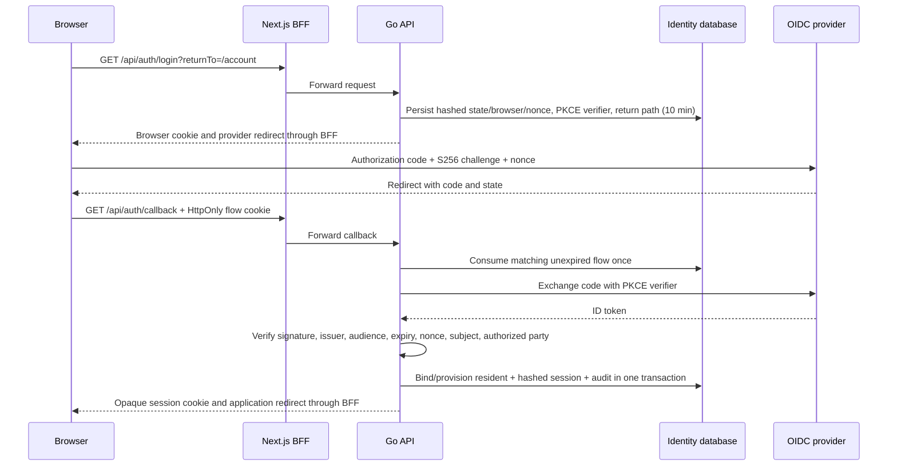

# OIDC accounts and session control

This milestone replaces the default fixture-account shortcut with a complete browser OIDC flow. It adds private identity binding, resident provisioning, chosen public profiles, session controls, and account-security audit events. The application remains a fictional local demonstration. The remaining privacy and launch gates are listed in the [implementation status](IMPLEMENTATION_STATUS.md).

## Run and sign in

`docker compose up --build -d` starts Keycloak alongside the existing application. Open `http://localhost:3100`, open the avatar menu, and select **Continue to sign in**. Keycloak runs on loopback port 8180 and imports the [local realm](../infra/identity/jansetu-realm.json). Its development database is container-local: recreating the provider restores the fixture identities from that file. JanSetu's application database remains in its existing named volume.

For host development, run `make db`, `make identity`, and `make seed`, then start the API, worker, and web app. The default issuer is `http://localhost:8180/realms/jansetu`; the client is `jansetu-web`. Compose supplies a local backchannel origin for container networking. It changes the server's HTTP destination while preserving the configured discovery/JWT issuer and browser URLs.

All local fixture passwords are `jansetu-demo`:

| Username          | Application access                                                                        |
| ----------------- | ----------------------------------------------------------------------------------------- |
| `ananya`, `rohan` | Resident                                                                                  |
| `coordinator`     | Existing coordinator, moderator, and publisher grants                                     |
| `cityworks`       | Existing City Works agency-agent grant                                                    |
| `verifier`        | Existing City Works independent-verifier grant                                            |
| `new-neighbour`   | Provisioned resident on first sign-in; no staff grants or automatic community memberships |

The imported client has an exact callback URI, authorization-code flow, and required S256 PKCE. Password grants and implicit flow are disabled. JanSetu does not handle passwords. The realm is intentionally a local fixture, with registration disabled and known credentials. It is not a production identity-provider deployment.

Setting `JANSETU_AUTH_MODE=demo` explicitly enables the old fixture shortcut for local/test API processes. With the default `oidc` mode, both `/dev/accounts` and `/dev/session` return 404, and sessions created in demo mode cannot authenticate. The startup guard still rejects other environment modes.

## Login boundary

The Go [provider module](../services/backend/internal/authn/provider.go) owns discovery, token exchange, and verification. Next.js transports redirects and each `Set-Cookie` header separately; it never receives provider credentials in client code. The callback URL comes from the configured web origin, not request host or forwarded headers. Return paths must stay within application pages. Provider errors become a generic retry message; token values, claims, codes, and provider error bodies are not logged by application handlers.

The flow binds independent random state and browser secrets, an ID-token nonce, and a fresh PKCE verifier. State is consumed atomically before exchange, including failed/cancelled callbacks. An invalid browser cookie cannot consume another browser's valid flow. A successful callback rotates the current browser's app session and revokes its previous cookie. Browser cookies are HttpOnly, SameSite=Lax, host-scoped, and marked Secure for an HTTPS web origin. Plain HTTP is used only by this local demonstration.

The provider must expose authorization, token, and JWKS endpoints on the exact configured issuer origin and sign ID tokens with RS256. Discovery, token exchange, and key retrieval use bounded HTTP timeouts and refuse redirects. The container backchannel override is supported only for local HTTP configuration; it does not disable issuer verification. To use another provider, configure and test these requirements and the exact callback registration. No ID or access token is accepted as a JanSetu API bearer credential.

## Account binding and provisioning

The account key is the exact `(issuer, subject)` pair in `identity.account_binding`. Email addresses, names, usernames, and provider role claims cannot link to an existing account or create platform/agency grants. The local seed binds five explicitly known immutable provider subjects to five fictional principals. Revoked bindings are not recreated or silently reactivated.

First sign-in serializes on that identity pair, then creates one principal, an independently identified public profile, the binding, and the app session transactionally. The generated profile uses a random handle and the neutral name **New neighbour**. It does not copy the provider's private display name, email, or picture. The profile can be edited at `/account` using `PATCH /me/profile`, with `If-Match`, handle uniqueness, strict field allowlisting, and Unicode-aware name/bio limits. Editing a public profile cannot change authentication identity or permissions.

Principal/profile suspension, binding revocation, and live app grants are checked on requests. Commands also check session validity after taking the principal lock, so a session revoked while a command waits cannot subsequently authorize that command. Staff grant administration remains outside this UI; no self-service staff enrollment has been introduced.

The [public profile guide](PUBLIC_PROFILES.md) describes UUID-based author pages and people search, with chosen public details and approved posts only. Account links to the public view and provides an owner-only **Blocked people** list. Unblocking remains available for an inactive account and does not restore previous follows. Provider/session details and private report/evidence data are excluded from public profiles.

## Sessions and audit

App sessions contain a hash of a random 256-bit cookie, their owner, authentication method, exact OIDC binding, timestamps, and revocation state. Provider access/refresh/ID tokens are discarded after sign-in. Sessions expire after 30 minutes without application requests or after an absolute 12 hours. A loaded page periodically refreshes its session state, so the absolute lifetime still applies to an open page. Accounts are limited to 20 active sessions; a new sign-in revokes the oldest excess sessions.

| Endpoint                          | Owner control                                                                        |
| --------------------------------- | ------------------------------------------------------------------------------------ |
| `GET /me/sessions`                | List own active sessions, creation/activity/expiry times, and current-session marker |
| `DELETE /me/sessions/{id}`        | Revoke an owned session; another owner's ID returns 404                              |
| `POST /me/sessions/revoke-others` | Revoke all other application sessions, retaining the current session                 |
| `POST /me/logout`                 | Revoke the current application session and clear its cookie                          |

The account UI shows these controls and clears account-scoped cached data when identity changes or the user signs out. Session DTOs omit token hashes, provider subjects, email, IP addresses, and full user-agent strings. Session revocation is applied before the next authorized request; an already completed request is unaffected. Logout ends the JanSetu session. Provider SSO is separate; JanSetu requests interactive login again on the next sign-in.

Provisioning, session creation/replacement/revocation/logout, bulk revocation, and profile edits append `ACCOUNT_SECURITY` events to `infra.audit_event` in their authoritative transaction. Events contain internal references and action/result codes, with no profile text or tokens. A trigger prevents ordinary UPDATE/DELETE of audit records. This is an initial local audit mechanism: immutable external retention and genuine account-event request-trace correlation remain pending. Restricted storage roles and separate vault purpose auditing are covered in the [database/vault guide](DATABASE_VAULT_ISOLATION.md).

## Validation and remaining gates

Go integration tests use isolated temporary databases and a real RSA-signed test OIDC server. They cover browser binding, callback replay, expired flows, wrong issuer/audience/authorized party/nonce, missing subject, invalid signatures, PKCE mismatch, concurrent provisioning, ignored privileged provider claims, fixture-shortcut rejection, binding revocation, session ownership/idle/absolute expiry, revoked commands, audit immutability, profile conflicts, and stale versions. Playwright exercises real Keycloak login for every existing resident/staff journey, plus first sign-in, profile persistence, another browser's session revocation, logout, and 320px account-page reflow.

Restricted database roles, transaction-local operational RLS, an independent self-scope vault service, encrypted ownership locators, and purpose-limited vault audit are now implemented locally; see the [database/vault guide](DATABASE_VAULT_ISOLATION.md). Managed envelope encryption/rotation, independent production hosts/administration/network, and stronger audit/backup retention remain pending. Provider backchannel logout/deprovisioning, production MFA/passkey policy, controlled staff provisioning, provider/account-link administration, rate limits, native-token validation, account export/closure, and production recovery/security review are also pending. Existing app sessions currently require app binding/principal/session revocation or expiry to reflect a provider-side account disable. These limitations remain launch blockers for real intake.

Primary implementation references: [go-oidc verification and nonce responsibility](https://pkg.go.dev/github.com/coreos/go-oidc/v3/oidc), [Go OAuth2 PKCE](https://pkg.go.dev/golang.org/x/oauth2#GenerateVerifier), [Keycloak containers](https://www.keycloak.org/server/containers), and [realm import](https://www.keycloak.org/server/importExport).
