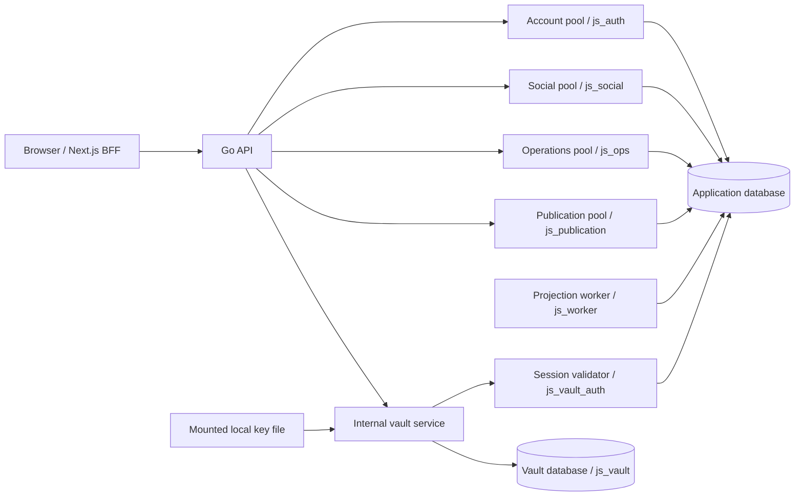

# Database and vault isolation

The local milestone now runs with restricted database logins and a separate self-scope vault service. Original report statements stay behind operational row policies; social credentials cannot query them. Report ownership is resolved through the vault, and public progress is written using a separate publication credential.

This implements the database/vault slice of the [system design](spec/SYSTEM_DESIGN.md). It remains a fictional local demonstration. The application rejects production mode; the production controls listed below are still required.

## Runtime boundaries



| Login            | Runtime access                                                                                                                   | Denied access                                                                                                   |
| ---------------- | -------------------------------------------------------------------------------------------------------------------------------- | --------------------------------------------------------------------------------------------------------------- |
| `js_auth`        | Account provisioning, browser flows, sessions, chosen public profiles, read-only staff grants, append-only account audit         | Private reports, receipt writes, grant administration, vault connection                                         |
| `js_social`      | Implemented community/post/comment/interactions/review tables; read approved receipts; scoped command records and outbox inserts | Operational schema, session hashes, vault, receipt publication                                                  |
| `js_ops`         | Report intake and case/task workflows subject to forced row policies                                                             | Session hashes, vault connection, signing key, receipt writes                                                   |
| `js_publication` | Case review, report publication preference only, publication decisions/bindings, safe public receipts/events                     | Original report statements, session hashes, vault connection                                                    |
| `js_worker`      | Outbox leases, event deduplication, post counts and post row locks                                                               | Operational reports, comment body text, identity tables, vault, receipt writes                                  |
| `js_vault_auth`  | Execute the narrow live-session validator                                                                                        | Direct identity/session table reads and vault connection                                                        |
| `js_vault`       | Encrypted locators, subjects, report aliases, key fingerprint, audit inserts                                                     | Application database connection, legacy plaintext mapping, disclosure/grant tables, audit reads/updates/deletes |

Runtime startup checks the exact role and rejects superusers, owners, role memberships, `BYPASSRLS`, and roles that can create databases/roles or replicate. Runtime logins receive no schema creation, table ownership, `TRUNCATE`, privilege delegation, or database `TEMP` privileges. Only the one-shot migrator receives the local administrator DSNs. Privileges are installed after migrations and seed, including upgrades on an existing volume; creating a new volume is unnecessary.

The API currently holds account, social, operations and publication pools in one process. The worker has its own credential and receives no vault database URL or key file. The vault is a separate Go process/container and has independent database/session-validation credentials. Compose exposes its RPC only on an internal bridge, with no published vault port. Both databases still use one local PostgreSQL cluster and a dedicated database bridge with a loopback-only database port for host development. These controls do not constitute independently administered production hosts or separate public/operations/publication API processes.

## Request scope and row policies

Every application query installs its scope inside a transaction using `set_config(..., true)`, PostgreSQL's transaction-local setting. Commit or rollback clears it before connection reuse. Generated queries use the scoped adapter; command transactions install the same scope before locking and writing.

Scope comes from the opaque session cookie and server configuration. Policies resolve its hash through `authz.authenticate`, which checks active principal/profile, session expiry/inactivity/revocation, configured authentication method, and active exact OIDC binding. Caller-selected principal/role/agency IDs cannot provide authority. Policies query live database grants. Commands also recheck the session after waiting for the account lock. Social/operations/publication roles cannot read account session hashes. The media worker can read only the requesting-session hash pinned in an already authorized analysis job, and cannot read account/session records.

Forced row security covers original reports, intake review, cases, observations, obligations, events, coordinator assignment, verification decisions, publication binding/decision, public receipts/events, command records, and profile updates. Staff case access follows active coordinator/publisher or agency grants. Reports require coordinator authority or a verified owner alias; the publication role gets only report ID and publication preference. Residents receive their original report and a minimal agency/state progress projection, without case-event payloads or task work summaries. Account/profile writes and reviewed public projection retain the existing application validation and state-machine rules.

Owner aliases are stronger than a caller-supplied UUID list. The vault signs an exact JSON claim using HMAC-SHA-256, bound to the session hash, alias list, and a 60-second expiry. The operations adapter installs the claim and signature. A narrowly scoped security-definer function verifies the signature against a key accessible only to the migration owner, checks the live session, then checks the alias. Tampering, expiry, replay under another session, or session revocation denies access. The signing key is separate from the vault encryption and lookup keys.

Trusted migration-owned security-definer functions use fixed `pg_catalog, pg_temp` search paths and qualified object names. PUBLIC execution is revoked; new authorization functions default to no PUBLIC execution. Constraint triggers can inspect media eligibility without giving social callers access to private media tables. Identifier updates used solely to obtain row locks cannot replace resource IDs.

Publisher-only current review and history use narrow security-barrier views guarded by live publisher/session/case scope. The operations pool can select these views without reading raw publication decisions, old safe payloads or reviewer identities. Private reasons stay out of public receipts and worker payloads. See the [public progress lifecycle guide](PUBLIC_PROGRESS_LIFECYCLE.md).

## Vault protocol, encryption and audit

The internal endpoints are `GET /aliases`, `POST /aliases` with only `submissionId`, and authenticated `GET /health/ready`. Requests require a service token and the resident's opaque session token. The vault validates that session independently against the application database. It does not accept principal selectors, staff lookup requests, arbitrary purposes, or contact/identity disclosure requests. Redirects are disabled in the client; requests have body/response/time limits. Browser-facing contracts are unchanged.

A stable HMAC lookup maps an authenticated principal to a random vault subject. The principal reference is stored as AES-256-GCM ciphertext with a fresh random nonce and authenticated context containing subject, field and key version. The lookup key is independent of the encryption key. Ordinary alias requests do not decrypt the locator. No contact details are collected; the foundation contact/identity ciphertext fields remain unused.

The migration copies existing principal-to-subject mappings into encrypted locators, verifies their ciphertext, and deletes the old live plaintext mappings in the same locked transaction. Subject IDs, alias IDs and submission scopes stay unchanged, so existing report ownership survives. Legacy tables receive no runtime privileges. Old plaintext can remain in WAL, backups and earlier copies; those need a separate retention and recovery plan.

The vault and migrator receive [synthetic local key material](../infra/vault/local-keys.json). A persisted version/fingerprint binds the database to all three keys. Migration and vault startup reject changed material, including a changed key with the same version. Do not replace that file to attempt rotation: a reviewed re-encryption/re-indexing/signature transition is required. The file is mounted only into the vault and migrator, and is not copied into application images. Its committed values provide no real-world secrecy.

Successful self alias issuance/listing and invalid resident-session denials append a vault audit event. Events contain purpose/action/result, an internal subject reference when known, an explicit `report_alias_id` field allowlist, and the API request trace ID. They contain no token, principal reference, original statement, ciphertext or decrypted contact values. Alias changes and successful audit insertion commit together; audit failure denies the operation. Audit updates/deletes are blocked by privileges and a trigger. Unauthenticated service requests and malformed requests are rejected before alias access; external immutable audit retention remains pending.

An app commit can fail after alias issuance. Retrying the same subject/submission reuses the alias. There is no distributed transaction; unused-alias reconciliation remains pending. Self alias enumeration is bounded to 5,000 aliases and fails rather than silently truncating ownership. Owner report pages remain bounded to 100 results; pagination is a later milestone.

## Upgrade and development

Stop the old API/worker before replacing their direct vault access. The new checkout defines the vault service, so the following preserves the named volume and existing reports:

```bash
docker compose stop api worker vault
docker compose up --build -d
docker compose ps
```

For host development, start PostgreSQL and identity, then install migrations/permissions and fixtures:

```bash
make db
make identity
make seed
```

Run `make vault`, `make api`, `make worker`, and `make web` in separate terminals. The host vault binds loopback `127.0.0.1:8082`; Compose uses the internal `vault:8082` URL. The [environment example](../.env.example) distinguishes account/social/operations/publication/worker URLs from vault/migration-only settings. Go does not load `.env` automatically. Avoid exporting migration/key settings to an API or worker process.

Newly provisioned accounts are not automatically enrolled into communities when fixtures are reseeded. Only the six known synthetic seed profiles receive seed memberships.

The [private media/OCR module](PRIVATE_MEDIA_OCR.md) adds separate `js_media` and `js_media_worker` roles with forced owner/coordinator row policies and narrow live-permission helpers.

## Verification and remaining gates

```bash
make check
make test-integration
make generate
npm run test:e2e
```

Integration tests create isolated application/vault databases, install actual restricted roles, and run all existing account/social/report/staff/worker workflows through those roles. Additional checks exercise cross-database connection denial, privileged-login rejection, schema/role/RLS changes, raw statement/session/audit access, immutable IDs, forged/expired/transferred owner grants, pooled commit/rollback scope clearing, live session/agency revocation, foreign submission collisions, the self-only vault protocol, append-only purpose audit, encryption tampering/context binding, changed-key rejection, and legacy alias-preserving migration. Browser journeys exercise real local OIDC and the private report-to-reviewed-publication flow through the separate vault service.

Production launch still requires managed envelope encryption/KMS and rotation/recovery, independent vault administration/host/network/backup boundaries, independent public/operations/publication service identities, an audit reader and external immutable retention, additional backup/administration boundaries, full social authorization policies, privileged admin oversight, transport TLS/workload authentication, rate limits, tested recovery, provider deprovisioning/MFA and controlled staff enrollment. Operational row policies enforce access scope; Go still enforces legal transitions and independent verification. These focused checks do not establish all canonical acceptance contracts or approve real/protected intake.

The database choices follow the primary PostgreSQL documentation for [row security](https://www.postgresql.org/docs/18/ddl-rowsecurity.html), [grants](https://www.postgresql.org/docs/18/sql-grant.html), and [security-definer functions](https://www.postgresql.org/docs/18/sql-createfunction.html). Encryption uses Go's [AES-GCM implementation](https://pkg.go.dev/crypto/cipher#NewGCM).

The [resident public-sharing module](RESIDENT_PUBLIC_SHARING.md) uses verified vault claims for owner requests and cancellation. Publishers receive a minimal guarded review view and sharing eligibility view; canonical owner provenance and decision tables remain unavailable to social/worker roles. Pending requests and the latest approved request without active permission prevent normal republication without changing the original report. [Resident permission renewal](RESIDENT_SHARING_RENEWAL.md) adds owner-only retained permission and guarded cancellation while withdrawn; publishers retain only the eligibility view, and social/worker roles gain no permission access.
