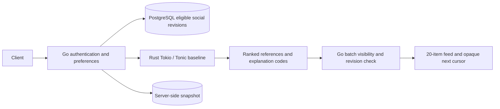

# Serving architecture

## Implemented boundary

Go retrieves permitted features with row-level security and explicit publication, author, community, language, mute and block predicates. Candidate sources execute as one bounded SQL statement for this baseline. Rust assembles scores and deduplicates; it owns no authoritative permissions. Go validates every result ID, revision, count and explanation. A service deadline, invalid response or outage returns authorized chronological candidates. Log only latency, candidate count, mode, success and top-20 overlap with chronological ordering; never viewer IDs, text or feature values.

The public API keeps a ten-second request ceiling; Rust calls get 120 ms of that budget and the service also rejects elapsed request deadlines. Rust transport caps messages and concurrent calls per connection. The internal Compose network exposes no host port and grants Rust no credentials. The optional [mutual TLS transport](TRANSPORT.md) authenticates both service peers with dedicated trust bundles. Production still requires provisioned deployment identities, certificate rotation and load-tested global admission control.

## Pagination and live state

Recommended pagination stores frozen references/revisions, model/policy versions and two scan offsets in PostgreSQL, with an [optional Redis cache](SNAPSHOTS.md). Cursors are random snapshot-derived UUID tokens, carry no content IDs/features, and match the authenticated viewer, query and generation. Anonymous snapshots also bind to an HttpOnly browser cookie hash. Tokens are backed by RLS-protected rows with a five-minute expiry. They survive API restarts/replica changes. Cursor replay returns the same next token/exposures rather than multiplying snapshot records. Cache writes follow database commit, retain the original absolute expiry and fall back to PostgreSQL on failure; cache hits still require live consent and permissions.

Go batch-hydrates all remaining social references in one statement and rechecks publication, active author/community, blocks and mutes. The approved revision must still match the served revision; changed posts are skipped until refresh. Receipts are also batch-hydrated from the sanitized social projection. Removed candidates do not pull in fresh IDs or rerank the snapshot. Final composition reapplies the author cap and civic allocation. Consent/history generation is checked again in the hydration transaction; a concurrent reset/withdrawal serializes through the same principal/profile lock boundary.

Recommendation commands use reviewed principal → profile → recommendation aggregate ordering, avoiding the pilot-wide advisory mutation lock. [Vote/repost count projections](CONCURRENCY.md) now serialize on their post aggregate and can proceed independently across posts. Existing civic/social commands and notification projections retain their original global lock because removing it without an aggregate-by-aggregate transaction audit would break invariants. That lock, the original nonrecommended per-item hydration, and full-scan eligible candidate CTEs remain measured scaling prerequisites. The new path is a baseline, not a completed million-user migration.

## Distributed target

| Layer | Target role | Boundary |
| --- | --- | --- |
| Go/PostgreSQL | Content/consent authority; transactional outbox; final batch hydration | Permissions never delegated to model scores |
| Rust/Tonic | Parallel retrieval adapters, feature assembly, inexpensive/deep ranking, diversity, deadlines | Stateless replicas across availability zones |
| Kafka | Replayable content-change and consented interaction streams | Separate consumer checkpoints and entity versions; no raw private outbox fanout |
| Redis | Online/session features and server snapshots | Keys include viewer generation; bounded TTL; fail closed on stale consent |
| Qdrant | Distributed public embedding retrieval | Only eligible published social revisions, version-filtered |
| Python/ONNX | Two-tower retrieval and multiple-outcome ranker | Reproducible artifact, dataset and runtime versions; parity tests before promotion |
| ClickHouse/S3 | Pseudonymous evaluation and versioned training datasets | Consent eligibility, retention and deletion propagate to exports |

Stream consumers must deduplicate explicit event IDs, reject older entity versions, acknowledge only after durable projection and support checkpoint replay. Consent revocation/reset increments a generation synchronously, then invalidates/removes old generation keys and datasets under retention rules. Generation must be checked against current authority at serving time; cached consent never permits continued use. Deletion tombstones must outlive stream replay and backup retention. Avoid identity-vault and operations schemas entirely; do not connect recommendation consumers to the mixed existing private/civic outbox.

The first [stage-3 stream slice](STREAMS.md) implements a separate transactional outbox, restricted Go Kafka publisher and a Redis projection consumer. A later [snapshot slice](SNAPSHOTS.md) adds optional cache reads with durable PostgreSQL fallback. The feature projection remains in shadow, and pilot Compose does not start stream/cache infrastructure automatically. Online feature serving and analytical exports remain future work.

Use separate adapters and credentials for retrieval, features, snapshots and analytics. Add Qdrant/Redis/Kafka only after their isolated replay/outage tests pass. Model serving should load immutable ONNX artifacts, verify digest/feature-schema/runtime compatibility at startup and atomically swap validated versions. A failed model promotion retains the prior baseline. An experiment flag never bypasses eligibility.

## Rollout

Shadow → 1% → 5% → 25% → full eligible traffic. SHA-256 assignment of viewer/browser binding and a versioned experiment salt is stable across requests and replicas. Current percentage changes do not reorder existing snapshots. Record policy/model versions internally on exposures. Baseline rollout defaults to shadow/0. A [shared PostgreSQL kill switch](ROLLOUT.md) immediately skips ranking on upgraded replicas and invalidates older ranked cursors at final hydration, including Redis hits. Its separate operator login uses version checks and audited transitions. Deployment mode `off` also retains the fallback path. Production still needs provisioned TLS/operator identities and credentials, certificate rotation, rollback drills and operational dashboards before expansion beyond the local pilot.
