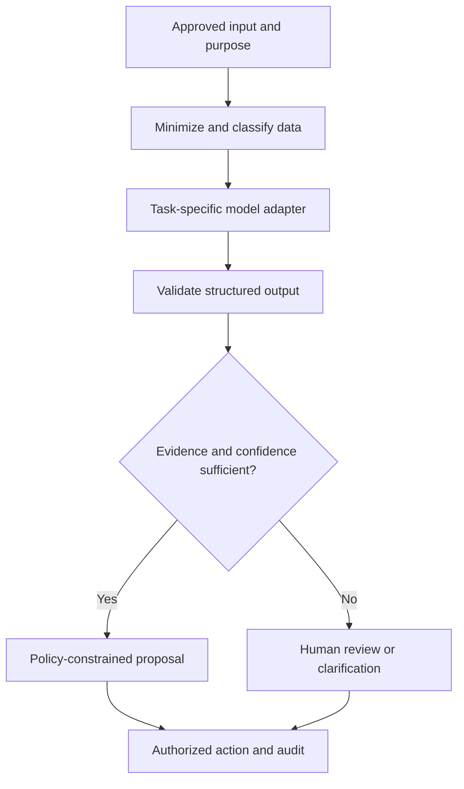
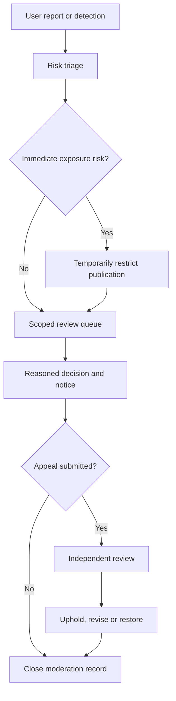

# JanSetu AI — Go Backend and AI Implementation

Version: 3.0. Date: 3 October 2026. Status: canonical design for implementation.

Audience: Go/backend/AI engineers, database owners, integration developers, and QA.

This document owns: Data dictionary, schema, HTTP contracts, transaction algorithms, workers, and media/AI interfaces. Read the [suite guide](README.md) and [domain glossary](../../CONTEXT.md) first. Requirements describe intended behavior; application code, agency integrations, and model evaluation remain implementation work. P0 is the controlled pilot, P1 is the next validated release, and P2 is later expansion.


## Contents

- [Database design and reference migrations](#database-design-and-reference-migrations)
- [API contracts](#api-contracts)
- [Critical write paths](#critical-write-paths)
- [Feeds, search, and revocation](#feeds-search-and-revocation)
- [AI system specification](#ai-system-specification)
- [Media, evidence, and low-connectivity implementation](#media-evidence-and-low-connectivity-implementation)
- [Moderation, complaints, and appeals](#moderation-complaints-and-appeals)
- [Supplemental schema and data dictionary](#supplemental-schema-and-data-dictionary)
- [Complete pilot wire contracts](#complete-pilot-wire-contracts)
- [Events, locking, and worker runbooks](#events-locking-and-worker-runbooks)

## Database design and reference migrations

Use random UUIDs for externally addressable objects, UTC timestamps, explicit state constraints, and integer optimistic-lock versions. Expose only DTO allowlists. Database table names and foreign keys are not a public API.

The SQL blocks define a reference data dictionary: execute the two foundation blocks, the geography block in [system design](SYSTEM_DESIGN.md#versioned-schema), then the supplemental schema below. The separate vault block goes in another database. This is not a production migration package: grants, publication/depth triggers, RLS, retention jobs, and extension compatibility remain explicit implementation work. P1 tables are marked dormant; protected-store intake is outside this schema.

### Social foundation

```sql
CREATE EXTENSION IF NOT EXISTS citext;
CREATE EXTENSION IF NOT EXISTS postgis;
CREATE EXTENSION IF NOT EXISTS btree_gist;
CREATE EXTENSION IF NOT EXISTS pg_trgm;

CREATE SCHEMA social;
CREATE SCHEMA ops;
CREATE SCHEMA geo;
CREATE SCHEMA infra;

CREATE TABLE social.profile (
  id uuid PRIMARY KEY,
  handle citext NOT NULL UNIQUE,
  display_name text NOT NULL,
  bio text NOT NULL DEFAULT '',
  state text NOT NULL CHECK (state IN ('ACTIVE','SUSPENDED','DEACTIVATED')),
  created_at timestamptz NOT NULL DEFAULT now(),
  version bigint NOT NULL DEFAULT 1,
  CHECK (char_length(handle::text) BETWEEN 3 AND 30),
  CHECK (char_length(display_name) BETWEEN 1 AND 80),
  CHECK (char_length(bio) <= 500)
);

CREATE TABLE social.community (
  id uuid PRIMARY KEY,
  slug citext NOT NULL UNIQUE,
  title text NOT NULL,
  scope_kind text NOT NULL CHECK (scope_kind IN ('GEOGRAPHIC','TOPIC')),
  admin_unit_id uuid,
  visibility text NOT NULL CHECK (visibility IN ('PUBLIC','RESTRICTED','PRIVATE')),
  rules_revision integer NOT NULL DEFAULT 1,
  rules_body text NOT NULL,
  state text NOT NULL CHECK (state IN ('ACTIVE','FROZEN','ARCHIVED')),
  created_at timestamptz NOT NULL DEFAULT now(),
  version bigint NOT NULL DEFAULT 1,
  CHECK (scope_kind <> 'GEOGRAPHIC' OR admin_unit_id IS NOT NULL)
);

CREATE TABLE social.community_member (
  community_id uuid NOT NULL REFERENCES social.community(id),
  profile_id uuid NOT NULL REFERENCES social.profile(id),
  role text NOT NULL CHECK (role IN ('MEMBER','CONTRIBUTOR','MODERATOR','OWNER')),
  state text NOT NULL CHECK (state IN ('ACTIVE','PENDING','BANNED','LEFT')),
  joined_at timestamptz NOT NULL DEFAULT now(),
  version bigint NOT NULL DEFAULT 1,
  PRIMARY KEY (community_id, profile_id)
);

CREATE TABLE social.profile_follow (
  follower_id uuid NOT NULL REFERENCES social.profile(id),
  followed_id uuid NOT NULL REFERENCES social.profile(id),
  created_at timestamptz NOT NULL DEFAULT now(),
  PRIMARY KEY (follower_id, followed_id),
  CHECK (follower_id <> followed_id)
);

CREATE TABLE social.profile_block (
  blocker_id uuid NOT NULL REFERENCES social.profile(id),
  blocked_id uuid NOT NULL REFERENCES social.profile(id),
  created_at timestamptz NOT NULL DEFAULT now(),
  PRIMARY KEY (blocker_id, blocked_id),
  CHECK (blocker_id <> blocked_id)
);

CREATE TABLE social.community_follow (
  profile_id uuid NOT NULL REFERENCES social.profile(id),
  community_id uuid NOT NULL REFERENCES social.community(id),
  created_at timestamptz NOT NULL DEFAULT now(),
  PRIMARY KEY (profile_id, community_id)
);

CREATE TABLE social.case_receipt (
  id uuid PRIMARY KEY,
  title text NOT NULL,
  safe_summary text NOT NULL,
  area_label text NOT NULL,
  public_state text NOT NULL,
  urgency_tier smallint NOT NULL CHECK (urgency_tier BETWEEN 0 AND 3),
  first_reported_at timestamptz NOT NULL,
  next_update_due_at timestamptz,
  responsibilities jsonb NOT NULL DEFAULT '[]',
  rank_features jsonb NOT NULL DEFAULT '{}',
  projection_version bigint NOT NULL CHECK (projection_version > 0),
  publication_state text NOT NULL
    CHECK (publication_state IN ('PUBLISHED','WITHDRAWN')),
  published_at timestamptz NOT NULL,
  updated_at timestamptz NOT NULL,
  policy_version text NOT NULL
);

CREATE TABLE social.case_follow (
  profile_id uuid NOT NULL REFERENCES social.profile(id),
  receipt_id uuid NOT NULL REFERENCES social.case_receipt(id),
  created_at timestamptz NOT NULL DEFAULT now(),
  PRIMARY KEY (profile_id, receipt_id)
);

CREATE TABLE social.post (
  id uuid PRIMARY KEY,
  author_id uuid REFERENCES social.profile(id),
  community_id uuid REFERENCES social.community(id),
  kind text NOT NULL CHECK
    (kind IN ('SHORT','DISCUSSION','QUESTION','PLAYBOOK','QUOTE','CASE_UPDATE')),
  state text NOT NULL CHECK
    (state IN ('DRAFT','PENDING','PUBLISHED','HIDDEN','DELETED')),
  source_post_id uuid REFERENCES social.post(id),
  receipt_id uuid REFERENCES social.case_receipt(id),
  current_revision integer NOT NULL DEFAULT 1,
  published_revision integer,
  created_at timestamptz NOT NULL DEFAULT now(),
  published_at timestamptz,
  updated_at timestamptz NOT NULL DEFAULT now(),
  version bigint NOT NULL DEFAULT 1,
  CHECK ((kind = 'QUOTE') = (source_post_id IS NOT NULL)),
  CHECK (source_post_id IS NULL OR source_post_id <> id),
  CHECK (
    (kind = 'CASE_UPDATE' AND author_id IS NULL AND receipt_id IS NOT NULL)
    OR (kind <> 'CASE_UPDATE' AND author_id IS NOT NULL)
  ),
  CHECK (kind NOT IN ('DISCUSSION','QUESTION','PLAYBOOK')
         OR community_id IS NOT NULL),
  CHECK (state <> 'PUBLISHED'
         OR (published_revision IS NOT NULL AND published_at IS NOT NULL))
);

CREATE TABLE social.post_revision (
  post_id uuid NOT NULL REFERENCES social.post(id),
  revision integer NOT NULL CHECK (revision > 0),
  title text,
  body text NOT NULL,
  language_tag text NOT NULL,
  review_state text NOT NULL CHECK
    (review_state IN ('PENDING','APPROVED','REJECTED')),
  created_at timestamptz NOT NULL DEFAULT now(),
  editor_id uuid REFERENCES social.profile(id),
  PRIMARY KEY (post_id, revision),
  CHECK (title IS NULL OR char_length(title) <= 180),
  CHECK (char_length(body) <= 8000)
);

ALTER TABLE social.post ADD CONSTRAINT post_current_revision_fk
  FOREIGN KEY (id, current_revision)
  REFERENCES social.post_revision(post_id, revision)
  DEFERRABLE INITIALLY DEFERRED;

ALTER TABLE social.post ADD CONSTRAINT post_published_revision_fk
  FOREIGN KEY (id, published_revision)
  REFERENCES social.post_revision(post_id, revision)
  DEFERRABLE INITIALLY DEFERRED;

CREATE TABLE social.comment (
  id uuid PRIMARY KEY,
  post_id uuid NOT NULL REFERENCES social.post(id),
  parent_id uuid,
  author_id uuid NOT NULL REFERENCES social.profile(id),
  body text NOT NULL,
  depth smallint NOT NULL CHECK (depth BETWEEN 0 AND 20),
  state text NOT NULL CHECK (state IN ('PENDING','PUBLISHED','HIDDEN','DELETED')),
  version bigint NOT NULL DEFAULT 1,
  current_revision bigint NOT NULL DEFAULT 1,
  published_version bigint,
  created_at timestamptz NOT NULL DEFAULT now(),
  updated_at timestamptz NOT NULL DEFAULT now(),
  UNIQUE (post_id, id),
  FOREIGN KEY (post_id, parent_id) REFERENCES social.comment(post_id, id),
  CHECK (parent_id IS NULL OR parent_id <> id),
  CHECK ((parent_id IS NULL AND depth = 0)
         OR (parent_id IS NOT NULL AND depth > 0)),
  CHECK (char_length(body) <= 4000)
);

CREATE TABLE social.comment_revision (
  comment_id uuid NOT NULL REFERENCES social.comment(id),
  version bigint NOT NULL CHECK (version > 0),
  body text NOT NULL,
  language_tag text NOT NULL,
  review_state text NOT NULL CHECK (review_state IN ('PENDING','APPROVED','REJECTED')),
  changed_at timestamptz NOT NULL DEFAULT now(),
  PRIMARY KEY (comment_id, version)
);

ALTER TABLE social.comment ADD CONSTRAINT comment_published_version_fk
  FOREIGN KEY (id, published_version)
  REFERENCES social.comment_revision(comment_id, version)
  DEFERRABLE INITIALLY DEFERRED;
ALTER TABLE social.comment ADD CONSTRAINT comment_published_version_required
  CHECK (state <> 'PUBLISHED' OR published_version IS NOT NULL);
ALTER TABLE social.comment ADD CONSTRAINT comment_current_revision_fk
  FOREIGN KEY (id, current_revision)
  REFERENCES social.comment_revision(comment_id, version)
  DEFERRABLE INITIALLY DEFERRED;

CREATE TABLE social.post_vote (
  profile_id uuid NOT NULL REFERENCES social.profile(id),
  post_id uuid NOT NULL REFERENCES social.post(id),
  value smallint NOT NULL CHECK (value IN (-1,1)),
  updated_at timestamptz NOT NULL DEFAULT now(),
  PRIMARY KEY (profile_id, post_id)
);

CREATE TABLE social.comment_vote (
  profile_id uuid NOT NULL REFERENCES social.profile(id),
  comment_id uuid NOT NULL REFERENCES social.comment(id),
  value smallint NOT NULL CHECK (value IN (-1,1)),
  updated_at timestamptz NOT NULL DEFAULT now(),
  PRIMARY KEY (profile_id, comment_id)
);

CREATE TABLE social.repost (
  profile_id uuid NOT NULL REFERENCES social.profile(id),
  post_id uuid NOT NULL REFERENCES social.post(id),
  created_at timestamptz NOT NULL DEFAULT now(),
  PRIMARY KEY (profile_id, post_id)
);

CREATE TABLE social.bookmark (
  profile_id uuid NOT NULL REFERENCES social.profile(id),
  post_id uuid NOT NULL REFERENCES social.post(id),
  created_at timestamptz NOT NULL DEFAULT now(),
  PRIMARY KEY (profile_id, post_id)
);

CREATE TABLE social.media_asset (
  id uuid PRIMARY KEY,
  uploader_id uuid REFERENCES social.profile(id),
  report_alias_ref uuid,
  storage_key text NOT NULL UNIQUE,
  declared_type text NOT NULL,
  actual_type text,
  byte_count bigint CHECK (byte_count > 0),
  sha256 bytea CHECK (sha256 IS NULL OR octet_length(sha256) = 32),
  state text NOT NULL CHECK
    (state IN ('UPLOADING','QUARANTINED','APPROVED','REJECTED','REVOKED')),
  derivative_key text,
  authorization_version bigint NOT NULL DEFAULT 1,
  created_at timestamptz NOT NULL DEFAULT now(),
  CHECK (num_nonnulls(uploader_id, report_alias_ref) = 1),
  CHECK (state <> 'APPROVED' OR derivative_key IS NOT NULL)
);

CREATE TABLE social.post_media (
  post_id uuid NOT NULL,
  revision integer NOT NULL,
  media_id uuid NOT NULL REFERENCES social.media_asset(id),
  ordinal smallint NOT NULL CHECK (ordinal BETWEEN 0 AND 3),
  alt_text text NOT NULL DEFAULT '',
  PRIMARY KEY (post_id, revision, ordinal),
  UNIQUE (post_id, revision, media_id),
  FOREIGN KEY (post_id, revision)
    REFERENCES social.post_revision(post_id, revision)
);

CREATE INDEX post_community_new_idx
  ON social.post (community_id, published_at DESC, id DESC)
  WHERE state = 'PUBLISHED';
CREATE INDEX post_author_new_idx
  ON social.post (author_id, published_at DESC, id DESC)
  WHERE state = 'PUBLISHED';
CREATE INDEX comment_page_idx
  ON social.comment (post_id, parent_id, created_at, id);
CREATE INDEX followers_reverse_idx
  ON social.profile_follow (followed_id, follower_id);
CREATE INDEX blocks_reverse_idx
  ON social.profile_block (blocked_id, blocker_id);
```

Application and database trigger responsibilities must be explicit:

- Insert a post and its first revision in one transaction because the revision foreign key is deferred.
- Only publication services may set `published_revision`. A trigger or constrained procedure verifies that the referenced revision is approved and its attached media are approved.
- A comment parent is immutable. A trigger validates `child.depth = parent.depth + 1` under the same post. With immutable parents and existing-parent insertion, cycles cannot be introduced.
- A published comment stays published while an edit awaits review. `comment.body` is a convenience copy of approved text; public readers hydrate `published_version`. Pending text exists only in `comment_revision` and an owner/reviewer DTO. Initial comments are PENDING until their first approval. HIDDEN/DELETED always deny public text.
- Votes and reposts must pass current object visibility, role, self-vote, and block checks. Uniqueness prevents duplicate rows; it does not provide authorization.
- Public read queries return the published revision, never `current_revision` merely because it is newer.
- Playbook steps and linked cases beyond the primary receipt use extension tables with foreign keys, not embedded copies of operational records.

### Operations and event foundation

```sql
CREATE TABLE ops.agency (
  id uuid PRIMARY KEY,
  name text NOT NULL,
  organization_type text NOT NULL,
  state text NOT NULL CHECK (state IN ('ACTIVE','PAUSED','RETIRED')),
  created_at timestamptz NOT NULL DEFAULT now()
);

CREATE TABLE ops.case_record (
  id uuid PRIMARY KEY,
  category_code text NOT NULL,
  state text NOT NULL CHECK
    (state IN ('OPEN','ACTIVE','VERIFICATION_PENDING','RESOLVED',
               'REOPENED','REFERRED','WITHDRAWN')),
  first_valid_report_at timestamptz NOT NULL,
  operational_location geography(Point,4326),
  accuracy_m integer CHECK (accuracy_m IS NULL OR accuracy_m >= 0),
  urgency_tier smallint NOT NULL CHECK (urgency_tier BETWEEN 0 AND 3),
  urgency_review_ref uuid,
  version bigint NOT NULL DEFAULT 1,
  created_at timestamptz NOT NULL DEFAULT now(),
  updated_at timestamptz NOT NULL DEFAULT now()
);

CREATE TABLE ops.report (
  id uuid PRIMARY KEY,
  client_submission_id uuid NOT NULL UNIQUE,
  reporter_ref uuid,
  source_channel text NOT NULL,
  language_tag text NOT NULL,
  statement text NOT NULL,
  observed_at timestamptz,
  received_at timestamptz NOT NULL DEFAULT now(),
  classification text NOT NULL CHECK (classification = 'PUBLIC_SERVICE'),
  publication_preference text NOT NULL
    CHECK (publication_preference IN ('PRIVATE','SANITIZED_RECEIPT')),
  intake_metadata jsonb NOT NULL DEFAULT '{}',
  retention_policy_id text NOT NULL
);

CREATE TABLE ops.case_observation (
  case_id uuid NOT NULL REFERENCES ops.case_record(id),
  report_id uuid NOT NULL REFERENCES ops.report(id),
  relation text NOT NULL CHECK (relation IN ('INITIAL','SUPPORTING','CHALLENGE')),
  linked_at timestamptz NOT NULL DEFAULT now(),
  PRIMARY KEY (case_id, report_id)
);

CREATE TABLE ops.evidence (
  id uuid PRIMARY KEY,
  report_id uuid NOT NULL REFERENCES ops.report(id),
  storage_key text NOT NULL UNIQUE,
  content_sha256 bytea NOT NULL CHECK (octet_length(content_sha256) = 32),
  captured_at timestamptz,
  received_at timestamptz NOT NULL DEFAULT now(),
  access_class text NOT NULL,
  retention_policy_id text NOT NULL
);

CREATE TABLE ops.obligation (
  id uuid PRIMARY KEY,
  case_id uuid NOT NULL REFERENCES ops.case_record(id),
  agency_id uuid REFERENCES ops.agency(id),
  obligation_type text NOT NULL,
  state text NOT NULL CHECK
    (state IN ('PROPOSED','DELIVERED','ACKNOWLEDGED','ACCEPTED','DISPUTED',
               'IN_PROGRESS','COMPLETION_CLAIMED','VERIFIED','CANCELLED')),
  authority_basis_ref text,
  due_at timestamptz,
  accepted_at timestamptz,
  completed_at timestamptz,
  version bigint NOT NULL DEFAULT 1,
  CHECK (state NOT IN ('ACCEPTED','IN_PROGRESS','COMPLETION_CLAIMED','VERIFIED')
         OR (agency_id IS NOT NULL AND accepted_at IS NOT NULL))
);

CREATE TABLE ops.case_event (
  id uuid PRIMARY KEY,
  case_id uuid NOT NULL REFERENCES ops.case_record(id),
  sequence bigint NOT NULL CHECK (sequence > 0),
  event_type text NOT NULL,
  actor_ref uuid NOT NULL,
  actor_role text NOT NULL,
  payload jsonb NOT NULL,
  occurred_at timestamptz NOT NULL,
  recorded_at timestamptz NOT NULL DEFAULT now(),
  UNIQUE (case_id, sequence)
);

CREATE TABLE ops.publication_binding (
  case_id uuid PRIMARY KEY REFERENCES ops.case_record(id),
  receipt_id uuid NOT NULL UNIQUE REFERENCES social.case_receipt(id),
  approved_case_version bigint NOT NULL,
  reviewer_ref uuid NOT NULL,
  decision_ref text NOT NULL,
  approved_at timestamptz NOT NULL
);

CREATE TABLE infra.outbox (
  id uuid PRIMARY KEY,
  aggregate_type text NOT NULL,
  aggregate_id uuid NOT NULL,
  aggregate_version bigint NOT NULL,
  event_type text NOT NULL,
  payload_version integer NOT NULL,
  payload jsonb NOT NULL,
  created_at timestamptz NOT NULL DEFAULT now(),
  available_at timestamptz NOT NULL DEFAULT now(),
  lease_until timestamptz,
  lease_owner text,
  lease_token uuid,
  delivered_at timestamptz,
  dead_lettered_at timestamptz,
  attempts integer NOT NULL DEFAULT 0,
  last_error_code text
);

CREATE TABLE infra.processed_event (
  consumer_name text NOT NULL,
  event_id uuid NOT NULL,
  processed_at timestamptz NOT NULL DEFAULT now(),
  PRIMARY KEY (consumer_name, event_id)
);

CREATE TABLE infra.idempotency_record (
  principal_ref uuid NOT NULL,
  operation text NOT NULL,
  idempotency_key text NOT NULL,
  request_hash bytea NOT NULL CHECK (octet_length(request_hash) = 32),
  result_resource_id uuid,
  response_code integer NOT NULL CHECK (response_code BETWEEN 200 AND 299),
  response_body jsonb NOT NULL,
  created_at timestamptz NOT NULL DEFAULT now(),
  expires_at timestamptz NOT NULL,
  PRIMARY KEY (principal_ref, operation, idempotency_key)
);

CREATE INDEX obligation_queue_idx
  ON ops.obligation (agency_id, state, due_at, id);
CREATE INDEX case_location_idx
  ON ops.case_record USING gist (operational_location);
CREATE INDEX outbox_due_idx
  ON infra.outbox (available_at, created_at)
  WHERE delivered_at IS NULL;
```

The social API role has no `SELECT` on `ops.report`, `ops.evidence`, or `ops.publication_binding`. A public receipt ID cannot be used as an authorization token for its source case. Raw evidence hashes and storage keys do not enter public DTOs.

Case events are immutable to application roles. Corrections append new events. Counter and feed projections remain replaceable. Do not claim that an append-only application table is immune to a database administrator; privileged tampering must be detectable through separately controlled audit export.

### Additional required tables and constraints

These table contracts complete the implementation backlog beyond the foundation DDL.

| Table | Required columns and keys | Enforced invariant |
|---|---|---|
| `identity.account_binding` | provider, provider_subject, profile_id, state; unique provider/subject | Private identity mapping; no public enumeration |
| `identity.organization_grant` | principal, agency, role, valid_from/to, revoked_at | Affiliation expires independently of account |
| `social.feed_preference` | profile PK, explicit interests, locale, coarse area, personalization_enabled, policy_version | Typed allowlist of signals |
| `social.mute` | profile, target type/ID, expires_at | Owner-only retrieval; target type validated |
| `social.post_stats` | post PK, up/down totals, comments, reposts, updated_at | Derived, non-negative counters; not decision evidence |
| `social.comment_stats` | comment PK, up/down totals, updated_at | Rebuildable from authoritative votes |
| `social.selected_response` | post PK, comment ID, selected_by | Composite FK keeps response in the same question |
| `social.post_case_link` | post, receipt; composite PK | Public receipt only; source-case ID prohibited |
| `social.playbook_revision` | post, revision, steps, applicability, reviewer, reviewed_at | Review is tied to an exact revision |
| `social.moderation_case` | ID, target type/ID, target version, reason, state | Supported target resolves to a real scoped object |
| `social.moderation_decision` | case, sequence, action, rule version, actor, reason, time | Append-only; no silent overwrite |
| `social.appeal` | decision, appellant, grounds, state, assigned reviewer | Reviewer cannot be the original decision maker |
| `social.notification` | recipient, event, channel, state, attempt, next_attempt | Unique recipient/event/channel delivery identity |
| `ops.dispute` | obligation, reason code, evidence references, owner, state, version | No free-text-only valid dispute |
| `ops.deadline` | entity, clock type, start event, calendar version, due_at, breached_at | Original clock remains reconstructable |
| `ops.agency_delivery` | obligation, destination, external ID, delivery state, retry key | Transport receipt is not acceptance |
| `ops.verification_decision` | case/obligation, evidence set, reviewer, result, version | Reviewed evidence set is immutable |
| `infra.projection_checkpoint` | consumer/aggregate PK, applied_version | Older events cannot overwrite newer projections |
| `infra.deletion_task` | object, action, store, policy, state, completed_at | Search/cache/media/export deletion is traceable |
| `infra.audit_event` | actor, purpose, object reference, action, result, time, trace ID | No raw report body or authentication secret |

Moderation uses typed foreign-key columns with exactly one target set, as defined in the supplemental DDL. The HTTP `targetType`/`targetId` pair resolves to that typed object only after scoped lookup. A UUID and declared type alone do not authorize a target.

## API contracts

### General conventions

Use REST JSON under `/v1`, UTF-8, UTC ISO-8601 timestamps, and opaque IDs. Return field-validation errors using a consistent problem object. Generate typed TypeScript clients from OpenAPI; do not manually duplicate models across web and mobile.

Mutating creation endpoints require `Idempotency-Key`. Optimistic updates require `If-Match` with the current resource version. Return `412` for a stale version, `409` for a domain conflict or reused idempotency key with a different body, `422` for validated but unacceptable input, and `429` with retry guidance for a quota limit.

Private or unauthorized objects return an indistinguishable unavailable response where disclosure of existence would be harmful. Staff APIs can return more specific authorization reasons only within an already authorized administrative context.

### Endpoint inventory

| Method and route | Permission | Behavior |
|---|---|---|
| `GET /v1/me` | Signed-in | Private account DTO without protected-case listing |
| `GET /v1/profiles/{handle}` | Public eligibility | Public profile fields |
| `PUT /v1/me/following/{profileId}` | Signed-in | Desired follow state; block checks |
| `PUT /v1/me/blocks/{profileId}` | Signed-in | Desired block state; revoke conflicting follows |
| `GET /v1/communities` | Visibility-scoped | Search directory |
| `PUT /v1/communities/{id}/membership` | Eligible account | Join/leave request |
| `POST /v1/posts` | Eligible publisher | Create draft or submit revision for review |
| `PATCH /v1/posts/{id}` | Author and current policy | New revision with If-Match |
| `DELETE /v1/posts/{id}` | Author or separate moderation route | Tombstone and revocation work |
| `GET /v1/posts/{id}` | Current audience eligibility | Approved revision or safe deleted-post tombstone; permitted child context |
| `POST /v1/posts/{id}/comments` | Comment permission | New parent-validated comment |
| `GET /v1/posts/{id}/comments` | Current thread/child eligibility | Top-level or parent-specific page, including permitted context under deleted public post |
| `PATCH /v1/comments/{id}` | Author | Versioned, reviewed edit |
| `DELETE /v1/comments/{id}` | Author | Tombstone; preserve thread structure |
| `PUT /v1/posts/{id}/vote` | Eligible voter | Set -1, 0, or +1 |
| `PUT /v1/comments/{id}/vote` | Eligible voter | Same desired-state contract |
| `PUT /v1/posts/{id}/repost` | Share permission | Set active true/false |
| `PUT /v1/posts/{id}/bookmark` | Viewer | Private desired state |
| `GET /v1/feed` | Optional sign-in | Mode, filters, signed continuation cursor |
| `GET /v1/search` | Visibility-scoped | Search safe projections |
| `POST /v1/media/uploads` | Publisher quota | Quarantined upload session |
| `POST /v1/media/{id}/complete` | Upload owner | Verify uploaded object and queue processing |
| `POST /v1/service-reports` | Intake policy | Commit report receipt; not agency acceptance |
| `GET /v1/my-reports/{id}` | Report-specific authorization | Private submission progress |
| `GET /v1/case-receipts/{id}` | Public eligibility | Sanitized current receipt |
| `PUT /v1/case-receipts/{id}/follow` | Signed-in | Case subscription |
| `POST /v1/case-receipts/{id}/observations` | Intake policy | Supporting observation or closure challenge |
| `POST /v1/content-reports` | Anti-abuse limits | Moderation report, with anonymous path where required |
| `POST /v1/moderation/{id}/decisions` | Scoped moderator | Reasoned action on exact content revision |
| `POST /v1/moderation/decisions/{id}/appeals` | Eligible appellant | Review request |
| `POST /v1/authority/obligations/{id}/accept` | Assigned agency role | Accepted obligation event |
| `POST /v1/authority/obligations/{id}/disputes` | Agency role | Structured dispute and evidence |
| `POST /v1/authority/obligations/{id}/completion-claims` | Assigned agency role | Work-completed claim |
| `POST /v1/authority/cases/{id}/verification-decisions` | Verification role | Evidence-specific decision |
| `POST /v1/integrations/{partner}/events` | Partner credential | Authenticated, replay-safe callback |

Protected endpoints live on a separate service contract and do not reuse public report IDs, social feed credentials, or public API serialization.

### Create-post example

All identifiers and locations in examples are synthetic.

```http
POST /v1/posts
Idempotency-Key: 88a4bdd0-c0be-42e5-9bce-769cb0d39e15
Content-Type: application/json
```

```json
{
  "kind": "DISCUSSION",
  "communityId": "9165fc10-53d1-4acd-8f48-2fbe22a963ca",
  "title": "Footpath access near the bus stop",
  "body": "The temporary barrier leaves no clear pedestrian path.",
  "languageTag": "en-IN",
  "mediaIds": [],
  "submitForReview": true
}
```

```json
{
  "id": "05e65a8a-e22e-41c5-9eef-c5b866d519ab",
  "state": "PENDING",
  "currentRevision": 1,
  "publishedRevision": null,
  "version": 1,
  "review": { "state": "QUEUED" },
  "caseCreated": false
}
```

The server responds `201 Created` because the post resource exists, even though publication is pending. It rejects client-provided author, moderator role, publication approval, case state, or organization affiliation fields.

### Voting and version examples

```http
PUT /v1/posts/05e65a8a-e22e-41c5-9eef-c5b866d519ab/vote
Content-Type: application/json

{"value": 1}
```

Repeating the request leaves one vote. `{"value":0}` deletes the current vote. A stale asynchronous count does not undo the returned viewer vote.

```json
{
  "viewerVote": 1,
  "aggregate": {
    "score": 42,
    "asOf": "2026-10-03T08:00:00Z",
    "consistency": "EVENTUAL"
  }
}
```

### Case intake acknowledgement

```json
{
  "reportId": "3143fa6d-b6f5-4b53-a5c7-44520fc9d3ba",
  "platformReceipt": "RECEIVED",
  "receivedAt": "2026-10-03T08:10:00Z",
  "caseLinkage": "PENDING_REVIEW",
  "agencyDelivery": "NOT_YET_DELIVERED",
  "agencyAcknowledgement": "NOT_RECEIVED",
  "publicReceiptId": null
}
```

The response cannot claim that an external authority accepted or registered the report unless an authenticated partner event or documented authorized action proves it.

## Critical write paths

### Repository organization and build contracts

| Path | Responsibility |
|---|---|
| `apps/web` | Next.js public website and staff routes |
| `apps/mobile` | Expo app with shared navigation contracts |
| `packages/api-client` | OpenAPI-generated TypeScript client |
| `packages/design-tokens` | Colors, spacing, typography, status terminology |
| `services/backend/go.mod`, `go.sum` | Backend Go module and dependency checksums |
| `services/backend/cmd/public-api` | Public social API binary and dependency assembly |
| `services/backend/cmd/operations-api` | Intake/staff API binary and dependency assembly |
| `services/backend/cmd/worker` | Projection, moderation, media, and delivery worker binary |
| `services/backend/internal/domain/*` | Domain modules with owned tables, services, and scoped repositories |
| `services/backend/internal/platform/*` | HTTP middleware, database pools, identity adapters, telemetry, worker lifecycle |
| `services/backend/internal/domain/*/sql` | Module-owned SQL queries and `sqlc` configuration |
| `services/backend/internal/domain/*/dbgen` | Generated typed queries; core transactions use `WithTx` |
| `services/ai-adapter` | Versioned inference adapters and evaluation harness |
| `contracts/openapi` | Public and operations API definitions |
| `contracts/events` | Versioned event JSON schemas |
| `db/migrations` | Goose SQL migrations, grants, triggers, seed reference data |
| `infra` | Environment definitions and deployment configuration |
| `tests/contract` | Consumer/provider and schema compatibility tests |

Share tokens and API types, not every rendered component. Native accessibility, keyboard behavior, uploads, and navigation need native implementations. Server rendering and staff tables remain web concerns.

Pin the Go toolchain, `sqlc`, and Goose independently. CI checks formatting with `gofmt`, static issues with `go vet`, unit/integration behavior with `go test`, race behavior on concurrency-sensitive packages, and reproducible query generation. Build the three entry-point binaries from the shared Go module. Run migrations under a separate migration role before deployment; API and worker runtime roles cannot migrate their own schema. The paths above describe the intended implementation layout, not directories already created.

### Create and publish a post

Implement the write sequence as a transactionally bounded command:

1. Resolve the authenticated principal to the active public profile; do not accept an author ID from the body.
2. Validate post type, length, language, community permission, quote eligibility, and ownership of media IDs.
3. Normalize the validated request into a canonical hash. Serialize its idempotency key within the transaction, then check for a committed receipt.
4. Insert the post and revision, with media links attached to that exact revision.
5. Record the result resource and a `PostReviewRequested` outbox event.
6. Commit and return the current resource state.
7. A worker processes the exact revision and media fingerprints, applies policy checks, and either requests human review or records an approval.
8. Publication takes a lock, checks the latest resource version and any removal decision, and publishes only the approved current candidate. It emits a projection event in the same transaction.

A delayed approval for revision 1 cannot publish revision 2. If the post was removed or the policy changed materially, the worker must not revive it. Review results are tied to content hashes and policy/model versions.

Acquire `pg_advisory_xact_lock` on a stable 64-bit hash of principal, operation, and key before looking up the receipt. A rare lock-hash collision only serializes unrelated requests; the full composite primary key is the identity. Insert the final successful response into `infra.idempotency_record` in the same transaction as the authoritative write; no pending placeholder is committed. A rollback leaves neither resource nor receipt. A matching retry returns the committed receipt after current authorization; a different hash returns conflict. Concurrent identical commands wait for commit/rollback and then recheck. Bound lock wait by the request deadline; a timeout returns a retriable problem, never a success receipt.

Keep ordinary social creation-key receipts for a documented retry window, initially 72 hours. After expiry, the client must reconcile an uncertain result before generating a fresh key. Service reports additionally enforce a unique `client_submission_id` for the report's retention lifetime, so a late offline retry cannot create another retained report merely because a short-lived HTTP idempotency record expired. Preserve the necessary non-content deduplication tombstone when deletion policy requires it; counsel approves its retention.

### Reference vote service

This Go excerpt illustrates the domain logic and explicit commit boundary. `CurrentActor`, `VoteScope`, `VoteResult`, and `ErrInvalidVote` are application contracts to implement. `NewScope` binds the policy and all participating repositories to the supplied transaction, including generated queries through `WithTx`. The snippet is not a complete deployable service.

```go
type VoteService struct {
	Pool     *pgxpool.Pool
	Actors   CurrentActor
	NewScope func(pgx.Tx) VoteScope
}

func (s *VoteService) SetPostVote(
	ctx context.Context, postID pgtype.UUID, desiredValue int,
) (VoteResult, error) {
	if desiredValue < -1 || desiredValue > 1 {
		return VoteResult{}, ErrInvalidVote
	}
	actor, err := s.Actors.RequireActiveProfile(ctx)
	if err != nil {
		return VoteResult{}, err
	}

	err = pgx.BeginTxFunc(ctx, s.Pool, pgx.TxOptions{}, func(tx pgx.Tx) error {
		scope := s.NewScope(tx)
		// Lock authorization context before the target post.
		if err := scope.Policy.LockInteractionContext(ctx, actor.ProfileID, postID); err != nil {
			return err
		}
		post, err := scope.Posts.RequireForUpdate(ctx, postID)
		if err != nil {
			return err
		}
		if err := scope.Policy.RequireCanVote(ctx, actor, post); err != nil {
			return err
		}
		previous, err := scope.Votes.FindValue(ctx, actor.ProfileID, postID)
		if err != nil {
			return err
		}
		if previous == desiredValue {
			return nil
		}
		if desiredValue == 0 {
			err = scope.Votes.Delete(ctx, actor.ProfileID, postID)
		} else {
			err = scope.Votes.Upsert(ctx, actor.ProfileID, postID, desiredValue)
		}
		if err != nil {
			return err
		}
		return scope.Outbox.AppendVoteChanged(ctx, postID, actor.ProfileID, desiredValue)
	})
	if err != nil {
		return VoteResult{}, err
	}
	return VoteResult{Value: desiredValue}, nil
}
```

The excerpt assumes imports for `context`, `github.com/jackc/pgx/v5`, `pgtype`, and `pgxpool`. `FindValue` returns zero for no vote, and outbox insertion creates a random event ID in the same transaction. `RequireCanVote` rechecks actor state and permissions under the acquired authorization locks. `BeginTxFunc` handles commit/rollback; a commit error returns no successful vote result [S17](README.md#sources).

The pilot serializes votes on the target post for simple correctness. At measured high contention, replace this with per-interaction locking plus a rigorously tested visibility-revocation protocol. Do not introduce an unlocked optimization first.

Use a shared lock ordering across social mutations: relevant profile rows in sorted ID order, community policy row, post, comment, then interaction row. Relevant authorization context includes the actor, target author when present, and membership grant. Block, membership, role, and suspension changes use the same relevant authorization locks. This lets a revocation wait for prior authorized writes and deny subsequent ones, rather than racing a cached permission decision.

Counters are asynchronous. The initial worker coalesces affected post IDs and recomputes counts from authoritative vote rows while serializing updates to each stats row. This avoids negative counts from out-of-order deltas. Reconcile periodically and expose an `asOf` timestamp. Never increment a Redis count as the only record of a vote.

### Comments, optimistic edits, and offline retry

For a reply, lock the post and relevant parent, validate current comment permission and maximum depth, insert the comment, and queue review in one transaction. Parent IDs are immutable; moving a comment requires a new moderated object with explicit attribution.

Edits use a version condition:

```sql
-- name: EditComment :one
UPDATE social.comment
SET version = version + 1,
    current_revision = current_revision + 1,
    updated_at = now()
WHERE id = sqlc.arg(comment_id)
  AND author_id = sqlc.arg(actor_profile_id)
  AND version = sqlc.arg(expected_version)
  AND state IN ('PENDING','PUBLISHED')
RETURNING id, version, current_revision;
```

`sqlc.arg` names are generation directives; `sqlc` emits PostgreSQL parameter placeholders and typed Go arguments. Execute the generated query through the transaction-bound query instance.

Authorization checks, inserting a PENDING `comment_revision` keyed by the returned `current_revision` and candidate body, and the review outbox event happen in the same transaction. Published body and state stay unchanged. Approval locks the comment, requires the exact current candidate revision and an eligible PENDING/PUBLISHED state, marks that revision APPROVED, and updates body/published_version/state together while incrementing the entity `version`. A rejected edit increments the entity version while retaining the prior approved body. `comment_revision.version` is the revision number; `comment.version` is the ETag version for any mutation, including review/removal. This separation prevents a review state change from reusing an old ETag. Zero rows after an authorized lookup means an edit conflict; the UI offers the latest version and preserves the local draft.

Offline public-service drafts receive a client-generated submission UUID. The app reuses that UUID as the idempotency key until it receives a committed receipt. Media resumption and report submission are separate states. Retrying upload must not create a second report.

### Outbox and consumer behavior

A worker claims due outbox rows using a short transaction and `FOR UPDATE SKIP LOCKED`, sets a lease owner and fresh random lease token, increments attempts, and performs external work after committing the lease. Heartbeats and success/failure updates require the matching owner/token and an unexpired lease; an old worker cannot finish another worker's claim. On failure record a sanitized error code and bounded exponential backoff with jitter. Exclude dead-lettered items from automatic claiming; operator replay clears the marker with an audit event.

A lease expiry makes work eligible again. Therefore delivery is **at least once**. Every consumer must tolerate duplicates:

- Database projections insert `processed_event` and apply the projection in one transaction.
- Per-aggregate checkpoints reject stale versions.
- Email, push, and agency adapters use a stable delivery ID; if the provider supports idempotency, forward it.
- After a retry limit, move the item to an operator queue without discarding the underlying obligation.
- Event payloads carry identifiers and minimum safe fields, not arbitrary copies of report bodies.

A provider timeout can mean “accepted but response lost.” Reconcile using the delivery ID before sending again where the partner allows it. Never describe this design as exactly-once delivery to an external authority.

### Operational state transitions

| Command | Preconditions | Transactional effects |
|---|---|---|
| Accept obligation | Active agency grant; current proposed/acknowledged version | Set accepted owner/time; append event; create applicable service clock |
| Partially accept | Defined obligation split and authorized scope | Create linked obligations; retain original case and history |
| Dispute | Reason code, supporting record, named coordinator | Append dispute; create evidence/adjudication clocks; preserve interim safety task |
| Claim completion | Accepted assignment and required work evidence | Record claim; move to verification pending; notify reviewer |
| Verify restoration | Authorized independent role where required; evidence checks | Append decision; update obligation/case only when all required conditions pass |
| Challenge closure | New observation or documented process concern | Create review task; preserve prior decision until reviewed |
| Transfer | Accepted destination or explicit disputed route | Record handoff; do not reset first-report time |
| External referral | Outside pilot with recorded destination and safe handoff basis | Show referral state; do not mislabel it verified resolution |

Case writes lock the case before its obligations in a consistent order. Each event receives a monotonically increasing sequence within that case. AI and social modules have no direct repository permission to change these states.

### Agency integration adapter

Each adapter declares supported categories, identity requirements, attachments, delivery semantics, acknowledgement mapping, status mapping, cancellation support, rate limits, and outage fallback. Unknown external statuses map to “external status awaiting interpretation,” not “resolved.”

Authenticate callbacks using partner-supported signatures or mutual TLS, check timestamp and replay ID, validate payload schema, and map external identifiers through `agency_delivery`. Preserve raw callback bodies only in approved restricted storage, not ordinary logs.

Manual agency contact is recorded as a human action with supporting reference and actor. A staff-entered “accepted” event requires the agreed evidentiary standard. Delivery screenshots alone do not prove that an agency accepted responsibility.

## Feeds, search, and revocation

### Candidate generation and hydration

The feed service retrieves candidate IDs from explicit follow relationships, eligible community posts, locality receipts, and approved topic pools. It ranks bounded sets, then hydrates content from current authorized projections.

Candidates are not permission grants. Every page rechecks post state, published revision, community eligibility, block relationships, source-quote eligibility, and receipt publication state. Authorization failure removes the candidate. A stale cached candidate must never restore a removed body.

### Stable pagination

For chronological Following feeds, use a high-water mark and keyset ordering by event time and unique ID. Reposts are feed events with their own time, referring to the original post.

For ranked feeds, create a five-minute snapshot of up to 200 candidate IDs and their rank positions. Bind the snapshot to the viewer or anonymous context, mode, filter hash, and ranking version. Return a signed opaque cursor containing snapshot ID, next scan position, and expiry.

When content is revoked, skip it and continue scanning the snapshot to fill the page. Advance the cursor to the last scanned position, not just the last item returned. A cursor cannot be reused by another user. Expired snapshots return a refresh instruction while the UI preserves scroll context where possible.

### Cache policy

| Cache | Contents | Invalidation |
|---|---|---|
| Anonymous locality candidates | IDs and ranking features | Short TTL plus case publication/status event |
| Signed-in feed snapshot | Ordered IDs and explanation codes | TTL; hydration always checks current eligibility |
| Post rendering | Approved public DTO keyed by revision and policy version | Publish, hide, delete, source withdrawal |
| Permission context | Minimal scoped grants | Revocation version check; fail closed when uncertain |
| Media edge | Approved derivative only | Revocation plus bounded TTL |
| Search index | Safe text and public IDs | Versioned update/delete; query hydration |

Do not shared-cache personalized HTTP responses under a public URL key. Protected and identity endpoints use `Cache-Control: no-store`. Web service workers cache static assets and approved public reading content only; they exclude staff and protected routes.

A revocation command updates the authoritative deny state synchronously, then issues outbox tasks to purge projections, search, caches, notifications, and media delivery. Public bodies are rechecked at origin; managed cached copies have the stated purge target. No design can retract a copy already downloaded by a reader.

### Search projection and safe ranking explanations

Search consumes only approved published revisions and current public receipt projections. An edit replaces the indexed version after approval. A removal emits a tombstone with a higher version so an old delayed index event cannot restore it.

Filter unauthorized candidates before returning titles, snippets, result counts, or facets. For complex private-community search in P1, maintain dedicated access-aware indexes or perform per-result authorization and avoid aggregate leakage.

“Why shown” explanations use documented codes such as `FOLLOWED_COMMUNITY`, `SELECTED_LOCALITY`, `OVERDUE_UPDATE`, or `EXPLICIT_TOPIC`. They never reveal another person's private follow, report, or inferred sensitive attribute.

## AI system specification

### Where AI contributes

| Component | Inputs | Structured output | Required authority |
|---|---|---|---|
| Speech transcription | Consented audio | Transcript, language, uncertain spans | Resident can correct |
| Category extraction | Submitted observation | Candidate categories and evidence spans | Intake rules or reviewer confirm |
| Location extraction | Description and permitted metadata | Candidate landmarks/areas with uncertainty | Resident or coordinator confirms |
| Jurisdiction assistance | Extracted facts and sourced rule candidates | Explanation and missing facts | Deterministic policy plus authorized acceptance |
| Duplicate suggestion | Eligible case summaries, location, time, asset | Ranked candidates with reasons | Merge rule or reviewer |
| Public redaction assistance | Candidate publication and media | Suggested removals and risk flags | Publication policy and human review where required |
| Thread summary | Eligible published content | Attributed summary with post/comment references | No new facts or status changes |
| Resolution evidence comparison | Before/after evidence | Differences, quality gaps, uncertainty | Human verification decision |
| Feed relevance | Permitted public and explicit preference features | Bounded scores and explanations | Deterministic eligibility and urgency constraints |
| Playbook drafting | Reviewed successful workflow | Steps, scope, dependencies, review date | Operational editor approval |

AI is valuable where language, imagery, and institutional terminology are messy. It is not needed to decide whether a vote is unique, a reviewer has permission, a deadline elapsed, or an agency accepted an obligation. Those are deterministic system responsibilities.

Unavailable or unclear transcription must remain explicitly unavailable or uncertain. Allow transcript correction and manual text input; never substitute a predefined complaint, placeholder observation, or invented transcript into the resident's report.

### Inference pipeline



Model output is untrusted. Validate schemas, allowed category IDs, coordinates, evidence references, and source citations. User text, attachments, and retrieved documents are data, never executable workflow instructions. Models cannot call arbitrary URLs, change permissions, or invoke agency actions directly.

### Example extraction contract

```json
{
  "schemaVersion": "1.0",
  "languageTag": "hi-IN",
  "categoryCandidates": [
    {
      "categoryCode": "ROAD_SURFACE_FAILURE",
      "confidence": 0.84,
      "evidenceSpans": ["segment-2"]
    }
  ],
  "locationCandidates": [
    {
      "source": "USER_LANDMARK",
      "areaReference": "synthetic-locality-A",
      "confidence": 0.58
    }
  ],
  "sensitivity": {
    "publicEligibility": "REVIEW_REQUIRED",
    "reasonCodes": ["PERSONAL_IDENTIFIER_PRESENT"]
  },
  "missingFacts": ["PRECISE_ASSET_LOCATION"],
  "recommendedNextAction": "ASK_LOCATION_CONFIRMATION"
}
```

A model-reported confidence is not automatically calibrated probability. Calibrate and evaluate each task before using thresholds. Rule conflicts or sensitive content can require review regardless of confidence.

### Duplicate, recurrence, and evidence design

Use category and geographic/time filters before semantic similarity. Distinguish duplicate reports of one event from recurrence after a claimed repair, and from two nearby assets with similar descriptions. Preserve source reports when cases merge, record who approved the merge, and support reversal.

Embeddings may be generated from sanitized public-service summaries. Do not mix protected narratives into the social vector index. Location and asset IDs should remain structured features, not hidden only in embeddings.

For before/after analysis, check asset correspondence, capture time uncertainty, image quality, and whether the photographed area actually covers the reported defect. A visually cleaner image alone cannot prove a complete repair.

### Model deployment and evaluation

The pilot may call contracted hosted models through the adapter; deployment region, retention, training use, and incident obligations must be approved before real data flows. Use synthetic protected examples until that lane is approved. No default provider training on submitted reports.

| Evaluation | Dataset requirement | Release condition |
|---|---|---|
| Sensitive-publication detection | Multilingual text, OCR, audio, indirect identifiers, adversarial drafts | All critical seeded disclosures blocked; human fallback operates |
| Category extraction | Human-labeled pilot service examples | Report precision/recall by category and language; meet agreed category thresholds |
| Jurisdiction proposals | Reviewed boundary, asset, and delegation cases | No invented destination; conflicts abstain; high-impact routes reviewed |
| Duplicate suggestions | True duplicates, nearby distinct assets, recurrences | Merge error risk explicitly approved; reversible workflow |
| Summaries | Source-linked multilingual threads | Every factual sentence grounded; disputed claims remain attributed |
| Feed ranking | Synthetic and pilot cohorts | Protected exclusion, urgency ordering, and diversity tests pass |
| Evidence comparison | Realistic before/after and misleading examples | Never independently marks a case restored |

Zero failures in a finite test set is not a guarantee of zero production failures. Monitor drift, reviewer disagreement, model costs, and safety incidents. Roll back model and prompt versions independently from the application release. Record model ID, prompt/template version, source set, policy version, latency, and decision disposition without dumping sensitive prompts into logs.

### OCR and image-recognition task contracts

Implement OCR, issue detection, scene description, redaction assistance, and before/after comparison as separately versioned tasks. A photo attachment alone does not prove image analysis is implemented. Each enabled task must have an adapter, usable model/provider, validated output, failure behavior, and evaluation evidence. Candidate engines and reference limitations are recorded in [reference research](../REFERENCE_RESEARCH.md).

Analyze only media admitted through the upload quarantine and authorized for the task's purpose. Workers resolve private storage references; an input URL must not permit arbitrary server-side fetching. Decode and scan before inference, with bounds on file size, decoded dimensions, time, cost, and worker resources.

Results bind to the exact media revision and preprocessing version. Record OCR text regions, script/language candidates, uncertain spans, issue category candidates, quality warnings, and source references. Preserve the crop, resize, and orientation transforms so overlays map back to the submitted image. Distinguish raw model scores from calibrated confidence and user/reviewer acceptance. Unknown categories and invented evidence references fail validation.

Track queued, running, succeeded, partial, failed, and cancelled results per task. OCR may succeed when detection fails. Allow targeted retry, user correction, and manual reporting without reuploading evidence. Cancel or discard stale results when the source revision changes, is deleted, or access is revoked. A reviewed, sanitized derivative is required for public presentation.

Choose engines using labeled pilot examples covering the supported languages/scripts, small print, rotation, glare, handwriting where in scope, multiple defects, unsupported categories, and misleading before/after pairs. Set per-task release thresholds from measured error costs. No claim about universal language support, production accuracy, or AMD acceleration follows from a reference repository alone. Hardware compatibility and model/code/data licensing must be established for the chosen deployment.

OCR text and image contents remain untrusted input. They cannot alter permissions, supply executable workflow instructions, trigger agency actions, or independently establish restoration. The full processing flow and user states are defined in the [experience plan](UI_IMPLEMENTATION.md).

## Media, evidence, and low-connectivity implementation

### Upload protocol

1. Client requests an upload session with intended purpose, declared type, size, and local checksum.
2. Server enforces account or intake quota and returns a short-lived upload grant for one random quarantine key.
3. Client uploads directly with resumable support where available.
4. Completion verifies object existence, actual byte length, checksum, and type signature.
5. Workers scan, decode in a sandbox, remove public metadata, generate derivatives, and perform relevant safety review.
6. Only an approved derivative can attach to a published social revision. Originals stay private.
7. Expired abandoned upload sessions become deletion tasks under the retention policy.

Initial public limits: images up to 10 MB each, video up to 60 seconds and 50 MB, and voice intake up to three minutes. Tune after low-bandwidth research. Permit server-side downscaling and explicit quality warnings. Do not force video when text or a landmark is enough.

### Evidence integrity

For operational evidence, record the content hash, uploader or intake reference, receipt time, claimed capture time, processing actions, and authorized access. Store each derived version separately with a parent reference.

Hashes can show that stored bytes changed; they do not prove the event occurred, the camera time is genuine, or the uploader is a reliable witness. Preserve originals where policy permits and clearly distinguish claimed metadata from independently observed metadata.

A public derivative has a separate identifier and key. Do not publish the raw hash or internal object path, because it can enable cross-system correlation. Grant raw access only for a necessary operational purpose.

### Native and web offline behavior

Cache ordinary public-service drafts locally with an explicit retention and removal control. Use platform-protected local storage for private draft metadata and queued credentials. The app retries only while allowed by OS behavior; show manual retry when background processing is restricted.

Resolve a successful upload with a failed form submission through the same upload session and submission key. A double tap or process restart must not create another case. Protected reporting has a separate reviewed offline policy; default to no persistent draft.

## Moderation, complaints, and appeals

### Three separate decision systems

| Decision system | Determines | Does not determine |
|---|---|---|
| Community moderation | Whether content meets community rules | Criminal guilt, agency responsibility, reporter identity |
| Platform trust and safety | Platform-wide publication, abuse, privacy, and account restrictions | Whether infrastructure has been repaired |
| Operational adjudication | Responsibility and workflow under the pilot agreement | Legal liability or criminal/disciplinary findings |

A moderator can remove an abusive discussion while the public-service case remains active. An agency cannot delete criticism by marking an obligation complete. A platform appeal cannot silently reverse a signed operational adjudication.

### Moderation workflow



Moderation cases bind to the exact content revision. Decisions record rule version, evidence reference, action, reason, duration, actor, and appeal route. Restoration re-evaluates current audience and safety policy; it does not blindly restore an old cache entry.

Internal response objectives are configurable by risk and staffing. Statutory deadlines, where applicable, are configured only after counsel confirms the trigger and required process. If the operator cannot staff the required response, reduce enabled scope before launch.

### Abuse controls

Use per-account and per-resource quotas, burst detection, duplicate-content checks, invitation controls, and restricted new-account capabilities. Treat shared IP addresses cautiously because households, offices, and public networks share connections.

A sudden voting burst can temporarily reduce the vote component of discussion ranking or hold aggregate display for review. It cannot reduce an unresolved case's urgency. Record interventions for audit and evaluate false positives across languages and communities.

Ban impersonation, doxxing, targeted harassment, threats, publishing protected identities, and evidence tampering. Provide a safe correction route. Do not encourage residents to investigate alleged gang members, confront alleged abusers, or photograph dangerous scenes.

### Public corrections and agency participation

Correct inaccurate public receipts by publishing a versioned correction with an explanation. Preserve restricted history for audit while showing the current safe record. Explain when a status reflects an agency claim, a coordinator decision, or an independently verified outcome.

Verified organization accounts can answer criticism and publish approved updates. They cannot moderate a community merely because it covers their jurisdiction. Conflicts involving a moderator or partner agency go to an independent reviewer.

## Supplemental schema and data dictionary

Every JSON column below has a versioned application schema, a bounded serialized size, and an allowlist. JSON does not replace the listed foreign keys. `*_ref` fields explicitly cross service/database boundaries and require authenticated existence checks; local relationships use FKs. UUIDs are application generated. Runtime writes use server time. P0 tables below supplement the foundation; `playbook_revision` is dormant P1 authoring support.

```sql
CREATE SCHEMA identity;

CREATE TABLE identity.principal (
  id uuid PRIMARY KEY,
  profile_id uuid UNIQUE REFERENCES social.profile(id),
  state text NOT NULL CHECK (state IN ('ACTIVE','SUSPENDED','CLOSED')),
  authorization_version bigint NOT NULL DEFAULT 1,
  created_at timestamptz NOT NULL DEFAULT now()
);
CREATE TABLE identity.account_binding (
  provider text NOT NULL,
  provider_subject text NOT NULL,
  principal_id uuid NOT NULL REFERENCES identity.principal(id),
  state text NOT NULL CHECK (state IN ('ACTIVE','REVOKED')),
  PRIMARY KEY (provider, provider_subject)
);
CREATE TABLE identity.session (
  id uuid PRIMARY KEY,
  principal_id uuid NOT NULL REFERENCES identity.principal(id),
  token_hash bytea NOT NULL UNIQUE CHECK (octet_length(token_hash) = 32),
  expires_at timestamptz NOT NULL,
  revoked_at timestamptz,
  created_at timestamptz NOT NULL DEFAULT now(),
  CHECK (expires_at > created_at)
);
CREATE TABLE identity.organization_grant (
  id uuid PRIMARY KEY,
  principal_id uuid NOT NULL REFERENCES identity.principal(id),
  agency_id uuid NOT NULL REFERENCES ops.agency(id),
  role text NOT NULL CHECK (role IN ('AGENCY_AGENT','AGENCY_LEAD','FIELD_WORKER','VERIFIER')),
  valid_from timestamptz NOT NULL,
  valid_to timestamptz NOT NULL,
  revoked_at timestamptz,
  version bigint NOT NULL DEFAULT 1,
  CHECK (valid_to > valid_from)
);
CREATE INDEX organization_scope_idx
  ON identity.organization_grant (principal_id, agency_id, valid_to)
  WHERE revoked_at IS NULL;
CREATE TABLE identity.platform_grant (
  id uuid PRIMARY KEY,
  principal_id uuid NOT NULL REFERENCES identity.principal(id),
  role text NOT NULL CHECK (role IN
    ('COORDINATOR','ADJUDICATOR','PUBLISHER','PLATFORM_MODERATOR','APPEAL_REVIEWER')),
  area_id uuid REFERENCES geo.admin_unit(id),
  valid_to timestamptz NOT NULL,
  revoked_at timestamptz,
  version bigint NOT NULL DEFAULT 1
);

CREATE TABLE social.feed_preference (
  profile_id uuid PRIMARY KEY REFERENCES social.profile(id),
  locale text NOT NULL DEFAULT 'en-IN',
  interests text[] NOT NULL DEFAULT '{}',
  coarse_area_id uuid REFERENCES geo.admin_unit(id),
  personalization_enabled boolean NOT NULL DEFAULT false,
  theme text NOT NULL DEFAULT 'SYSTEM' CHECK (theme IN ('SYSTEM','LIGHT','DARK')),
  density text NOT NULL DEFAULT 'COMFORTABLE' CHECK (density IN ('COMFORTABLE','COMPACT')),
  notification_channels text[] NOT NULL DEFAULT ARRAY['IN_APP'],
  quiet_hours jsonb NOT NULL DEFAULT '{}',
  policy_version text NOT NULL,
  version bigint NOT NULL DEFAULT 1
);
CREATE TABLE social.mute (
  id uuid PRIMARY KEY,
  profile_id uuid NOT NULL REFERENCES social.profile(id),
  muted_profile_id uuid REFERENCES social.profile(id),
  muted_community_id uuid REFERENCES social.community(id),
  expires_at timestamptz,
  CHECK (num_nonnulls(muted_profile_id, muted_community_id) = 1)
);
CREATE UNIQUE INDEX mute_profile_unique ON social.mute(profile_id, muted_profile_id);
CREATE UNIQUE INDEX mute_community_unique ON social.mute(profile_id, muted_community_id);
CREATE TABLE social.post_stats (
  post_id uuid PRIMARY KEY REFERENCES social.post(id),
  up_count bigint NOT NULL DEFAULT 0 CHECK (up_count >= 0),
  down_count bigint NOT NULL DEFAULT 0 CHECK (down_count >= 0),
  comment_count bigint NOT NULL DEFAULT 0 CHECK (comment_count >= 0),
  repost_count bigint NOT NULL DEFAULT 0 CHECK (repost_count >= 0),
  as_of timestamptz NOT NULL
);
CREATE TABLE social.comment_stats (
  comment_id uuid PRIMARY KEY REFERENCES social.comment(id),
  up_count bigint NOT NULL DEFAULT 0 CHECK (up_count >= 0),
  down_count bigint NOT NULL DEFAULT 0 CHECK (down_count >= 0),
  as_of timestamptz NOT NULL
);
CREATE TABLE social.selected_response (
  post_id uuid PRIMARY KEY REFERENCES social.post(id),
  comment_id uuid NOT NULL,
  selected_by uuid NOT NULL REFERENCES social.profile(id),
  selected_at timestamptz NOT NULL DEFAULT now(),
  FOREIGN KEY (post_id, comment_id) REFERENCES social.comment(post_id, id)
);
CREATE TABLE social.post_case_link (
  post_id uuid NOT NULL REFERENCES social.post(id),
  receipt_id uuid NOT NULL REFERENCES social.case_receipt(id),
  PRIMARY KEY (post_id, receipt_id)
);
CREATE TABLE social.playbook_revision (
  post_id uuid NOT NULL,
  revision integer NOT NULL,
  steps jsonb NOT NULL CHECK (jsonb_typeof(steps) = 'array'),
  applicability text NOT NULL,
  reviewer_ref uuid,
  reviewed_at timestamptz,
  PRIMARY KEY (post_id, revision),
  FOREIGN KEY (post_id, revision) REFERENCES social.post_revision(post_id, revision)
);
CREATE TABLE social.moderation_case (
  id uuid PRIMARY KEY,
  post_id uuid REFERENCES social.post(id),
  comment_id uuid REFERENCES social.comment(id),
  media_id uuid REFERENCES social.media_asset(id),
  profile_id uuid REFERENCES social.profile(id),
  target_version bigint NOT NULL,
  reporter_ref uuid,
  reason_code text NOT NULL,
  grounds text NOT NULL,
  state text NOT NULL CHECK (state IN ('OPEN','REVIEWING','DECIDED','CLOSED')),
  version bigint NOT NULL DEFAULT 1,
  created_at timestamptz NOT NULL DEFAULT now(),
  CHECK (num_nonnulls(post_id, comment_id, media_id, profile_id) = 1)
);
CREATE TABLE social.moderation_decision (
  id uuid PRIMARY KEY,
  moderation_case_id uuid NOT NULL REFERENCES social.moderation_case(id),
  sequence bigint NOT NULL,
  action text NOT NULL CHECK (action IN ('ALLOW','HIDE','REMOVE','RESTRICT','RESTORE')),
  rule_version text NOT NULL,
  actor_ref uuid NOT NULL,
  reason text NOT NULL,
  decided_at timestamptz NOT NULL DEFAULT now(),
  UNIQUE (moderation_case_id, sequence)
);
CREATE TABLE social.appeal (
  id uuid PRIMARY KEY,
  decision_id uuid NOT NULL REFERENCES social.moderation_decision(id),
  appellant_ref uuid NOT NULL,
  grounds text NOT NULL,
  state text NOT NULL CHECK (state IN ('OPEN','REVIEWING','UPHELD','REVERSED','WITHDRAWN')),
  reviewer_ref uuid,
  version bigint NOT NULL DEFAULT 1,
  created_at timestamptz NOT NULL DEFAULT now(),
  UNIQUE (decision_id, appellant_ref)
);
CREATE TABLE social.notification (
  id uuid PRIMARY KEY,
  recipient_id uuid NOT NULL REFERENCES social.profile(id),
  event_id uuid NOT NULL,
  channel text NOT NULL CHECK (channel IN ('IN_APP','EMAIL','PUSH')),
  post_id uuid REFERENCES social.post(id),
  receipt_id uuid REFERENCES social.case_receipt(id),
  state text NOT NULL CHECK (state IN ('QUEUED','SENT','SUPPRESSED','FAILED')),
  attempts integer NOT NULL DEFAULT 0,
  next_attempt_at timestamptz,
  read_at timestamptz,
  created_at timestamptz NOT NULL DEFAULT now(),
  CHECK (num_nonnulls(post_id, receipt_id) <= 1),
  UNIQUE (recipient_id, event_id, channel)
);
CREATE TABLE social.feed_snapshot (
  id uuid PRIMARY KEY,
  viewer_scope_hash bytea NOT NULL,
  query_hash bytea NOT NULL,
  ranking_version text NOT NULL,
  candidate_ids jsonb NOT NULL CHECK (jsonb_typeof(candidate_ids) = 'array'),
  expires_at timestamptz NOT NULL,
  created_at timestamptz NOT NULL DEFAULT now()
);
ALTER TABLE social.community ADD COLUMN description text NOT NULL DEFAULT '';
ALTER TABLE social.community ADD COLUMN language_tag text NOT NULL DEFAULT 'und';
ALTER TABLE social.profile ADD COLUMN avatar_media_id uuid REFERENCES social.media_asset(id);
CREATE TABLE social.community_request (
  id uuid PRIMARY KEY,
  requested_by uuid NOT NULL REFERENCES social.profile(id),
  title text NOT NULL,
  proposed_slug citext NOT NULL,
  scope_kind text NOT NULL CHECK (scope_kind IN ('GEOGRAPHIC','TOPIC')),
  admin_unit_id uuid REFERENCES geo.admin_unit(id),
  language_tag text NOT NULL,
  steward_note text NOT NULL,
  state text NOT NULL CHECK (state IN ('RECEIVED','REVIEWING','APPROVED','REJECTED')),
  community_id uuid REFERENCES social.community(id),
  reason text,
  version bigint NOT NULL DEFAULT 1
);
CREATE TABLE social.membership_decision (
  id uuid PRIMARY KEY,
  community_id uuid NOT NULL,
  profile_id uuid NOT NULL,
  actor_ref uuid NOT NULL,
  action text NOT NULL CHECK (action IN ('APPROVE','BAN','UNBAN','CHANGE_ROLE')),
  reason text NOT NULL,
  expires_at timestamptz,
  decided_at timestamptz NOT NULL,
  FOREIGN KEY (community_id, profile_id)
    REFERENCES social.community_member(community_id, profile_id)
);
CREATE TABLE social.case_receipt_event (
  receipt_id uuid NOT NULL REFERENCES social.case_receipt(id),
  sequence bigint NOT NULL,
  type text NOT NULL,
  safe_text text NOT NULL,
  actor_type text NOT NULL CHECK (actor_type IN ('PLATFORM','AGENCY','REVIEWER')),
  occurred_at timestamptz NOT NULL,
  projection_version bigint NOT NULL,
  PRIMARY KEY (receipt_id, sequence)
);
CREATE TABLE social.search_document (
  id uuid PRIMARY KEY,
  post_id uuid REFERENCES social.post(id),
  receipt_id uuid REFERENCES social.case_receipt(id),
  community_id uuid REFERENCES social.community(id),
  profile_id uuid REFERENCES social.profile(id),
  source_version bigint NOT NULL,
  language_tag text NOT NULL,
  safe_text text NOT NULL,
  category_code text,
  area_id uuid REFERENCES geo.admin_unit(id),
  updated_at timestamptz NOT NULL,
  CHECK (num_nonnulls(post_id, receipt_id, community_id, profile_id) = 1)
);
CREATE INDEX search_text_trigram_idx
  ON social.search_document USING gin (lower(safe_text) gin_trgm_ops);
CREATE UNIQUE INDEX search_post_language_unique ON social.search_document(post_id, language_tag);
CREATE UNIQUE INDEX search_receipt_language_unique ON social.search_document(receipt_id, language_tag);
CREATE UNIQUE INDEX search_community_language_unique ON social.search_document(community_id, language_tag);
CREATE UNIQUE INDEX search_profile_language_unique ON social.search_document(profile_id, language_tag);

CREATE TABLE infra.upload_session (
  id uuid PRIMARY KEY,
  media_id uuid NOT NULL UNIQUE REFERENCES social.media_asset(id),
  storage_upload_ref text NOT NULL,
  part_size_bytes bigint NOT NULL CHECK (part_size_bytes > 0),
  declared_size_bytes bigint NOT NULL CHECK (declared_size_bytes > 0),
  state text NOT NULL CHECK (state IN ('OPEN','COMPLETING','COMPLETE','ABORTED','EXPIRED')),
  expires_at timestamptz NOT NULL,
  version bigint NOT NULL DEFAULT 1
);
CREATE TABLE infra.media_derivative (
  id uuid PRIMARY KEY,
  media_id uuid NOT NULL REFERENCES social.media_asset(id),
  source_sha256 bytea NOT NULL CHECK (octet_length(source_sha256) = 32),
  storage_key text NOT NULL UNIQUE,
  transform_version text NOT NULL,
  pixel_width integer NOT NULL CHECK (pixel_width > 0),
  pixel_height integer NOT NULL CHECK (pixel_height > 0),
  original_to_derivative jsonb NOT NULL,
  approved_at timestamptz,
  revoked_at timestamptz
);
CREATE TABLE infra.language_capability (
  language_tag text NOT NULL,
  capability text NOT NULL CHECK (capability IN
    ('UI','SEARCH','VOICE_TRANSCRIPTION','OCR','CONTENT_TRANSLATION')),
  status text NOT NULL CHECK (status IN ('PLANNED','EVALUATING','READY','PAUSED')),
  pack_version text NOT NULL,
  evidence_ref text,
  reviewer_ref uuid,
  fallback_language_tag text,
  updated_at timestamptz NOT NULL,
  PRIMARY KEY (language_tag, capability),
  CHECK (status <> 'READY' OR (evidence_ref IS NOT NULL AND reviewer_ref IS NOT NULL))
);
CREATE TABLE infra.analysis_job (
  id uuid PRIMARY KEY,
  media_id uuid NOT NULL REFERENCES social.media_asset(id),
  requested_by uuid REFERENCES identity.principal(id),
  report_alias_ref uuid,
  source_sha256 bytea NOT NULL CHECK (octet_length(source_sha256) = 32),
  authorization_version bigint NOT NULL,
  language_tag text NOT NULL,
  state text NOT NULL CHECK (state IN
    ('QUEUED','RUNNING','SUCCEEDED','PARTIAL','FAILED','CANCELLED')),
  version bigint NOT NULL DEFAULT 1,
  created_at timestamptz NOT NULL DEFAULT now(),
  expires_at timestamptz NOT NULL,
  CHECK (num_nonnulls(requested_by, report_alias_ref) = 1)
);
CREATE TABLE infra.analysis_task (
  id uuid PRIMARY KEY,
  job_id uuid NOT NULL REFERENCES infra.analysis_job(id),
  task_kind text NOT NULL CHECK (task_kind IN
    ('QUALITY','OCR','ISSUE_DETECTION','REDACTION','VOICE_TRANSCRIPTION')),
  state text NOT NULL CHECK (state IN
    ('QUEUED','RUNNING','SUCCEEDED','FAILED','UNSUPPORTED','CANCELLED')),
  attempt integer NOT NULL DEFAULT 0,
  model_version text,
  result_schema_version integer NOT NULL,
  result jsonb,
  error_code text,
  completed_at timestamptz,
  UNIQUE (job_id, task_kind)
);

ALTER TABLE ops.report ADD COLUMN request_hash bytea NOT NULL
  CHECK (octet_length(request_hash) = 32);
ALTER TABLE ops.obligation ADD COLUMN required_for_restoration boolean NOT NULL DEFAULT true;
ALTER TABLE ops.obligation ADD CONSTRAINT obligation_case_id_unique UNIQUE (case_id, id);
ALTER TABLE ops.case_event ADD CONSTRAINT case_event_case_id_unique UNIQUE (case_id, id);
CREATE TABLE ops.coordinator_assignment (
  case_id uuid PRIMARY KEY REFERENCES ops.case_record(id),
  principal_id uuid NOT NULL REFERENCES identity.principal(id),
  roster_version text NOT NULL,
  assigned_at timestamptz NOT NULL,
  version bigint NOT NULL DEFAULT 1
);
CREATE TABLE ops.dispute (
  id uuid PRIMARY KEY,
  obligation_id uuid NOT NULL REFERENCES ops.obligation(id),
  reason_code text NOT NULL CHECK (reason_code IN
    ('JURISDICTION','ASSET_OWNER','MANDATE','DUPLICATE','INSUFFICIENT_EVIDENCE')),
  source_refs jsonb NOT NULL CHECK (jsonb_array_length(source_refs) > 0),
  proposed_destination_id uuid REFERENCES ops.agency(id),
  coordinator_ref uuid NOT NULL REFERENCES identity.principal(id),
  state text NOT NULL CHECK (state IN ('OPEN','EVIDENCE_PENDING','ADJUDICATING','DECIDED')),
  decision jsonb,
  version bigint NOT NULL DEFAULT 1,
  created_at timestamptz NOT NULL DEFAULT now()
);
CREATE TABLE ops.clock_policy (
  id text PRIMARY KEY,
  version text NOT NULL,
  clock_type text NOT NULL,
  calendar jsonb NOT NULL,
  duration_seconds bigint NOT NULL CHECK (duration_seconds > 0),
  signed_source_ref text NOT NULL,
  UNIQUE (id, version)
);
CREATE TABLE ops.deadline (
  id uuid PRIMARY KEY,
  case_id uuid NOT NULL REFERENCES ops.case_record(id),
  obligation_id uuid,
  start_event_id uuid NOT NULL,
  clock_type text NOT NULL,
  policy_id text NOT NULL,
  policy_version text NOT NULL,
  started_at timestamptz NOT NULL,
  due_at timestamptz NOT NULL,
  breached_at timestamptz,
  stopped_at timestamptz,
  FOREIGN KEY (case_id, obligation_id) REFERENCES ops.obligation(case_id, id),
  FOREIGN KEY (case_id, start_event_id) REFERENCES ops.case_event(case_id, id),
  FOREIGN KEY (policy_id, policy_version) REFERENCES ops.clock_policy(id, version),
  CHECK (due_at >= started_at)
);
CREATE INDEX deadline_due_idx ON ops.deadline(due_at, id)
  WHERE breached_at IS NULL AND stopped_at IS NULL;
CREATE TABLE ops.agency_delivery (
  id uuid PRIMARY KEY,
  obligation_id uuid NOT NULL REFERENCES ops.obligation(id),
  destination_ref text NOT NULL,
  external_id text,
  delivery_key uuid NOT NULL UNIQUE,
  state text NOT NULL CHECK (state IN
    ('QUEUED','SENDING','DELIVERED','AMBIGUOUS','FAILED','CANCELLED')),
  delivered_at timestamptz,
  acknowledged_at timestamptz,
  attempts integer NOT NULL DEFAULT 0
);
CREATE TABLE ops.verification_decision (
  id uuid PRIMARY KEY,
  case_id uuid NOT NULL REFERENCES ops.case_record(id),
  obligation_id uuid NOT NULL,
  reviewer_ref uuid NOT NULL REFERENCES identity.principal(id),
  result text NOT NULL CHECK (result IN ('VERIFIED','NOT_RESTORED','INSUFFICIENT')),
  reason text NOT NULL,
  decided_at timestamptz NOT NULL,
  FOREIGN KEY (case_id, obligation_id) REFERENCES ops.obligation(case_id, id)
);
CREATE TABLE ops.verification_evidence (
  decision_id uuid NOT NULL REFERENCES ops.verification_decision(id),
  evidence_id uuid NOT NULL REFERENCES ops.evidence(id),
  PRIMARY KEY (decision_id, evidence_id)
);
CREATE TABLE ops.publication_decision (
  id uuid PRIMARY KEY,
  case_id uuid NOT NULL REFERENCES ops.case_record(id),
  case_version bigint NOT NULL,
  action text NOT NULL CHECK (action IN ('PUBLISH','CORRECT','WITHDRAW')),
  safe_payload jsonb,
  reviewer_ref uuid NOT NULL REFERENCES identity.principal(id),
  policy_version text NOT NULL,
  decided_at timestamptz NOT NULL,
  CHECK (action = 'WITHDRAW' OR safe_payload IS NOT NULL)
);
CREATE TABLE ops.integration_inbox (
  partner text NOT NULL,
  event_id text NOT NULL,
  payload_hash bytea NOT NULL CHECK (octet_length(payload_hash) = 32),
  external_id text NOT NULL,
  state text NOT NULL CHECK (state IN ('RECEIVED','APPLIED','REVIEW_REQUIRED','REJECTED')),
  received_at timestamptz NOT NULL,
  PRIMARY KEY (partner, event_id)
);
CREATE TABLE ops.export_job (
  id uuid PRIMARY KEY,
  requested_by uuid NOT NULL REFERENCES identity.principal(id),
  agency_id uuid REFERENCES ops.agency(id),
  approved_fields text[] NOT NULL,
  filters jsonb NOT NULL,
  purpose_code text NOT NULL,
  authorization_version bigint NOT NULL,
  state text NOT NULL CHECK (state IN ('QUEUED','RUNNING','READY','REVOKED','FAILED','EXPIRED')),
  storage_key text,
  expires_at timestamptz NOT NULL,
  created_at timestamptz NOT NULL
);
CREATE TABLE infra.projection_checkpoint (
  consumer_name text NOT NULL,
  aggregate_id uuid NOT NULL,
  applied_version bigint NOT NULL,
  PRIMARY KEY (consumer_name, aggregate_id)
);
CREATE TABLE infra.deletion_task (
  id uuid PRIMARY KEY,
  object_kind text NOT NULL,
  object_id uuid NOT NULL,
  store text NOT NULL,
  policy_id text NOT NULL,
  action text NOT NULL,
  state text NOT NULL CHECK (state IN ('QUEUED','RUNNING','COMPLETE','HELD','FAILED')),
  completed_at timestamptz
);
CREATE TABLE infra.audit_event (
  id uuid PRIMARY KEY,
  actor_ref uuid NOT NULL,
  purpose_code text NOT NULL,
  object_kind text NOT NULL,
  object_id uuid NOT NULL,
  action text NOT NULL,
  result_code text NOT NULL,
  trace_id text NOT NULL,
  occurred_at timestamptz NOT NULL
);
```

Additional enforcement: published post/comment revision approval and media eligibility; immutable comment parents/depth; selected response belongs to a published QUESTION and visible comment; moderation reviewer scope and independent appeal reviewer; verification evidence belongs to this case through observations; release/clock-policy/decision/event immutability; session/grant revocation; deadline policy version cannot be overwritten. A clock-policy revision gets a new ID (e.g. `pilot-response-v2`), preserving referenced old rows. These require constrained services/triggers and behavioral tests, beyond successful DDL execution.

Report media uses a pre-issued intake alias (`report_alias_ref`), never a social uploader ID; its analysis jobs use the same alias instead of `requested_by`. POST media uses the social uploader. On promotion to evidence, copy into the restricted evidence store with independently assigned key and chain-of-custody event. Public API grants expose only social-media rows through RLS and allowlisted derivative views; report media, quarantine keys, aliases and raw analysis results are inaccessible to that role. `post_media` attachment policy rejects alias-owned assets; public evidence requires a separate reviewed derivative with a publication-service asset lineage, no identity alias on the public row. Current owner's report-media authorization is checked through the vault on each lookup. Applying RLS/grants is a required migration gate, not provided by this reference DDL alone.

Report ownership lives in the separate vault: add a `vault.principal_subject` table with principal reference PK and subject FK, and resolve report aliases through authenticated vault calls. Public services cannot query this mapping. `/my-reports` obtains only the actor's aliases from the vault and queries their minimal progress; operational staff do not receive the principal-to-alias index. Cross-database writes use a short-lived pre-issued alias; unreferenced aliases are reconciled/expired. No distributed transaction is claimed.

`case_receipt.responsibilities` uses the Receipt DTO allowlist and stable publication aliases for actions; IDs are not operational obligation IDs. `rank_features` is `{schemaVersion,serviceImpact,overdue,unowned,age,evidenceFreshness,fallbackCodes}` with numeric components in0–1 or null, reviewed safe inputs and explicit fallback codes from PRD. Public API never queries operational evidence to complete missing values. `report.intake_metadata` stores only validated suggestion/duplicate/contact-policy references, not raw account identifiers/contact destinations. Search rows are safe, replaceable projections: source-version checkpointing plus current visibility hydration applies to every result/facet. Private communities require separately scoped indexing before P1.

## Complete pilot wire contracts

### Shared types, limits, and errors

All DTO property names use camelCase. Omit restricted fields instead of filling them from another service. Unknown request fields are rejected. Nullable fields are explicitly shown below; UUID identifiers are strings. Responses include `requestId`, resource responses use `ETag: "<version>"`, and list responses use `{items,nextCursor,snapshotAt}` with `nextCursor: null` at the end. Default page size 20, maximum 50; invalid cursor -> `400 INVALID_CURSOR`, expired snapshot -> `410 CURSOR_EXPIRED` with restart action. A cursor is HMAC-signed over viewer scope, query/filter hash, ranking version, position, snapshot ID, expiry; it contains no raw protected data. Recheck visibility on every page.

Development limits, configurable only within the deployed contract: SHORT/QUOTE/CASE_UPDATE body 1,000 Unicode code points; DISCUSSION/QUESTION body 8,000; comment 4,000; title 180; display name 80; bio 500; report statement 8,000; alt text 300; maximum four post/report attachments; image 10 MiB, audio 20 MiB and 120 seconds. Enforce bytes (HTTP 64 KiB JSON limit) as well as code points; grapheme-aware UI counters explain server limits for combining marks. MIME sniffing overrides declared MIME; P0 allows JPEG/PNG/WebP and approved AAC/M4A/WAV audio, rejects SVG/HTML/executables and unsupported video. Server config advertises upload maxima.

```json
{
  "type": "urn:jansetu:problem:version-conflict",
  "status": 412,
  "code": "VERSION_CONFLICT",
  "title": "This item changed",
  "requestId": "req-example-1",
  "retryable": false,
  "fields": [{"path": "version", "code": "STALE"}],
  "currentVersion": 9
}
```

`currentVersion` is included only after authorized lookup. Standard codes: `INVALID_REQUEST` (400), `AUTH_REQUIRED` (401), `UNAVAILABLE` (404 for missing/private objects), `POLICY_DENIED` (403 within known scope), `IDEMPOTENCY_CONFLICT`/`STATE_CONFLICT` (409), `CURSOR_EXPIRED` (410), `VERSION_CONFLICT` (412), `PAYLOAD_TOO_LARGE` (413), `UNSUPPORTED_MEDIA` (415), `VALIDATION_FAILED`/`CAPABILITY_UNAVAILABLE` (422), `PRECONDITION_REQUIRED` (428), `RATE_LIMITED` (429, Retry-After), `DEPENDENCY_UNAVAILABLE` (503), `REQUEST_TIMEOUT` (504). Never expose SQL, provider keys, unredacted text, or existence-sensitive IDs in errors. Automatic retry requires `retryable:true` and the original key/body.

### Social DTOs and commands

| Contract | Required fields and semantics |
|---|---|
| Profile | `id,handle,displayName,bio,affiliationLabels[],viewer:{following,blocked,canFollow},version`; counts are scoped projections, no contact fields |
| Community | `id,slug,title,scope:{kind,areaLabel},visibility,state,rules:{revision,body},viewer:{membershipState,role,following,canPost},version` |
| Post | `id,kind,state,publishedRevision,title:null\|string,body,languageTag,author:null\|ProfileSummary,community:null\|CommunitySummary,receipt:null\|ReceiptSummary,media[],createdAt,publishedAt,version,stats:{score,comments,reposts,asOf},viewer:{vote,bookmarked,reposted,canReply,canEdit,canDelete,canReport}`; body from approved revision only |
| Post owner view | Adds `currentRevision,review:{state,reasonCode},candidate:{title,body,mediaIds}` after owner/reviewer authorization; pending candidate never in public Post |
| Comment | `id,postId,parentId:null\|string,depth,state,body:null\|string,publishedVersion,version,author:null\|ProfileSummary,createdAt,stats,viewer,hasMoreReplies`; deleted/hidden uses null body, safe tombstone |
| Receipt | `id,title,safeSummary,areaLabel,state,urgencyTier,firstReportedAt,nextUpdateDueAt:null\|string,responsibilities:[{id,agencyLabel,state,actionSummary,dueAt:null\|string}],projectionVersion,timeline:[{sequence,type,safeText,actorType,occurredAt}],viewer:{following,canObserve}`; responsibility IDs are publication aliases; no case ID/reporter/raw coordinates |
| Media | `id,url,expiresAt,width,height,altText,authorizationVersion`; URL for approved derivative through current authorization, no storage keys |

| Command route | Request | Response and checks |
|---|---|---|
| `POST /v1/posts` | Example above; QUOTE also `sourcePostId`; P0 QUOTE/PLAYBOOK -> feature unavailable | 201 owner view; community/media/rules/author policy |
| `PATCH /v1/posts/{id}` | `title,body,languageTag,mediaIds,submitForReview`; If-Match | 200 owner view with incremented version; old published revision retained |
| `POST /v1/posts/{id}/comments` | `body,languageTag,parentId:null\|string`; key | 201 owner comment, PENDING; same post/depth/media-free P0 |
| `PATCH /v1/comments/{id}` | `body,languageTag`; If-Match | 200 owner view with candidate; approved text retained |
| `DELETE /v1/posts/{id}` or `/v1/comments/{id}` | Empty; If-Match | 204 committed tombstone, cascade revocation jobs |
| `PUT /v1/posts/{id}/vote`, `/v1/comments/{id}/vote` | `value:-1\|0\|1` | 200 viewerVote + eventual aggregate; author cannot self-vote |
| `PUT /v1/posts/{id}/repost` | `active:boolean` | 200 `{active}`; source eligibility checked; no copied source text |
| `PUT /v1/posts/{id}/bookmark` | `active:boolean` | 200 `{active}`; owner-only list |
| `PUT /v1/me/following/{profileId}`, `/blocks/{profileId}` | `active:boolean` | 200 `{active}`; block transaction removes follows in both directions |
| `PUT /v1/communities/{id}/membership` | `active:boolean,rulesRevision:number` | 200 `{state,role,version}`; restricted join PENDING; stale rules -> 409 |
| `PUT /v1/communities/{id}/follow` | `active:boolean` | 200 `{active}`; membership independent |
| `PUT /v1/case-receipts/{id}/follow` | `active:boolean` | 200 `{active}`; sanitized notification subscription |
| `PUT /v1/posts/{id}/selected-response` | `commentId:null\|string`; If-Match on post | 200 `{commentId,version}`; question author/scoped moderator; visible same-post comment |
| `PUT /v1/me/mutes` | `targetType:PROFILE\|COMMUNITY,targetId,active,expiresAt:null\|string` | 200 `{active}`; typed target and owner-only policy |

Desired-state PUTs are naturally idempotent and need no creation key. The client serializes each actor/target interaction, coalesces unsent taps, and applies responses in send order. Their writes use the revocation locks above. PATCH/DELETE require If-Match; all POST creates/actions require a key, except authenticated callbacks with partner event identity. Security-sensitive permission changes also invalidate the actor's cache namespace.

Deleting a previously public post revokes its body/media/discovery but retains an eligible thread tombstone: `{id,state:"DELETED",title:null,body:null,author:null,media:[],viewer:{canReply:false},canReadChildren:true}`. Public API may return that tombstone and independently eligible comments after checking the current community audience and child safety/block rules. A removed/private/never-published post cannot reveal children to an unauthorized viewer. Moderation can withhold unsafe children independently. Feed/search never list this tombstone as a new post. Do not make `post.state=PUBLISHED` a mandatory condition for all child reads, or retained replies would become unreachable.

### Navigation, account, and queue reads

| Endpoint | Parameters/request | Result and policy |
|---|---|---|
| `GET /v1/feed` | `mode:HOME\|FOLLOWING\|NEARBY\|UNRESOLVED\|RESOLVED,areaId?,communityId?,sort:NEW\|HOT\|TOP,unresolvedOrder:NEED\|OLDEST,needsOwnership?,verificationPending?,period?,languageTag?,category?,cursor?,limit?` | HOME is For You UI label; typed Post/Receipt items + safe `reasonCode`; Unresolved always orders urgency first, NEED/OLDEST affects within-tier order; illegal combinations rejected |
| `GET /v1/search` | `q` max 200, `type:POST\|COMMUNITY\|PROFILE\|RECEIPT\|PLAYBOOK`, area/language/category/status/cursor | Scoped list; PLAYBOOK gated P1; facets only eligible candidates, no protected index |
| `GET /v1/profiles/{handle}/posts`, `/v1/communities/{id}/posts` | sort, cursor | Published eligible Posts |
| `GET /v1/communities/{id}` | — | Community; private unavailable if ineligible |
| `GET /v1/posts/{id}/comments` | `parentId?,sort:NEW\|OLDEST\|TOP,cursor?,limit?` | TOP is Helpful UI label; one sibling page, current tombstones; continuation for each expanded parent |
| `GET /v1/me/bookmarks`, `/v1/me/following`, `/v1/me/mutes` | cursor | Owner-scoped lists, unavailable source placeholders |
| `GET /v1/activity` | cursor | `{id,type,safeText,target:null\|{kind,id},createdAt,readAt}`; hydrate targets at read time |
| `PUT /v1/activity/{id}/read` | `read:true` | 200 `{readAt}`; actor recipient only |
| `GET /v1/me/preferences` | — | FeedPreference DTO, ETag |
| `PATCH /v1/me/preferences` | changed `locale,interests,coarseAreaId,personalizationEnabled,theme,density,notificationChannels,quietHours`; If-Match | 200 preference + version; time zone/quiet hours validated |
| `PATCH /v1/me/profile` | `displayName,bio,avatarMediaId:null\|string`; If-Match | 200 Profile; approved owner media only; P0 handle immutable; edited affiliation fields rejected |
| `GET /v1/capabilities` | `languageTag?` | `{release,limits,features,languageCapabilities:[{languageTag,capability,status,packVersion,fallbackLanguageTag}]}`; omit reviewer/internal evidence |
| `GET /v1/my-reports` | cursor | Minimal owned report progress, via report aliases; no public profile join |
| `GET /v1/authority/cases` | state, agency, area, cursor | Authorized operational case summaries only |
| `GET /v1/authority/cases/{id}` | — | Scoped case, obligations, clocks, event history, allowed evidence; no identity-vault lookup |
| `GET /v1/authority/obligations` | state, overdue, cursor | Current agency scope and due order |
| `GET /v1/work/tasks` | taskType, state, cursor | Assigned coordinator/verifier work; expired grant denies access |
| `GET /v1/moderation` | communityId, state, cursor | Scoped moderation cases and allowed candidate revisions |
| `GET /v1/moderation/{id}` | — | Current target version, reason, allowed decisions/history |
| `GET /v1/moderation/appeals` | state,cursor | Independent reviewer/appellant scope |

OIDC web login/logout/callback is a dedicated BFF session flow, not a public JSON resource. Validate state, nonce, issuer/audience/token format; use Secure/HttpOnly/SameSite cookies and CSRF. Native uses provider authorization code + PKCE, secure platform token storage, and verified API audience. `POST /v1/me/logout` revokes the current session (204); `POST /v1/me/account-closure` with `{confirm:true}` and key returns 202 deletion task receipt. Closure does not promise deletion of records under an approved hold. Account export is `POST /v1/me/exports` with `{format:"JSON"}` -> 202 export job, and an owner-only status/download endpoint following the export rules below.

### Intake, media, AI, and staff contracts

```json
{
  "clientSubmissionId": "b0d5e240-20e0-408f-b40e-5144f4f4d5c5",
  "statement": "The footpath is obstructed near the bus stop.",
  "languageTag": "en-IN",
  "observedAt": "2026-10-03T08:00:00Z",
  "location": {"latitude": 12.97, "longitude": 77.59, "accuracyM": 80, "source": "USER_PIN"},
  "categorySuggestion": "FOOTPATH_ACCESS",
  "mediaIds": [],
  "publicationPreference": "SANITIZED_RECEIPT"
}
```

The category is a suggestion; signed rules/review determine routing. Location can be null if intake policy permits descriptive location; require human clarification before precise routing. No raw model output replaces statement. `clientSubmissionId` deduplicates for retained report lifetime: a matching retry returns the original report, a changed normalized hash returns 409 even after HTTP-key expiry.

Optional intake fields: `candidateReceiptId:null|string`, `duplicateDecision:SAME|DIFFERENT|UNSURE` and `safeContact:{channels:["IN_APP"],allowPreview:false}`. Supported contact channels come from the intake service's reviewed catalog, separate from social notification consent; contact destinations live only in the vault. Choosing SAME requests case linkage review, never an automatic merge. Store these suggestions in the report's versioned intake metadata. `MyReportProgress` contains `reportId,receivedAt,platformReceipt,caseLinkage,agencyDelivery,agencyAcknowledgement,obligationAcceptance,publicReceiptId:null|string,informationRequests:[{id,prompt,state,version}]`; no other reporter aliases or private staff-only event payloads.

| Route | Request -> response | Preconditions/effects |
|---|---|---|
| `POST /v1/service-reports` | Intake above -> 201 acknowledgement above | Alias issued by intake identity service; immutable original; matching media ownership/approved processing; queue triage |
| `POST /v1/case-receipts/{id}/observations` | intake fields + `relation:SUPPORTING\|CHALLENGE` -> 201 own report receipt | Receipt visible; reference resolves internally; no operational case ID accepted |
| `POST /v1/media/uploads` | `mimeType,byteCount,purpose:POST\|REPORT\|VOICE` -> 201 `{mediaId,uploadId,partSize,parts:[{number,url,expiresAt}],expiresAt}` | quota, owner, purpose; signed PUTs confined to random quarantine key and content constraints |
| `GET /v1/media/{id}/upload` | — -> `{state,completedParts,expiresAt,version}` | owner only; renewed part URLs through `POST /v1/media/{id}/upload-parts` with `{partNumbers:[]}` |
| `POST /v1/media/{id}/complete` | `parts:[{number,etag}]` -> 202 `{mediaId,state:"QUARANTINED"}` | completion/hash/sniff verification; provider metadata not trusted content proof |
| `DELETE /v1/media/{id}/upload` | If-Match -> 204 | owner; abort multipart and cancel pending analyses |
| `GET /v1/media/{id}` | — -> `{id,state,authorizationVersion,derivatives:[]}` | allowed owner/public derivative view; no original key |
| `POST /v1/media/{id}/analyses` | `tasks:QUALITY\|OCR\|ISSUE_DETECTION\|REDACTION\|VOICE_TRANSCRIPTION[],languageTag` -> 202 `{jobId,state,version}` | owner/approved purpose; task kind must match media; pin hash/auth version; unavailable capability reported per task |
| `GET /v1/analyses/{id}` | — -> job + `tasks:[{kind,state,result,errorCode,retryable}]` | request owner or explicit scoped grant; result schema described below |
| `POST /v1/analyses/{id}/retry` | `tasks:[]`; If-Match -> 202 job | retry failed tasks only, pinned current media; retain successful task results |
| `DELETE /v1/analyses/{id}` | If-Match -> 204 | mark CANCELLED; stale worker cannot apply result |
| `POST /v1/content-reports` | `targetType,targetId,targetVersion,reasonCode,grounds` -> 201 `{moderationCaseId,state}` | typed target; rate limits; untrusted fields bounded; publication not automatic |
| `POST /v1/moderation/{id}/decisions` | `action,ruleVersion,reason`; If-Match -> 201 decision | current target hash/version, scope, immutable decision; restore rechecks media/publication policy |
| `POST /v1/moderation/decisions/{id}/appeals` | `grounds` -> 201 appeal | eligible appellant; distinct reviewer enforced |
| `POST /v1/moderation/appeals/{id}/decisions` | `result:UPHELD\|REVERSED,reason`; If-Match -> 201 decision | independent scoped reviewer; current safety policy before any restoration |
| `POST /v1/authority/cases/{id}/routes` | `releaseId,proposalId,reason`; If-Match -> 201 decision | coordinator, active source-backed geography; preserve accepted obligation history |
| `POST /v1/authority/obligations/{id}/accept` | `authorityBasisRef`; If-Match -> 201 event/current version | assigned grant, eligible state, accepted scope; clock from signed policy |
| `POST /v1/authority/obligations/{id}/disputes` | `reasonCode,sourceRefs:[{kind,id}],proposedDestinationId:null\|string`; If-Match -> 201 dispute | structured grounds + coordinator; valid accessible evidence/source records |
| `POST /v1/authority/disputes/{id}/decisions` | `result:REASSIGN\|CONFIRM\|REFER,reason,sourceRefs,destinationAgencyId:null\|string`; If-Match -> 201 event | adjudication role/independence; new obligations and clocks explicit |
| `POST /v1/authority/obligations/{id}/start` | `note`; If-Match -> 201 event | accepted assignee -> IN_PROGRESS |
| `POST /v1/authority/obligations/{id}/completion-claims` | `evidenceIds,summary`; If-Match -> 201 event | accepted assignee, approved evidence -> COMPLETION_CLAIMED, verification task |
| `POST /v1/authority/cases/{id}/verification-decisions` | `obligationId,result,evidenceIds,reason`; If-Match -> 201 decision | independent authorized verifier; exact evidence hashes; resolve only PRD aggregate conditions |
| `POST /v1/authority/cases/{id}/publications` | `action,safeTitle,safeSummary,areaLabel,policyVersion`; If-Match -> 201 decision | publisher/reviewer; allowlist, redaction, preferences; asynchronous safe projection |
| `POST /v1/authority/cases/{id}/transfers` | `obligationIds,destinationAgencyId,authorityBasisRef,reason`; If-Match -> 201 event | coordinator/accepted destination evidence; preserve age and previous breaches |
| `POST /v1/authority/cases/{id}/referrals` | `destinationRef,reason,handoffEvidenceId`; If-Match -> 201 event | explicit outside-pilot handoff; REFERRED distinct from resolved |
| `POST /v1/authority/exports` | `agencyId,approvedFields,filters,purposeCode,format:CSV\|JSON` -> 202 export job | allowlisted scoped fields/records; output private, CSV formula escape, audit |
| `GET /v1/authority/exports/{id}` | — -> `{id,state,expiresAt,downloadUrl:null\|string}` | reauthorize requested scope on status and download; revoked grant revokes job/link |
| `POST /v1/integrations/{partner}/events` | `eventId,externalId,eventType,occurredAt,data` -> 202 `{state:"RECEIVED"}` | verified signature/mTLS, clock window, inbox hash; duplicate identical event returns same ack, altered hash 409 |

Staff If-Match references the resource named in the path (case, obligation, dispute, moderation case, appeal). Response includes its new version and resulting events. The command locks case before obligations where needed and increments all changed resource versions. Client must refresh related views after success. Unknown partner events go to review; partner `COMPLETED` becomes completion claim, never verification.

### AI result schema and correction boundaries

`result` is a discriminated task DTO, never HTML or executable instructions. Image results contain `schemaVersion,modelVersion,sourceSha256,coordinateSpace:"ORIGINAL_PIXELS",originalSize:{width,height},regions[]`. OCR regions include `id,text,languageTag,polygon:[[x,y]],confidence:null|number`; detection regions include `label,polygon,confidence:null|number`; quality includes codes such as `BLUR`, `LOW_LIGHT`, `LOW_RESOLUTION`. Voice results instead contain `schemaVersion,modelVersion,sourceSha256,durationMs,segments:[{startMs,endMs,text,confidence}]`, omitting image coordinates. Confidence is meaningful only after evaluation/calibration; unknown is null, not zero or certainty. Polygon coordinates must be within original size and consistent with recorded transforms. Bound regions to 500 and result JSON to 256 KiB. Empty extraction is explicit successful-empty or quality-limited, never generated filler.

PARTIAL is a job-level state when some independent tasks succeed and others fail/are unsupported. Task states are exactly those in DDL; retry never clears another task's successful result. Scene description and before/after comparison are optional adapter extensions after their own contract/evaluation; they are not enabled by the P0 task enum. Restoration verification remains a human/scoped operational decision.

Client corrections remain in draft/statement with provenance `{taskId,regionId,originalText,correctedText,appliedAt}`; do not mutate the raw OCR output or attach an AI “verified” badge. Scope raw OCR as private to the uploader/report workflow; public post rendering uses only the resident's chosen approved text/media. A task checks media hash, authorization version, job version/cancel state and current permission before recording/returning results.

## Events, locking, and worker runbooks

```json
{
  "eventId": "a45fdcf4-b44a-4f44-8854-0285aab3ee20",
  "eventType": "PostPublished",
  "payloadVersion": 1,
  "aggregateType": "POST",
  "aggregateId": "05e65a8a-e22e-41c5-9eef-c5b866d519ab",
  "aggregateVersion": 3,
  "occurredAt": "2026-10-03T08:12:00Z",
  "data": {"publishedRevision": 2, "authorizationVersion": 3}
}
```

| Event family | Producer -> consumers | Reconciliation |
|---|---|---|
| PostReviewRequested/CommentReviewRequested | social -> moderation | exact revision + current policy; delayed results fenced |
| PostPublished/CommentPublished | social -> feed/search/stats | hydrate authority, checkpoint version; no raw candidate text |
| ContentRevoked/BlockChanged/MembershipChanged | policy -> search/feed/media/notification | synchronous authoritative deny; async purge/rebuild |
| VoteChanged/RepostChanged | interactions -> stats/feed | coalesced authoritative recomputation |
| ReportReceived/ObservationLinked | intake -> routing/coordinator | client submission dedupe and case linkage review |
| ObligationChanged/DisputeOpened/DeadlineBreached | operations -> tasks/delivery | case sequence; one task per clock/action version |
| CompletionClaimed/VerificationRecorded | operations -> verification/publication | no automatic public truth without safe review |
| PublicationApproved/PublicationWithdrawn | publisher -> receipt/feed/search | safe payload hash + case/projection version |
| MediaCompleted/AnalysisRequested | media -> quarantine/AI | owner, hash, version fencing |
| ExportRequested/DeletionRequested | scoped service -> export/lifecycle | reauthorization/hold checks at every store |

Initial job defaults: outbox batch 50, lease 60s, heartbeat 20s, 8 attempts; backoff random in `[0,min(300s,2^attempt seconds)]`. For longer AI work use task leases with a 180s deadline and heartbeat; renew only with matching token. Per-worker concurrency: projections 8, delivery 4, media 2, AI2 per adapter instance. These are starting knobs to load test. Providers receive stable delivery IDs; ambiguity is reconciled or reviewed, not blindly retried. Long external work holds no DB transaction.

Projection consumers that use checkpoints must either hydrate the latest authoritative aggregate under lock or buffer sequence gaps. A simple `version > checkpoint` check is insufficient for delta events: skipping version 2 and applying version 3 could lose an effect. Pilot consumers recompute current state, so old events cannot undo newer state. `processed_event` and projection commit together; acknowledge outbox only afterward. If acknowledgment is lost, duplicate processing hits the receipt. Consumer backlog/dead letters preserve operator tasks and original deadlines.

Deadline worker locks due rows with SKIP LOCKED, confirms active case/obligation and policy, marks breach and appends event/task/outbox in one transaction. Unique action key `(deadlineId,actionType)` is implemented in the task module. Reassignment creates new clocks anchored to new valid events but never edits first report or deletes historical breach rows. Pauses/extensions require signed policy, reason and new event; display old and new due times. A missing policy creates a configuration task instead of a guessed deadline.

Operational task storage is `ops.task(id uuid PK,case_id FK,deadline_id FK nullable,type text,state OPEN|ASSIGNED|DONE|CANCELLED,assigned_to identity.principal FK nullable,action_key text UNIQUE,version bigint,created_at,due_at nullable)`. Completion evidence attachment uses a join table `(obligation_id FK,evidence_id FK,claimed_at,PRIMARY KEY(obligation_id,evidence_id))`; validate case association. Add these migrations before enabling work queues. Their shapes are included in the supplemental migration extension below.

```sql
CREATE TABLE ops.task (
  id uuid PRIMARY KEY,
  case_id uuid NOT NULL REFERENCES ops.case_record(id),
  deadline_id uuid REFERENCES ops.deadline(id),
  type text NOT NULL,
  state text NOT NULL CHECK (state IN ('OPEN','ASSIGNED','DONE','CANCELLED')),
  assigned_to uuid REFERENCES identity.principal(id),
  action_key text NOT NULL UNIQUE,
  version bigint NOT NULL DEFAULT 1,
  created_at timestamptz NOT NULL,
  due_at timestamptz
);
CREATE INDEX task_queue_idx ON ops.task(assigned_to, state, due_at, id);
CREATE TABLE ops.completion_evidence (
  obligation_id uuid NOT NULL REFERENCES ops.obligation(id),
  evidence_id uuid NOT NULL REFERENCES ops.evidence(id),
  claimed_at timestamptz NOT NULL,
  PRIMARY KEY (obligation_id, evidence_id)
);
ALTER TABLE ops.obligation ADD COLUMN parent_obligation_id uuid REFERENCES ops.obligation(id);
CREATE TABLE ops.information_request (
  id uuid PRIMARY KEY,
  report_id uuid NOT NULL REFERENCES ops.report(id),
  case_id uuid NOT NULL REFERENCES ops.case_record(id),
  requested_by uuid NOT NULL REFERENCES identity.principal(id),
  prompt text NOT NULL,
  state text NOT NULL CHECK (state IN ('OPEN','ANSWERED','CANCELLED')),
  response_text text,
  created_at timestamptz NOT NULL,
  answered_at timestamptz,
  version bigint NOT NULL DEFAULT 1
);
```

Remaining pilot actions complete these table-backed workflows:

| Endpoint | Request / response | Authorization and invariant |
|---|---|---|
| `POST /v1/community-requests` | `title,proposedSlug,scopeKind,adminUnitId?,languageTag,stewardNote` -> 201 request | signed-in; no automatic creation |
| `GET /v1/community-requests/{id}` | -> request state/reason/version | requester or scoped platform reviewer |
| `POST /v1/community-requests/{id}/decisions` | `result:APPROVED\|REJECTED,reason`; If-Match -> 201 decision | platform reviewer; approval creates community/owner atomically |
| `GET /v1/communities/{id}/members` | state,cursor -> permitted member/request DTOs | owner/moderator; no voter/contact lists |
| `POST /v1/communities/{id}/member-decisions` | `profileId,action,role?,reason,expiresAt?`; member version If-Match -> 201 decision | scoped moderator/owner; only owner assigns moderator; last owner cannot leave |
| `POST /v1/authority/obligations/{id}/partial-acceptances` | `acceptedScope,remainingScope,authorityBasisRef`; If-Match -> 201 linked obligations/event | agency grant; coordinator confirms non-overlapping complete split; required remainder not discarded |
| `POST /v1/authority/cases/{id}/information-requests` | `reportId,prompt`; If-Match -> 201 request | scoped staff; report associated with case; safe-contact delivery policy |
| `POST /v1/my-reports/{id}/responses` | `requestId,text,mediaIds`; If-Match on request -> 201 response/event | owned alias and open request; retain original report statement |
| `POST /v1/authority/obligations/{id}/updates` | `summary,evidenceIds`; If-Match -> 201 case event | assigned agency/worker; update cannot mark verified |
| `POST /v1/work/tasks/{id}/actions` | `action:START\|COMPLETE,note,evidenceIds`; If-Match -> 201 task view | active assignment; field-task completion is a work update; separate verification |

P1/P2 APIs require a separate reviewed contract expansion before enablement: quote creation uses existing source ID; playbook steps use exact post revision; private community invitations require membership-aware discovery/counts; messaging/live/predictive features have no enabled pilot endpoint. This suite specifies their product intent and release gates without presenting unimplemented transport as a working service.

`POST /v1/service-report-suggestions` accepts `{statement,languageTag,categorySuggestion,location:null|{latitude,longitude,accuracyM}}` with a request key and returns `{items:[{receiptId,title,areaLabel,state,reasonCodes,similarity:null|number}],nextCursor:null}`. Maximum ten currently public eligible receipts; no hidden-case suggestions or private similarity reasons. Store no new report or case. Input is minimized and short-lived under intake data policy. The resident's same/different/unsure choice attaches to the eventual report review, never auto-merges. In P0 use deterministic category/area/time candidates and reviewed text similarity; embeddings are optional after evaluation.

### Complete Go request-decoding example

This standalone package compiles using only the Go standard library. HTTP handlers additionally apply `http.MaxBytesReader`, authentication, policy and error mapping before invoking the domain command. It demonstrates strict decoding, required values and trailing-body rejection; it is not an application server.

```go
package request

import (
	"encoding/json"
	"errors"
	"io"
)

var ErrInvalidVote = errors.New("invalid vote request")

func DecodeVote(r io.Reader) (int, error) {
	var body struct {
		Value *int `json:"value"`
	}
	d := json.NewDecoder(r)
	d.DisallowUnknownFields()
	if err := d.Decode(&body); err != nil {
		return 0, ErrInvalidVote
	}
	if body.Value == nil || *body.Value < -1 || *body.Value > 1 {
		return 0, ErrInvalidVote
	}
	var extra any
	if err := d.Decode(&extra); err != io.EOF {
		return 0, ErrInvalidVote
	}
	return *body.Value, nil
}
```

Domain-policy fixtures are separate from decoding: actor suspension, self-vote, case-update target and membership/block revocation must still reject a syntactically valid vote. Generated contracts and service tests enforce these boundaries; the helper cannot prove them.

Production runbooks must cover: replay one dead letter (fresh lease, same event ID); rebuild a projection into a new namespace then switch; reconcile ambiguous partner delivery; pause a bad language/model adapter; quarantine compromised media; revoke a staff grant/export; reapply deletion ledger after restore; roll back application while leaving compatible expansion migrations. Operator tools require explicit scoped commands and audit reasons, not ad hoc changes to case-state columns.
