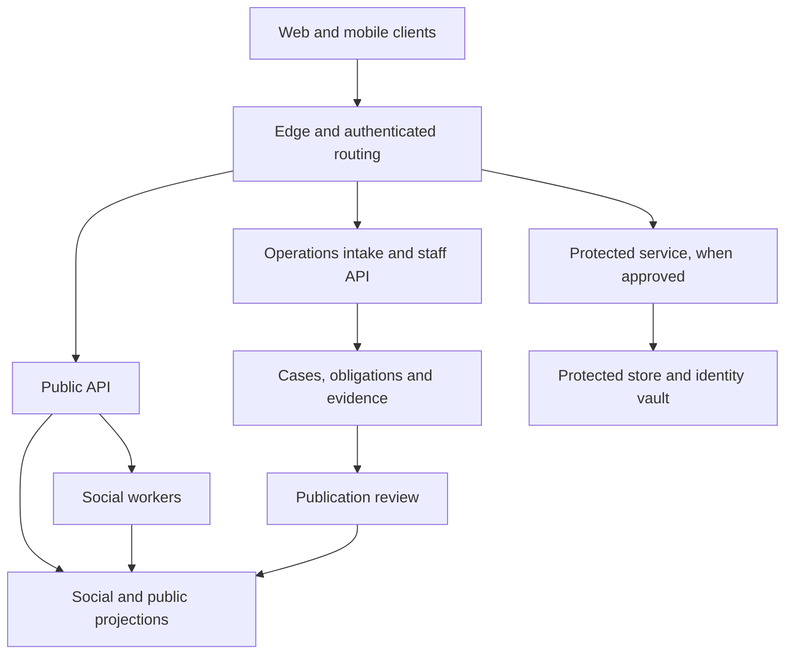
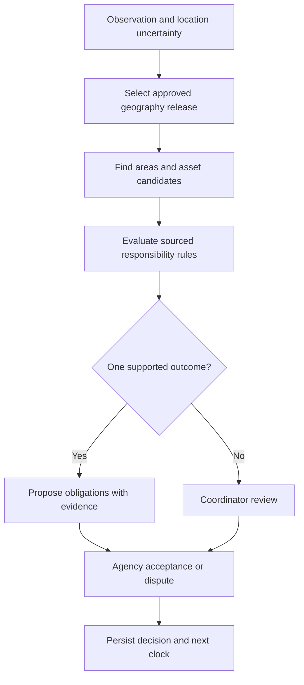
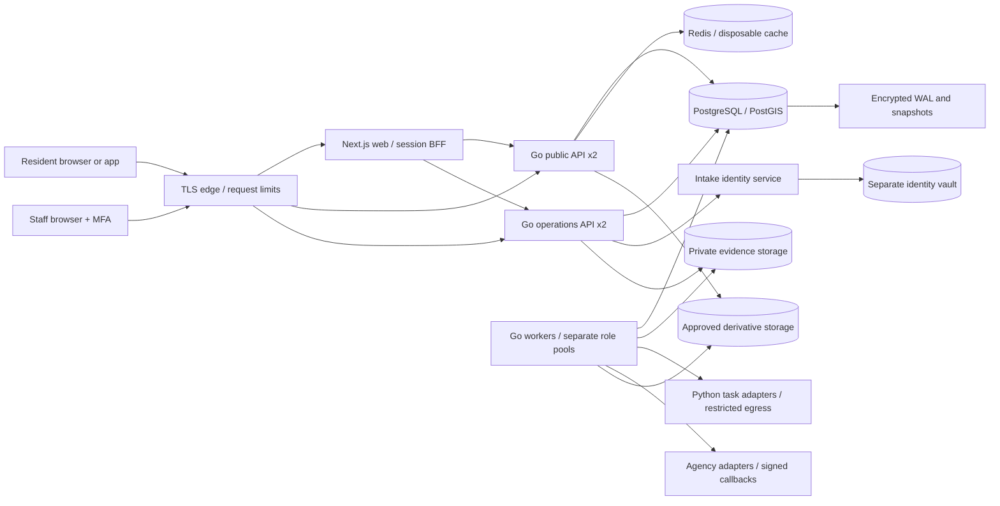
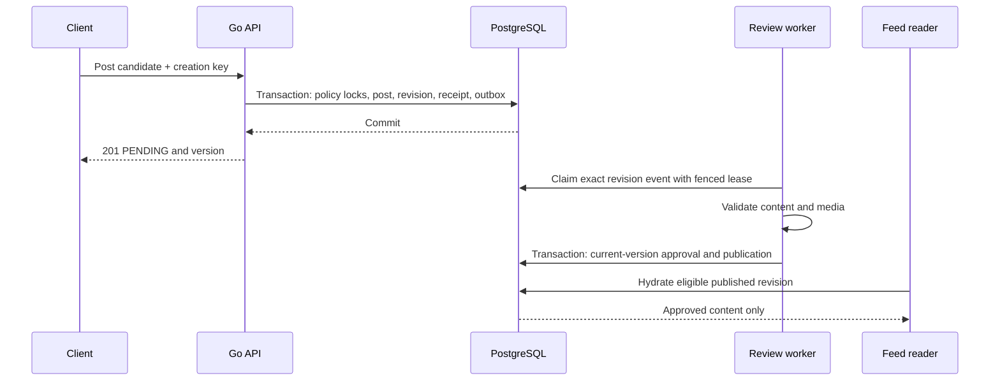
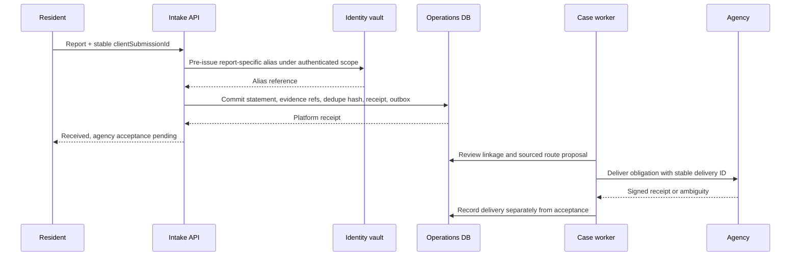

# JanSetu AI — System Design

Version: 3.0. Date: 3 October 2026. Status: canonical design for implementation.

Audience: Technical leads, backend/AI engineers, infrastructure owners, and security reviewers.

This document owns: Deployment, module ownership, data/trust topology, geography, capacity, and operational architecture. Read the [suite guide](README.md) and [domain glossary](../../CONTEXT.md) first. Requirements describe intended behavior; application code, agency integrations, and model evaluation remain implementation work. P0 is the controlled pilot, P1 is the next validated release, and P2 is later expansion.


## Contents

- [System architecture and module ownership](#system-architecture-and-module-ownership)
- [Capacity, reliability, and cost assumptions](#capacity-reliability-and-cost-assumptions)
- [Administrative hierarchy and routing implementation](#administrative-hierarchy-and-routing-implementation)
- [Security, pseudonymity, and access implementation](#security-pseudonymity-and-access-implementation)
- [Deployment topology and module interfaces](#deployment-topology-and-module-interfaces)

## System architecture and module ownership

### Chosen stack

| Layer | Baseline choice | Reason |
|---|---|---|
| Website | Next.js App Router, React, TypeScript | Public rendering, accessible web UI, staff console |
| Mobile | React Native with Expo Router | Shared TypeScript contracts, native media and notifications |
| API | Go, standard-library `net/http`, explicit authentication and authorization middleware | Typed domain services, context-aware requests, compiled API binaries |
| Persistence | PostgreSQL 18 with compatible PostGIS | Relational constraints, spatial routing, durable events |
| Database access | `pgx` v5, `sqlc`, and explicit SQL for core writes | Generated typed queries, visible locking, permission-sensitive transactions |
| Migrations | Goose SQL migrations | Ordered, reviewed schema changes |
| Cache and quotas | Redis | Disposable feed caches and distributed counters |
| Media | S3-compatible private object storage | Upload quarantine and controlled derivatives |
| Background work | Go workers with PostgreSQL outbox and leases | Durable work with bounded concurrency and explicit cancellation |
| AI adapter | Separate Python service behind versioned contracts; FastAPI proposed for HTTP | Model isolation, validated task contracts, independent resource limits |
| Identity | Managed or self-hosted OIDC provider with MFA/passkeys | Avoid custom credential handling |
| Monitoring | OpenTelemetry plus metrics, logs, and alerts | Cross-request traceability with data redaction |

Go is the user's selected backend language. Pin a supported Go toolchain, exact tested dependency/tool versions, and container digests when the implementation is created. Use Go's HTTP server foundation [S4](README.md#sources), `pgx` for PostgreSQL [S17](README.md#sources), transaction-bound `sqlc` queries [S18](README.md#sources), and Goose for SQL migrations [S19](README.md#sources). Next.js and Expo documentation provide the selected routing foundations [S5–S6](README.md#sources).

Use one repository and explicit module boundaries. Deploy a public API, an operations API, and worker processes with distinct runtime credentials. They can share libraries and release tooling. Protected intake, if enabled, runs in a separate trust environment. Do not introduce a microservice for every table.

### Trust and data topology



The operations database stores reports and assignments. The public API cannot query those raw tables. The publication worker reads explicitly approved operational fields and writes sanitized projections. Protected data has no generic path to social projections. The pilot publishes no protected-case receipts.

### Backend modules

| Module/path | Owns | Allowed collaboration |
|---|---|---|
| `identity` | Session-to-profile mapping and account state | Identity provider; no reporter lookup |
| `communities` | Community rules, members, roles | Social policy service |
| `social` | Posts, revisions, comments, votes, reposts | Media approval and publication policies |
| `feeds` | Candidates, snapshots, explanations | Authorized public projections only |
| `intake` | Public-service reports and observation linkage | Operations cases, evidence, jurisdiction |
| `cases` | Case and obligation transitions | Adjudication and agency integrations |
| `jurisdiction` | Geographic versions and responsibility rules | Reviewed source records |
| `publication` | Safe receipts and case update posts | Explicit review decisions |
| `moderation` | Content decisions, appeals, enforcement | Social content only |
| `notifications` | Preferences, delivery, retries | Current projection at send time |
| `media` | Upload sessions, scanning, derivatives | Object store with scoped roles |
| `integrations` | Agency deliveries and callbacks | Contract-specific adapters |
| `audit` | Access and state-change receipts | Append-only records |
| `protected` | Separate optional product/service boundary | Approved specialist pathways only |

HTTP handlers validate transport fields, application services enforce policy and transitions, repositories perform scoped persistence, and outbox events trigger asynchronous work. Handlers cannot call another module's repository. Domain modules live under the Go module's `internal/domain` tree and expose explicit service interfaces; process entry points only assemble dependencies.

Use `net/http` handlers and middleware for identity resolution, object authorization, CSRF/origin checks where cookie-authenticated, request limits, error mapping, and redacted tracing. Use an OIDC client such as `go-oidc` with `golang.org/x/oauth2` for login integration [S20](README.md#sources). API access-token validation must follow the selected provider's token format, issuer, and audience rules; an ID token is not automatically an API access token. Case/community/organization permissions remain explicit application policy.

Each command owns an explicit `pgx` transaction. Bind every participating repository and generated query to that transaction using `sqlc`'s `WithTx`; return success only after commit succeeds [S17–S18](README.md#sources). Do not accidentally issue command writes through the pool outside that transaction. Apply RLS request context transaction-locally and pass `context.Context` through handlers, queries, and external adapters. External calls run after the authoritative commit through outbox workers.

Bound HTTP body sizes, request and external-call deadlines, database pools, worker concurrency, and shutdown time. Use separate runtime credentials per API/worker role. Retry only the whole eligible command under its idempotency/locking contract, never an arbitrary partial transaction. Measure memory, latency, contention, and throughput against [capacity objectives](SYSTEM_DESIGN.md#capacity-reliability-and-cost-assumptions) before making scaling or cost claims.

### Request and event consistency

A successful synchronous write commits the authoritative row, revision or domain event, idempotency receipt, and outbox item together. Search, counters, feed candidates, and notifications update asynchronously.

API responses distinguish committed state from pending review and eventual projections. WebSocket or server-sent events may notify a client that a resource changed; the client refetches authorized data. The real-time channel is not a second authority for case status.

Use server-sent events for staff task and case updates where browser support fits; use push and foreground refresh for native clients. A polling fallback must remain available. Reconnect uses an event cursor and deduplicates events. Never send raw protected content over a general social event stream.

## Capacity, reliability, and cost assumptions

### Pilot load model

These are sizing inputs, not traffic forecasts.

| Input | Assumption | Derived load |
|---|---:|---:|
| Registered accounts | 50,000 | Identity and profile sizing |
| Daily active accounts | 10,000 | Feed and notification cohort |
| Feed requests per daily account | 20 | 200,000/day; about 2.3 requests/second average |
| Peak multiplier | 20× average | About 46 feed requests/second |
| New posts/comments per day | 20,000 | About 0.23 writes/second average before reactions |
| Votes/follows/bookmarks per day | 200,000 | About 2.3 writes/second average |
| Media uploads | 2,000/day at 3 MB average | About 6 GB/day raw |
| Raw media retained for 30 days | At the above rate | About 180 GB before derivatives, replicas, and backups |
| Average feed JSON | 40 KB per response | About 8 GB/day before compression; media delivery is additional |

Test at 100 feed requests/second, 100 interaction writes/second, and 10 concurrent uploads as an initial stress envelope. These are engineering test targets to revise after representative load tests, not guaranteed capacity from the stack alone.

### Service objectives

| Surface | Initial objective | Measurement boundary |
|---|---|---|
| Public read API | 99.9% monthly availability | Eligible requests at the API edge |
| Feed query | p95 under 500 ms | Server processing excluding media/client network |
| Social mutation | p95 under 700 ms | Commit acknowledgement excluding async review |
| First usable feed | p75 under 2.5 seconds | Defined pilot phone and mobile-network profile |
| Async ordinary projection | p95 under 10 seconds | Commit to feed/search visibility |
| Public revocation | New origin reads denied immediately after authoritative revocation; managed edge purge within 60 seconds target | Already delivered copies cannot be recalled |
| API recovery | RTO 60 minutes; RPO 15 minutes initial target | Tested restore and failover procedure |
| Protected service | Separately contracted and staffed objectives | Disabled until approved |

Monitor percentile distributions, not averages alone. Track urgency and language separately so slow categories are visible. Social-system availability does not imply an authority will act within the same time.

### Scaling policy

Start with feed generation on read, bounded candidate retrieval, indexed queries, and shared caches for anonymous locality feeds. At the pilot size, a durable relational outbox is easier to operate than a streaming platform.

Consider a broker and hybrid feed fanout only after measurements show sustained outbox lag, expensive follower joins, or unacceptable feed latency. A future high-follower account should be pulled into feeds at read time rather than generating millions of synchronous fanout writes. Bound fanout by active followers and delivery budget; select thresholds from measured costs.

Split services because of independent security, ownership, or scaling needs. Do not treat a hypothetical national user count as a reason to ship many untested services.

## Administrative hierarchy and routing implementation

### Geography is not a single chain

Administrative containment, municipal governance, utility service territory, police jurisdiction, elected representation, and asset ownership can overlap. Store them separately. A ward community can belong to a municipality while a state agency owns a road within it.

Use authoritative directory codes where available, including the Local Government Directory [S7](README.md#sources). A directory code identifies an administrative entity; it is not proof of responsibility for every asset inside it.

### Versioned schema

```sql
CREATE TABLE geo.release (
  id uuid PRIMARY KEY,
  status text NOT NULL CHECK (status IN ('DRAFT','ACTIVE','RETIRED')),
  source_manifest jsonb NOT NULL,
  recorded_at timestamptz NOT NULL DEFAULT now(),
  approved_at timestamptz,
  approved_by uuid
);

CREATE TABLE geo.admin_unit (
  id uuid PRIMARY KEY,
  country_code char(2) NOT NULL,
  registry_name text,
  registry_code text,
  UNIQUE (country_code, registry_name, registry_code)
);

CREATE TABLE geo.unit_version (
  id uuid PRIMARY KEY,
  release_id uuid NOT NULL REFERENCES geo.release(id),
  unit_id uuid NOT NULL REFERENCES geo.admin_unit(id),
  official_name text NOT NULL,
  unit_type text NOT NULL,
  valid_during tstzrange NOT NULL,
  boundary geometry(MultiPolygon,4326),
  source_ref text NOT NULL,
  CHECK (NOT isempty(valid_during)),
  CHECK (boundary IS NULL OR ST_IsValid(boundary)),
  EXCLUDE USING gist
    (release_id WITH =, unit_id WITH =, valid_during WITH &&)
);

CREATE TABLE geo.hierarchy_edge (
  id uuid PRIMARY KEY,
  release_id uuid NOT NULL REFERENCES geo.release(id),
  child_unit_id uuid NOT NULL REFERENCES geo.admin_unit(id),
  parent_unit_id uuid NOT NULL REFERENCES geo.admin_unit(id),
  hierarchy_kind text NOT NULL,
  valid_during tstzrange NOT NULL,
  source_ref text NOT NULL,
  CHECK (child_unit_id <> parent_unit_id),
  CHECK (NOT isempty(valid_during)),
  EXCLUDE USING gist
    (release_id WITH =, child_unit_id WITH =,
     hierarchy_kind WITH =, valid_during WITH &&)
);

CREATE TABLE geo.unit_lineage (
  predecessor_id uuid NOT NULL REFERENCES geo.admin_unit(id),
  successor_id uuid NOT NULL REFERENCES geo.admin_unit(id),
  change_kind text NOT NULL CHECK (change_kind IN ('SPLIT','MERGE','REPLACED')),
  effective_at timestamptz NOT NULL,
  source_ref text NOT NULL,
  PRIMARY KEY (predecessor_id, successor_id, effective_at),
  CHECK (predecessor_id <> successor_id)
);

CREATE TABLE geo.responsibility_rule (
  id uuid PRIMARY KEY,
  release_id uuid NOT NULL REFERENCES geo.release(id),
  agency_id uuid NOT NULL REFERENCES ops.agency(id),
  category_code text NOT NULL,
  obligation_type text NOT NULL,
  coverage_unit_id uuid REFERENCES geo.admin_unit(id),
  service_boundary geometry(MultiPolygon,4326),
  asset_scope_ref text,
  valid_during tstzrange NOT NULL,
  precedence integer NOT NULL,
  authority_source_ref text NOT NULL,
  source_document_hash text NOT NULL,
  CHECK (NOT isempty(valid_during)),
  CHECK (coverage_unit_id IS NOT NULL OR service_boundary IS NOT NULL
         OR asset_scope_ref IS NOT NULL)
);

CREATE TABLE ops.route_decision (
  id uuid PRIMARY KEY,
  case_id uuid NOT NULL REFERENCES ops.case_record(id),
  case_version bigint NOT NULL,
  release_id uuid NOT NULL REFERENCES geo.release(id),
  valid_at timestamptz NOT NULL,
  input_fingerprint text NOT NULL,
  candidate_rules jsonb NOT NULL,
  result text NOT NULL CHECK
    (result IN ('PROPOSED','AMBIGUOUS','NO_MATCH','MANUAL_REVIEW')),
  explanation jsonb NOT NULL,
  decided_at timestamptz NOT NULL DEFAULT now(),
  decided_by uuid,
  model_version text
);

ALTER TABLE social.community ADD CONSTRAINT community_admin_unit_fk
  FOREIGN KEY (admin_unit_id) REFERENCES geo.admin_unit(id);

CREATE INDEX unit_boundary_idx ON geo.unit_version USING gist (boundary);
CREATE INDEX rule_boundary_idx
  ON geo.responsibility_rule USING gist (service_boundary);
```

A release is immutable after activation. Corrections create a new release, preserving what was known before. `valid_during` records when a fact applies; release timestamps record when JanSetu adopted that knowledge. Together these support effective-time and knowledge-time reconstruction without mutating historical routing decisions.

A renaming retains the unit ID with a new version. A split or merger creates successor IDs and lineage records. Cases retain their original routing decision and can receive a new proposal under the new release. No bulk job silently rewrites accepted obligations.

Before activating a release, validate acyclicity within each hierarchy, allowed parent/child types, effective-time coverage, duplicate identifiers, geometry validity, expected overlaps, source integrity, and reviewer approval. The exclusion constraint assumes one administrative parent per hierarchy at a given time; many-to-many service coverage belongs in responsibility rules.

### Routing data flow



Use `ST_Covers` for boundary-inclusive geometry matching [S8](README.md#sources). If a point lies on a shared boundary, keep both candidates. Where an accuracy radius intersects several areas, evaluate the uncertainty region instead of treating the center point as exact.

Routing evaluates incident time for historical context and current mandate for present assignment. These may differ after a reorganization; record both bases. Asset ownership, delegation orders, work contracts, and service category can outrank simple geographic containment.

AI extracts candidate categories, locations, and referenced assets from unstructured input. Deterministic rules operate on reviewed geographic and responsibility records. If records conflict or confidence is inadequate, produce a review task with competing candidates. Never invent an agency, infer legal authority from a community name, or treat silence as acceptance.

## Security, pseudonymity, and access implementation

### Security boundaries

The public API authenticates and authorizes every mutation and resource read. Apply object-level checks to nested resources, bulk endpoints, exports, search, previews, and media delivery. Random IDs reduce enumeration convenience but never replace authorization [S9–S10](README.md#sources).

Use separate database roles for migration, public API, operations API, publication worker, media processing, audit export, and backup. Runtime roles cannot alter schemas or grant themselves permissions. Only the publication role can write public case receipts.

Enable PostgreSQL row-level security on scoped operational tables as defense in depth. Apply `FORCE ROW LEVEL SECURITY` where appropriate, and ensure application roles are neither table owners nor `BYPASSRLS` roles. PostgreSQL documents these bypass rules explicitly [S9](README.md#sources). The operations service sets request context only from verified server-side identity, within a transaction; pooled connections must not retain another request's scope.

Treat authentication tokens, identity mappings, evidence, and operational locations as separate data classes. Use key management with controlled decryption roles, encrypted transport, restricted egress, secret rotation, and audited break-glass access.

Web mutations require CSRF protection and origin checks when cookie-authenticated. Apply a restrictive content-security policy and sanitize rendered content. Native OAuth follows current security guidance, including PKCE and protected refresh-token handling [S11](README.md#sources). No secrets are embedded in app bundles.

### Reporter pseudonymity model

A public profile is a social identity, not a reporter identity. The identity vault holds any necessary link between a private subject, safe contact method, and report-specific alias. Operational services receive aliases and controlled contact capabilities, not unrestricted subject lookup.

Use separate aliases for separate reports or cases. Do not derive aliases from email, phone number, or a deterministic public user ID. A reporter can later choose public attribution to a social post, but this does not make the underlying evidence or identity public.

The following is a separate-vault reference schema, not a schema to add to the public PostgreSQL instance:

```sql
CREATE SCHEMA vault;

CREATE TABLE vault.subject (
  id uuid PRIMARY KEY,
  identity_ciphertext bytea,
  contact_ciphertext bytea,
  key_reference text,
  safe_contact_policy jsonb NOT NULL,
  created_at timestamptz NOT NULL DEFAULT now(),
  retention_policy_id text NOT NULL,
  CHECK (
    (identity_ciphertext IS NULL AND contact_ciphertext IS NULL)
    OR key_reference IS NOT NULL
  )
);

CREATE TABLE vault.pseudonym_binding (
  alias_id uuid PRIMARY KEY,
  subject_id uuid NOT NULL REFERENCES vault.subject(id),
  scope_kind text NOT NULL CHECK (scope_kind IN ('REPORT','CASE')),
  scope_id uuid NOT NULL,
  created_at timestamptz NOT NULL DEFAULT now(),
  UNIQUE (subject_id, scope_kind, scope_id)
);

CREATE TABLE vault.principal_subject (
  principal_ref uuid PRIMARY KEY,
  subject_id uuid NOT NULL REFERENCES vault.subject(id),
  created_at timestamptz NOT NULL DEFAULT now()
);

CREATE TABLE vault.access_grant (
  id uuid PRIMARY KEY,
  principal_ref uuid NOT NULL,
  resource_kind text NOT NULL CHECK (resource_kind IN ('REPORT','CASE','SUBJECT')),
  resource_id uuid NOT NULL,
  purpose_code text NOT NULL,
  field_allowlist text[] NOT NULL,
  approved_by uuid NOT NULL,
  issued_at timestamptz NOT NULL,
  expires_at timestamptz NOT NULL,
  revoked_at timestamptz,
  CHECK (principal_ref <> approved_by),
  CHECK (expires_at > issued_at)
);

CREATE TABLE vault.disclosure_request (
  id uuid PRIMARY KEY,
  request_document_key text NOT NULL,
  requesting_body text NOT NULL,
  claimed_legal_basis text NOT NULL,
  requested_scope jsonb NOT NULL,
  approved_scope jsonb,
  state text NOT NULL CHECK
    (state IN ('RECEIVED','VALIDATING','CHALLENGED','APPROVED',
               'REJECTED','FULFILLED','CLOSED')),
  legal_reviewer_ref uuid,
  independent_reviewer_ref uuid,
  received_at timestamptz NOT NULL,
  fulfilled_at timestamptz,
  CHECK (legal_reviewer_ref IS NULL OR independent_reviewer_ref IS NULL
         OR legal_reviewer_ref <> independent_reviewer_ref)
);
```

Foreign resources in another database require authenticated service validation and reconciliation; a UUID in this schema is not proof the resource exists or is authorized. The decryption service verifies grant expiry, purpose, field scope, case assignment, revocation, and approval before each access.

Application-layer envelope encryption uses an approved cryptographic library and managed keys. Bind ciphertext to its subject, field, and key version through authenticated context. Encrypt backups and separate backup restoration privileges from ordinary data access. An audit receipt records which fields were accessed and why, not their decrypted values.

The pilot does not offer unconditional anonymity. Network records, volunteered details, evidence context, device access, privileged compromise, and legally required disclosure can identify a reporter. The user-facing promise is specific: what JanSetu collects, who can access it, how publication is limited, and which exceptions apply.

### Threat model

| Threat actor or event | Failure path | Required control | Residual limit |
|---|---|---|---|
| Retaliating official | Looks up reporter through case console | Case-scoped aliases, minimal evidence, independent sensitive routing | Narrative details may identify a person |
| Community moderator | Uses moderation tools to inspect raw reports | No operational/vault permissions | Public self-disclosure may remain visible |
| Compromised public API | Queries protected identities | Separate credentials, database boundary, no protected network route | Public data and social drafts remain at risk |
| Staff insider | Bulk exports identities or evidence | Purpose grants, export limits, dual approval, anomaly review | Collusion remains a risk |
| Unauthorized viewer | Guesses private object IDs | Uniform unavailable responses, object policy, scoped queries | Timing and operational metadata need testing |
| Model or vendor misuse | Retains prompts or leaks protected text | Data minimization, contracted processor, restricted input classes | Provider compromise cannot be eliminated |
| Malicious post | Prompt injection or dangerous attachment | No model tool authority; sandboxed processing; schema validation | Novel adversarial content requires monitoring |
| Shared device access | Reads previews, drafts, or browser state | Safe-contact preferences, no sensitive push, short sessions | Device owner may still inspect history or screenshots |
| Brigading group | Manipulates votes to suppress a case | Votes excluded from operational priority; abuse controls | Discussions may still become noisy |
| Cache/search lag | Removed content continues appearing | Synchronous deny state, hydration, tombstones, purge tasks | Already delivered external copies remain |
| Administrator/key compromise | Decrypts or changes records | Key separation, constrained administration, independent audit | Full privileged compromise defeats many controls |
| Compelled disclosure | Overbroad request exposes unrelated people | Validity review, scope minimization, recorded approvals and export | Valid legal obligations may require disclosure |

### Lawful-access workflow

Receive requests through a dedicated channel, validate requester and claimed authority, preserve relevant records where required, review jurisdiction and scope, seek clarification or challenge through counsel where appropriate, and release only the approved material through a controlled export.

Record every request, decision, field set, approver, recipient, and delivery receipt. Notify the affected person only when lawful and safe. Emergency requests use a separately approved expedited process, not a general “admin unlock” button.

These are system control requirements. The legal basis, deadlines, challenge rights, notification restrictions, and emergency exceptions require answers from counsel in [readiness requirements](TRACEABILITY_AND_DELIVERY.md#pilot-legal-and-governance-readiness).

## Deployment topology and module interfaces

### Pilot containers and trust boundaries



Social and operational schemas may share one HA database cluster in P0 with different roles and RLS. The intake identity vault uses a separate database, encryption keys, service identity and network segment even for ordinary service reports. Protected intake adds another independently approved environment; it is not depicted as an enabled P0 route. No social role reads raw operational tables or the vault. Publication uses a narrowly privileged worker role; other workers use separate pools and least-privilege modules, not one shared superuser connection.

A signed upload URL sends bytes directly to quarantine storage. The resident does not receive evidence storage keys or raw download URLs for someone else's report. Approved social derivatives use a gated origin and revocable authorization version; anonymous edge caching includes only public eligibility, short TTL and purge. Private/staff/owner DTOs are `Cache-Control: private, no-store` and never enter shared edge cache. Signed URLs cannot retract already downloaded copies; expire and purge them under the revocation contract.

Minimum production pattern: two API/web replicas across failure domains, one database primary with tested standby/failover, encrypted point-in-time backup in a separately controlled location, redundant object storage, and worker pools independently restarted. Redis failure degrades to bounded database reads and conservative quotas. A Redis cluster is optional at measured need; it stores no sole authoritative data. Start with containers on a managed container platform or VMs; Kubernetes is a future operational choice. No cloud vendor is required.

### Deep application interfaces

| Public module interface | Input/output | Details hidden from callers |
|---|---|---|
| `Social.SubmitPost(ctx, actor, command)` | validated candidate -> committed owner view | revisions, locks, media policy, key receipts, review events |
| `Social.SetVote(ctx, actor, target, desired)` | desired vote -> authoritative viewer value | authorization lock order, upsert/delete, projection events |
| `Intake.SubmitReport(ctx, actor, command)` | immutable observation -> honest platform receipt | alias issuance, client submission dedupe, quarantine scope, triage |
| `Cases.Execute(ctx, actor, command, expectedVersion)` | typed acceptance/dispute/completion/verification -> event + new version | case lock order, signed clocks, evidence checks, resolution rules |
| `Jurisdiction.Propose(ctx, observation, release)` | candidates + source-backed explanation | overlapping boundaries, incident/current times, asset rules |
| `Publication.Decide(ctx, reviewer, command)` | exact case version + safe fields -> decision | allowlist, publication preference, media redaction, public binding |
| `Feeds.Page(ctx, viewer, query)` | signed cursor -> eligible hydrated items | candidate retrieval, ranking snapshots, block/revoke filtering |
| `Media.RequestAnalysis(ctx, actor, media, tasks)` | pinned media -> task job | hash/transform lineage, adapters, capability gate, cancellation |
| `IdentityVault.OwnedAliases(ctx, principal)` | authenticated self scope -> minimal report aliases | subject/account mapping, purpose policy, audit |

Interfaces accept domain-level commands and return committed outcomes. They do not expose raw `*sql.DB`, table mutators, permission booleans supplied by callers, or per-column state setters. Repositories and transaction-bound scopes remain private to modules. Cross-module commands use explicit contracts; shared transaction composition is assembled inside an owning application service, never hidden inside middleware. `context.Context` cancellation governs IO but does not imply a committed transaction can be undone.

### Publish and intake sequences





### Runtime configuration and budgets

All values are development starting points, tuned with measured pilot load. Mandatory missing configuration fails startup. Read secrets through a secret manager or mounted secret file, never checked-in `.env` or client build variables.

| Configuration | Starting value / validation | Owner |
|---|---|---|
| `JANSETU_ENV`, `JANSETU_RELEASE` | local/staging/pilot; immutable release ID | deployment |
| `JANSETU_DB_DSN_FILE` | role-specific secret, TLS required outside local | database |
| `JANSETU_DB_POOL_MAX` | 20 per API replica; 10 per worker pool | capacity |
| `JANSETU_HTTP_ADDR` | `:8080` behind TLS edge | deployment |
| HTTP read-header/write/idle | 5s / 15s / 60s; request budget 10s | API |
| Shutdown drain | 30s HTTP; stop claiming first, fence/release unfinished work | runtime |
| OIDC issuer/audience/JWKS | exact allowlist, no wildcard issuer | identity |
| `JANSETU_CURSOR_KEY_FILE` | rotating key IDs, overlap until cursors expire | security |
| Object endpoint/buckets/region | separate quarantine/evidence/derivative/export policies | media |
| AI endpoints/model manifests | registered adapters only, no arbitrary user URLs | ML |
| `JANSETU_PILOT_RELEASE_ID` | approved geography release | operations |
| Feature/language manifests | versioned deploy artifact + capability evidence | product/localization |
| OTLP collector/redaction config | no body/token/evidence logging | observability |

Budget the database connection sum across all replicas, workers, maintenance and reserved administration slots before changing pools. Initial resource requests for benchmarking: API 1 vCPU/512 MiB each, web 1 vCPU/1 GiB, worker 1 vCPU/512 MiB each, database 4 vCPU/16 GiB with measured IOPS, Redis 256 MiB, AI adapter 2 vCPU/4 GiB before model-specific limits. These are test allocations, not promised sufficient capacity. Do not put model weights in API memory. Model manifests declare resident RAM/VRAM, input limits, timeout and concurrency. Autoscale by request load/outbox age only within DB/provider capacity; cap replicas and shed low-priority analysis before starving case writes.

`/health/live` checks process loop only. `/health/ready` checks essential DB/schema compatibility and ability to serve; optional AI/Redis outage does not make the public API restart continuously. Dependency status is an internal authenticated page; public health returns no infrastructure secrets. On shutdown stop accepting, drain, cancel eligible IO, return ambiguous client results safely, and let expired worker leases be reclaimed. In-flight external side effects remain subject to reconciliation.

### Failure and recovery ownership

| Failure | User-visible behavior | Recovery action |
|---|---|---|
| Database unavailable | writes fail with retry guidance; draft retained | failover/restore; original key reused |
| Redis unavailable | slower bounded feed; conservative quota behavior | rebuild cache, no interaction loss |
| AI task outage | partial/manual report with explicit capability status | pause adapter, targeted retry |
| Object upload timeout | completed parts retained, progress honest | renew authorized part URLs or expire/abort |
| Agency outage | platform receipt + delivery pending, clocks retained | retry/reconcile under partner contract; coordinator fallback |
| Projection lag | current commit visible to owner; public update pending | inspect backlog, replay/rebuild with deny states |
| Credential compromise | session/grant/export revoked | rotate keys, audit scope, staged restore |
| Backup restore | new writes paused until deletion/revocation ledger reapplied | compare event manifests, PITR, replay authorized projections |

Operator change logs record model/language/policy/geography versions alongside application release. Incident reviews separate platform availability, actual agency actions, publication decisions and model quality; one green dashboard cannot stand in for all four.
