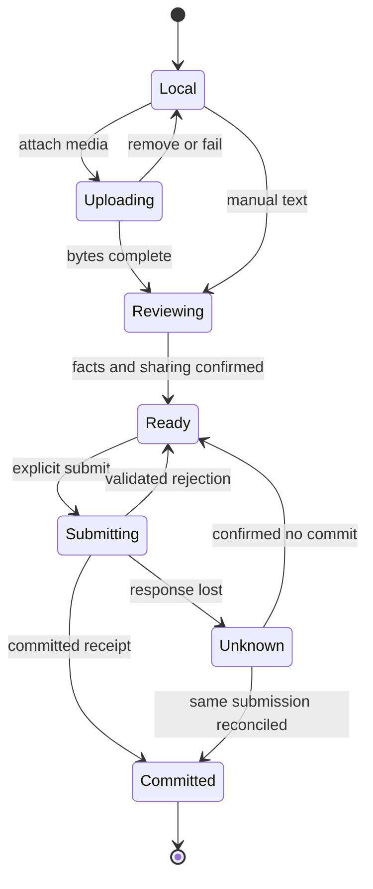

# JanSetu AI — UI and Frontend Implementation

Version: 3.0. Date: 3 October 2026. Status: canonical design for implementation.

Audience: Designers, web/mobile engineers, accessibility reviewers, and QA.

This document owns: Navigation, visuals, components, screen contracts, and web/native implementation behavior. Read the [suite guide](README.md) and [domain glossary](../../CONTEXT.md) first. Requirements describe intended behavior; application code, agency integrations, and model evaluation remain implementation work. P0 is the controlled pilot, P1 is the next validated release, and P2 is later expansion.


## Contents

- [Navigation and responsive structure](#navigation-and-responsive-structure)
- [Visual system and reusable components](#visual-system-and-reusable-components)
- [Screen-level implementation](#screen-level-implementation)
- [Visual implementation contract](#visual-implementation-contract)
- [Frontend implementation architecture](#frontend-implementation-architecture)
- [Indian-language capability catalog](#indian-language-capability-catalog)

## Navigation and responsive structure

### Mobile app

The bottom navigation has five destinations: Home, Communities, Create, Activity, and Profile. Search is available in the Home header. “My cases” is a persistent shortcut in Home and Profile. Protected help is a plainly labeled entry inside Create and Help; it is never advertised using a sensitive notification badge.

Create opens a choice sheet with “Write a post,” “Report a service issue,” and “Get help or report privately.” This choice happens before the app asks for a location or media permission.

### Website

| Region | Desktop behavior | Tablet/mobile web behavior |
|---|---|---|
| Global navigation | Left rail, approximately 224 px | Collapsible rail; bottom navigation on narrow screens |
| Main content | Readable column, maximum approximately 680 px | Full available width with 16 px margins |
| Context panel | Approximately 300 px for rules, filters, and related cases | Drawer or content below the main section |
| Header | Search, locality selector, language, account | Search icon and compact locality selector |
| Composer | Inline entry opens dedicated editor | Full-screen editor |
| Authority workspace | Table plus task detail panel | Task list followed by full-screen detail |

These dimensions are design defaults, not fixed layout requirements. At 200% zoom the layout must reflow without losing controls. The website supports public indexing only for eligible pages. Private drafts, accounts, protected pages, and operational consoles are excluded from sitemaps and emit appropriate access and indexing controls; indexing controls never replace authorization.

### Route map

| Website route | Native destination | Access |
|---|---|---|
| `/home` | Home tabs | Public content with optional signed-in customization |
| `/communities` | Community directory | Public |
| `/c/{slug}` | Community detail | Visibility-dependent |
| `/p/{postId}` | Post thread | Object policy |
| `/cases/{receiptId}` | Public case timeline | Published receipt only |
| `/u/{handle}` | Public profile | Public fields only |
| `/compose` | Composer | Signed-in |
| `/report/service` | Service report wizard | Intake policy |
| `/my-cases` | My cases | Signed-in, private response |
| `/activity` | Notifications | Signed-in |
| `/settings/feed` | Feed controls | Signed-in |
| `/moderation/{communityId}` | Moderator workspace | Community role |
| `/work` | Worker tasks | Assigned staff |
| `/authority` | Authority workspace | Staff role and organization scope |
| `/help/private` | Protected help entry | Minimal public guidance; intake service has separate session controls |

Deep links resolve to the same canonical content in web and app. The app does not expose private content in link previews, OS app-switcher snapshots, or analytics route names.

## Visual system and reusable components

### Design tokens

| Token | Default | Application |
|---|---|---|
| Page background | `#F7F9FC` | Neutral, low-noise canvas |
| Main text | `#172033` | Primary body text |
| Brand action | `#155EEF` | Primary CTA and focus accent |
| Surface | `#FFFFFF` | Cards and panels |
| Success | `#146C43` | Verified restoration with icon and text |
| Caution | `#8A4B08` | Awaiting action or overdue with text |
| Critical | `#B42318` | Urgent safety indication only |
| Border | `#D5DBE5` | Inputs and separators |
| Spacing | 4, 8, 12, 16, 24, 32, 48 px | Shared layout rhythm |
| Radius | 8 px controls; 12 px cards | Consistent interaction surfaces |
| Body type | 16 px / 1.5 line-height | System font with tested local-script fallback |
| Touch target | At least 44 × 44 CSS px design target | Icons, vote controls, menus |

Validate actual foreground/background combinations, focus indicators, motion, keyboard behavior, and screen-reader output against WCAG 2.2 AA. A token list alone does not prove accessibility. Use text and shape with status colors. Respect reduced motion and system text size. Reference S3 is the accessibility baseline.

### Component contracts

| Component | Required props/data | Required behavior |
|---|---|---|
| PostCard | Post ID, published revision, author projection, scope, body, media, viewer actions | Separate author and content badges; overflow menu with report/mute/block |
| VoteControl | Current viewer vote, displayed aggregate, pending state | Optimistic value; rollback on rejection; labeled buttons |
| CaseCard | Receipt ID/version, safe title, area, status, next obligation, elapsed age | No reporter attribution; “Follow case” and “Add observation” |
| StatusTimeline | Ordered published events with actor type and time | Distinguish claim, acceptance, and verification |
| CommunityHeader | Rules revision, scope, posting policy, viewer role | Join/follow states are distinct |
| MediaPreview | Sanitized derivative reference and caption | No automatic raw-object fallback on loading failure |
| SafetyNotice | Reviewed content and locale-specific support options | Clear action; no alarming gamification |
| Composer | Type, scope, revision, media state | Draft recovery, validation, review state |
| EmptyState | Reason code and permitted action | Never invent activity or imply a hidden protected case |
| PermissionState | Generic unavailable message | Does not distinguish missing from unauthorized private object |

### Content labels

Use “Agency account” for verified affiliation, “Reported observation” for an unverified submission, “Agency reports work completed” for a completion claim, and “Verified restored” only after the relevant verification decision.

Do not label a citizen as a verified witness because they passed phone verification. Avoid “AI verified,” “criminal,” “fake reporter,” and “FIR filed” unless the exact authorized, independently recorded fact supports the wording.

### Theme, density, and social presentation

Provide light, dark, and system themes through semantic tokens for surfaces, text, dividers, focus, actions, and statuses. Provide comfortable and compact feed density without reducing touch targets or hiding action labels. Validate both themes and densities using realistic long content, translated labels, mixed scripts, and actual media loading states.

Use a readable social stream with inline dividers, clear community context, short updates, and readily accessible reply/repost/bookmark actions. Discussion detail provides nested, collapsible replies with bounded mobile indentation. Case receipts retain their separate responsibility and evidence hierarchy. Preserve the selected feed, query, filters, and visible anchor within the session when a reader opens and returns from a detail screen.

The detailed contracts below define card anatomy and screen review requirements. Design reviews must cover loading, empty, review-pending, partial upload, offline, permission, stale revision, removal, and failure states alongside populated screens.

## Screen-level implementation

### Home and Unresolved

The first viewport contains locality and language controls, feed tabs, one visible filter summary, and the first relevant cards. The Unresolved tab shows each case's current owner or “Responsibility under review,” age, next promised update, and evidence date.

The “Why is this near the top?” sheet explains ranking inputs in plain language: “Safety priority reviewed; next update overdue; no accepted restoration owner.” It does not expose protected evidence or a hidden reporter score.

A stale-data banner states when the last successful refresh occurred. If the ranking service fails, use the documented deterministic ordering and label the temporary mode. Do not return an empty feed that looks like all problems were solved.

### Community page and thread

Community pages contain About, Posts, Cases, and Playbooks tabs. Rules and moderator contacts are visible. The Cases tab is a filtered public-receipt view; community moderators cannot remove the underlying case from the platform.

A thread begins with the approved post revision, edited indicator, voting and share controls, followed by comments. Comments have a Reply action, collapse control, timestamp, revision indicator, and contextual report action. “Continue thread” opens deeper replies without endless sideways indentation.

Sorting a thread preserves the user's place where practical. Newly added replies appear in a “New replies available” notice instead of unexpectedly moving the current content.

### Composer

The composer presents content type, audience, primary community, text, media, and an optional existing public case link. The Publish button states the audience, such as “Submit to Ward discussion.”

Images show upload and review states independently. Upload completion does not imply publication approval. A user may save a local or server draft, remove media, edit alternative text, and preview the exact public card.

When a draft identifies a person in connection with abuse, corruption, or threats, the UI pauses public submission and offers private help. It explains the publication concern without accusing the author of misuse. Serious or uncertain material enters specialist review.

### Service-report wizard

1. Describe the observation using text or voice. Display the transcript and let the user correct it.
2. Confirm the category and time. “Not sure” is valid.
3. Set the operational location using a map, landmark, or manual area; show accuracy.
4. Review similar public cases and either add an observation or continue separately.
5. Review evidence and public sharing choices. Show the sanitized preview separately from raw evidence.
6. Submit and display a JanSetu receipt. Clearly show agency delivery or acknowledgement only when those events arrive.

The submission remains available offline as a draft for ordinary civic reports. The screen says “Not sent” until the server commits it. Protected drafts are not cached by default.

### Public case page

Sections are Summary, Timeline, Responsibility, Public Evidence, and Discussion. The header shows state, elapsed age, locality, last update, and “Follow case.”

Responsibility lists separate obligations and their states. If two agencies disagree, show the neutral dispute state and next review deadline. Agency completion evidence and independent verification are visibly distinct.

Discussion links to eligible posts rather than copying social comments into the official event history. “I still see the problem” creates a structured observation and possible review task. It does not directly reopen a case without the configured decision.

### Private activity and account controls

Activity separates social replies, followed-case progress, and account security. Mark-all-read affects presentation only. It does not acknowledge an agency obligation or discharge a safety task.

Settings expose language, locality, personalization off/reset, muted topics, blocked accounts, notification channels, data requests, and account closure. The user can inspect which explicit interests influence the feed. The system does not display inferred sensitive traits because none should be created.

### Authority and worker workspaces

| View | Core controls | Guardrail |
|---|---|---|
| Agency queue | Category, due time, organization, unacknowledged, disputed | No personal popularity ranking |
| Obligation detail | Accept, partially accept, dispute, request clarification | Structured reason and evidence reference |
| Work update | Action performed, time, evidence, next date | Completion remains a claim until verification |
| Dispute workspace | Competing responsibility records, evidence, decision request | Reporter identity omitted unless authorized and necessary |
| Supervisor view | Missed clocks, unowned tasks, capacity exceptions | Cannot erase case age |
| Worker mobile task | Assigned action, safe directions, evidence checklist, offline sync | No access to unrelated reports |

Actions that change operational state require a confirmation summary showing the outcome and actor role. Routine social actions do not receive unnecessary confirmation dialogs.

### Required interaction states

Every screen must implement loading, empty, offline, unauthorized, removed, review-pending, validation-error, retryable-failure, and success states where relevant. Protected routes must additionally support safe exit, session expiry, unsafe-contact change, and service-unavailable guidance.

For account-sensitive or protected screens, safe exit immediately replaces the screen and clears app-owned transient state. It cannot guarantee deletion of browser history, OS records, screenshots, or third-party telemetry; interface wording must not promise that.

### Photo analysis review

The service report supports OCR and image-recognition suggestions for an uploaded, authorized media revision. Show extracted text, optional region overlays, candidate categories, quality warnings, and any partial result. The resident can correct or reject suggestions and continue manually when analysis fails. Confirm location and category separately; photographed text and model scores are not proof of jurisdiction or event truth.

## Visual implementation contract

### Semantic color pairs

The following values extend the initial light tokens. Only the approved foreground/background pairs below are intended for text; low-contrast decorative dividers are not input boundaries. Verify contrast during token generation and recheck composited/disabled/focus states in the rendered UI.

| Semantic token | Light | Dark | Use |
|---|---|---|---|
| `canvas` | `#F7F9FC` | `#0B1220` | page |
| `surface` | `#FFFFFF` | `#131E30` | feed/panel |
| `textPrimary` | `#172033` | `#F1F5FA` | body on canvas/surface |
| `textSecondary` | `#526176` | `#B1BED1` | metadata on canvas/surface |
| `action` | `#155EEF` | `#79A8FF` | links/focus on canvas/surface |
| `onAction` | `#FFFFFF` | `#0B1220` | text on filled action |
| `inputBoundary` | `#66758A` | `#8192AA` | meaningful control outline |
| `divider` | `#D5DBE5` | `#2D3C52` | decorative row separation |
| `successText` | `#146C43` | `#7DE0AD` | verified status, icon+label |
| `cautionText` | `#8A4B08` | `#F9CA86` | pending/overdue, icon+label |
| `criticalText` | `#B42318` | `#FF9E95` | urgency label, never a whole flashing card |

Required text pairs: textPrimary/textSecondary/action/successText/cautionText/criticalText against both canvas and surface, and onAction against action. Minimum normal-text ratio 4.5:1; inputBoundary/focus against adjacent surface 3:1. Use a two-pixel focus ring with two-pixel offset, preserved in forced colors. Status backgrounds use surface; do not invent tinted combinations without checking them. Disabled controls retain descriptive text and explain why an action is unavailable. Color never conveys the only state.

Typography: body 16/24, metadata 14/20, heading 24/32, page title 32/40, control 16/24. Use logical CSS properties and script-appropriate fallback fonts; no forced uppercase or letter spacing on Indic text. Native values scale with platform font settings. Long names/labels wrap; do not truncate critical ownership/deadline information. Dates use locale formatting; staff can inspect exact UTC time and configured calendar. All numeric/status labels are localized message keys, not hard-coded string concatenation.

Comfortable rows use 16px internal vertical spacing; compact uses 12px and a shorter body preview. Both retain 44px action hit areas,14px minimum metadata and 16px body. Icons 20px, avatar 36px, case-status icon 20px. Media previews use 4:3 reserved box with contain for documents and optional crop for ordinary photographs; full viewer shows the entire approved derivative. Animation durations 120–180ms for nonessential transitions; reduced-motion mode removes movement and uses immediate state changes.

### Responsive layout and card anatomy

| Width | Shell | Content behavior |
|---|---|---|
| below 768px | 56px top bar, 64px bottom bar plus safe area | single column,16px gutters; drawer filters; full-screen compose/report |
| 768–1199px | 72px icon rail,56px header | main min 0/max 680px; context drawer;24px gutters |
| 1200px and above | 224px left rail,680px main,300px context |24px gaps, max 1280px shell centered; empty context space allowed |

Widths are layout thresholds, not device detection. At 320px and 400% zoom reflow to one column; staff tables become labelled task cards or accessible horizontal table region without page overflow. Sticky controls must not cover the focused input or virtual keyboard. Reading length remains bounded even on ultrawide screens.

```text
HOME, DESKTOP
[224px navigation] [Following | For You | Unresolved | Nearby | Resolved] [Context]
                   [Locality + language + mode filters]                 [Rules]
                   [Write a post / Report a service issue]              [Communities]
                   [Community / author / time / menu]
                   [Title, bounded body, approved media]
                   [Useful / reply / repost / bookmark / share]
                   [Receipt: area, status, age, next update]
                   [Follow case / Add observation / View timeline]

REPORT, MOBILE
[Back] Report a service issue                      [Save draft]
[Step and remaining sections]
[Observation text / photo / voice]
[OCR review: selected spans + correction / use text]
[Category and location confirmation]
[Similar cases: same / different / unsure]
[Public sharing preview and private evidence explanation]
[Submit] -> [Platform receipt + separate agency progress]
```

Short posts lead with author/affiliation and optional community; discussions lead with community/title then author/time. Case receipts lead with problem/area, urgency label and operational state, never a voter score or reporter avatar. Official updates show institutional affiliation and source time; the timeline remains the status authority. Actions appear in the same order across themes/densities. Every row has a stable item ID; duplicate reposts group by source ID within the reading session.

### Full screen and data map

The original route map remains canonical. These additional destinations complete the pilot. `API` entries refer to the [wire contract](BACKEND_IMPLEMENTATION.md#complete-pilot-wire-contracts).

| Screen / route | Data and actions | Empty/error/permission contract |
|---|---|---|
| First visit `/` | capabilities, community directory; explicit area/language | browse without sign-in/GPS; explain language fallback |
| Search `/search` | search type/area/language/category/status | debounce 300ms after IME composition, cancel obsolete requests; no hidden-object hints |
| Saved `/bookmarks` | my bookmarks, remove bookmark | owner-only; unavailable source placeholder |
| Community request `/communities/request` | title, scope, language, steward note | received review receipt, duplicate suggestion, no instant creation |
| Community members `/c/{slug}/members` | staff-scoped requests/grants | restricted contributor approval; reasons/appeal for ban |
| Preferences `/settings` | theme/density/language/locality/personalization | persisted version, save/error/revert; reset explicit confirmation |
| Safety settings `/settings/safety` | blocked/muted lists, notification consent | undo/manage each item, block limitation copy |
| Data/account `/settings/account` | own export and closure | scope/retention explanation before action; job pending/download expired |
| Own report `/my-cases/{reportId}` | authorized private progress/information requests | unsent vs platform received vs delivered/acknowledged/accepted; refresh lag |
| Appeal `/appeals/{appealId}` | owner/reviewer appeal history | original reviewer cannot decide; queue state and reason |
| Staff case `/authority/cases/{caseId}` | case, obligations, evidence, clocks | no self lookup of reporter; stale-version compare/refetch |
| Dispute `/authority/disputes/{id}` | sourced grounds, response, adjudication | next clock/interim action; no reset age |
| Export `/authority/exports/{id}` | scoped export progress | grant revoked clears preview/download; expired link explicit |

Service-report wizard steps: statement/media, analysis correction, location/time/category, similar cases, contact/publication, confirmation. Back navigation retains fields. A step is complete only after required fields validate; manual text can bypass optional analysis. Show approximate accuracy separately from a pinned point. Duplicate suggestion is not a required merge: different/unsure proceeds as an independent report. Contact controls use the intake service's approved safe-contact catalog; public preview never includes contact fields.

### Interaction state matrix

| State | Required rendering | Action/state preservation |
|---|---|---|
| Loading first page | labelled skeleton with reserved dimensions | no invented usernames/counters; one live-region status |
| Fetching more | inline progress after existing rows | keep rows/anchor; cancel on navigation |
| Empty Following | useful community choices | retain filters; no automatic subscriptions |
| Empty search/locality | current query and allowed reset | no implication a protected case exists |
| Pending initial publication | owner candidate with Review pending | editable subject to version; absent from public feed |
| Pending published edit | approved public text + owner-only candidate/banner | rejected candidate retains local correction, old approval visible |
| Partial upload/analysis | per-file/task state | retry failed part/task only, remove/cancel, continue manually |
| Offline draft | Not sent banner, saved time, queued upload status | explicit submit on reconnect; no silent reporting |
| Unknown submit outcome | Checking submission banner | retry original key/body after reconciliation; no new ID |
| Stale edit | latest approved version and candidate compare | preserve local text, explicit merge/resubmit |
| Rate-limited/dependency failure | retry timer and specific safe code | preserve draft; never retry forever |
| Permission expired | generic unavailable for private objects | clear staff/owner cache and overlays immediately |
| Removed parent/source | safe tombstone and available child context | no raw-original fallback/removed quote preview |
| New feed updates | N new updates button | no forced prepend or scroll jump |
| Deadline unknown | Deadline unavailable with staff config task | do not display fabricated countdown |
| Completion claimed | Agency reports work completed; verification pending | residents may add observation; do not display verified badge |
| Protected intake disabled | reviewed help/referral and scope explanation | real sensitive uploads are not accepted by demo |

## Frontend implementation architecture

### Web and native boundaries

Use Next.js App Router for layouts/public server-rendered eligibility and metadata; interactive compose/vote/filter widgets are client components. Server-only modules contain session exchange and API credentials. Do not serialize server secrets or private operational DTOs into public page props. Cache eligibility is explicit at each fetch/render boundary. This follows Next.js's [server/client component model](https://nextjs.org/docs/app/getting-started/server-and-client-components); our permission rules are application requirements.

Native uses Expo Router stack/tab destinations and canonical content IDs, with a navigation guard that fetches current authorized DTOs. Use platform sheets/keyboard avoidance, accessibility roles, safe-area insets and screen-reader ordering. Incoming universal/app links resolve through the same permission checks as normal navigation; authenticate and then resume the original eligible destination. Expo's [navigation documentation](https://docs.expo.dev/router/basics/navigation/) supplies routing primitives. Staff-heavy adjudication and export tables are web-first; native field tasks expose only assigned work.

Share generated API types, formatting/message keys, semantic tokens and pure validation; render web DOM and native components separately. Prefer semantic HTML/CSS and accessible primitives on web; use React Native accessibility APIs on native. Do not wrap clickable cards around nested action buttons. Post title opens detail; actor/community names have separate links; actions are real labelled buttons. Native cards follow the equivalent accessible grouping and action ordering.

### State ownership and mutation protocol

| State | Owner/storage | Invalidation |
|---|---|---|
| Authorized server DTOs/pages | TanStack Query with viewer scope + auth version in keys | logout, grant/block/revoke change, mutation/refetch |
| Current form and review selections | local reducer, explicit schema version | successful commit or owner discard |
| Ordinary offline draft | opt-in IndexedDB web / encrypted app draft store | TTL, logout, user discard, account closure |
| Reading session | session memory: mode/query/filter/snapshot/anchor/offset | query change; restore after detail navigation |
| Upload progress | upload ID, confirmed parts and expiry | reconcile server, abort/expire; never persist signed URLs |
| Theme/density/locality | preference DTO + bounded local bootstrap | account switch/server version, clear on logout |

TanStack Query is selected for server-state caching and mutation state; its [optimistic-update documentation](https://tanstack.com/query/latest/docs/framework/react/guides/optimistic-updates) supports pending UI and rollback. Our implementation serializes per actor/target/action: cancel incompatible refetch, store authoritative prior value, show optimistic desired state, send one request, coalesce additional taps into the next desired state, apply responses in order, roll back only the failed operation, then refetch authority. A late stats response cannot overwrite a committed viewer vote. Agency acceptance/verification, moderation, and report submission show pending requests until server commit; their status is not optimistically declared successful.

Feed query keys contain `viewerScope,authorizationVersion,mode,areaId,language,sort,period`; cursor pages append to that query only. Search includes normalized query/filter hash and request sequence; ignore old results after scope/query change. On back, restore anchor by stable ID and pixel offset after rows hydrate. If the anchor was removed, use the nearest retained neighbor and announce it. Snapshot expiry keeps reading context while offering refresh. New updates remain separate until chosen.

Offline storage is for ordinary social/service drafts only. Web IndexedDB is readable by scripts with origin access; disclose shared-device limits and offer no-save mode. Native encrypted drafts use a keystore-managed key; clear decrypted memory on background/account switch where practical. Protected intake never reuses this cache. Draft object: `schemaVersion,draftId,ownerScope,kind,body,languageTag,mediaIds,uploadIds,clientSubmissionId,lastSavedAt,state:LOCAL|READY|SUBMITTING|UNKNOWN|COMMITTED`. Persist no access tokens, public signed URLs or authority evidence DTOs. Reconciliation starts only after current identity/permission and media status checks; the user explicitly sends unsent drafts.

### Report client state machine



### Accessibility and performance implementation

Dialog/sheet has a named heading, focus trap on web, escape/dismiss, and focus return; destructive actions require concrete effect copy. Vote buttons expose pressed state and useful/not useful labels; score updates do not cause repeated announcements. Error summary links to fields; progress/live regions are polite; urgent system notices use alert sparingly. OCR overlay has a text-region list with equivalent keyboard/screen-reader selection. Full viewer supports zoom/pan and close without gesture-only dependency. RTL mirrors layout/directional chevrons, preserves image coordinates and numeric identifiers, and uses bidi isolation around handles/codes.

Web first page requests 20 items; image derivatives sized to viewport, lazy loaded below fold, reserve dimensions. Native FlatList uses stable keys and measured rendering window; dynamic text/media heights preserve anchor. Bound expanded reply pages and dispose offscreen viewers. Start code-splitting staff/OCR viewer routes, prefetch only eligible safe routes, and avoid downloading original evidence to feed. Measure p75 first usable feed against the named low/mid-range pilot devices and throttled network in [NFRs](PRD.md#nonfunctional-requirements). Browser/native profiling must precede broad memoization or list changes.

## Indian-language capability catalog

The inventory targets English plus the scheduled languages listed by the government source in [PRD](PRD.md#multilingual-product-contract). Every row starts PLANNED for UI/SEARCH/VOICE_TRANSCRIPTION/OCR/CONTENT_TRANSLATION until its independent evidence passes. A locale being selectable does not advertise OCR/voice availability. Additional languages/dialects can be added; these script examples guide review and are not an exhaustive linguistic classification.

| Language | Initial tag candidates | Script/interaction review fixtures |
|---|---|---|
| English | en-IN | Latin; long labels/numbers |
| Assamese | as-IN | Assamese Bengali script shaping |
| Bengali | bn-IN | Bengali shaping/conjuncts |
| Bodo | brx-IN | Devanagari shaping |
| Dogri | doi-IN | Devanagari shaping |
| Gujarati | gu-IN | Gujarati shaping |
| Hindi | hi-IN | Devanagari, mixed Latin |
| Kannada | kn-IN | Kannada shaping/line breaks |
| Kashmiri | ks-Arab-IN, ks-Deva-IN | RTL Arabic and Devanagari variants |
| Konkani | kok-Deva-IN, kok-Latn-IN | Devanagari/Latin variants |
| Maithili | mai-IN | Devanagari, other scripts by demand |
| Malayalam | ml-IN | Malayalam shaping/long words |
| Manipuri | mni-Mtei-IN, mni-Beng-IN | Meetei Mayek/Bengali variants |
| Marathi | mr-IN | Devanagari shaping |
| Nepali | ne-IN | Devanagari shaping |
| Odia | or-IN | Odia shaping |
| Punjabi | pa-Guru-IN | Gurmukhi shaping |
| Sanskrit | sa-Deva-IN | Devanagari, other scripts by demand |
| Santali | sat-Olck-IN | Ol Chiki; fallback glyph coverage |
| Sindhi | sd-Arab-IN, sd-Deva-IN | RTL Arabic/Devanagari variants |
| Tamil | ta-IN | Tamil shaping/line breaks |
| Telugu | te-IN | Telugu shaping |
| Urdu | ur-IN | RTL Arabic, mixed identifiers |

Enable UI only with reviewed critical messages, core task walkthrough, fonts/input/IME, screen-reader labels, dates/numbers, and truncation/reflow checks. Search needs labelled queries incl. spelling/mixed-script variants and scoped facet tests. Voice needs noisy speech/accent fixtures, consent and correction/failure tests. OCR needs original/cropped/rotated/mixed-script images, regional text error measurements and manual alternatives. Translation needs human review of obligations/status/safety wording and preserved original. Store reviewer, fixture version, metrics and rollout date per capability; pause one capability without disabling Unicode manual reporting.

Frontend work packages: tokens/primitive accessibility; public shell + signed-out reading; query state + card/thread/social actions; composer + revision review; upload/analysis/report wizard; private activity/settings/my reports; staff queues/actions; localization/device/performance review. Each package closes its required states and contracts before accepting a populated-screen demo as complete.

Keep the current description and upload when retrying a failed analysis task. A completed result for replaced or deleted media cannot overwrite the active report. Public preview shows the reviewed derivative separately from the private evidence. Screen-level behavior and UX-01–37 are specified in the [experience plan](UI_IMPLEMENTATION.md).
